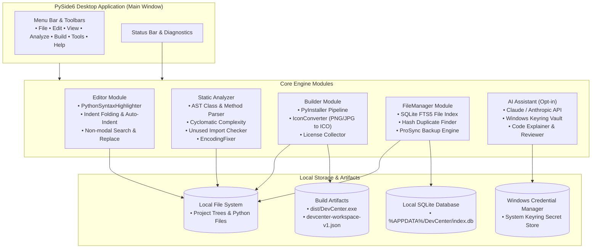
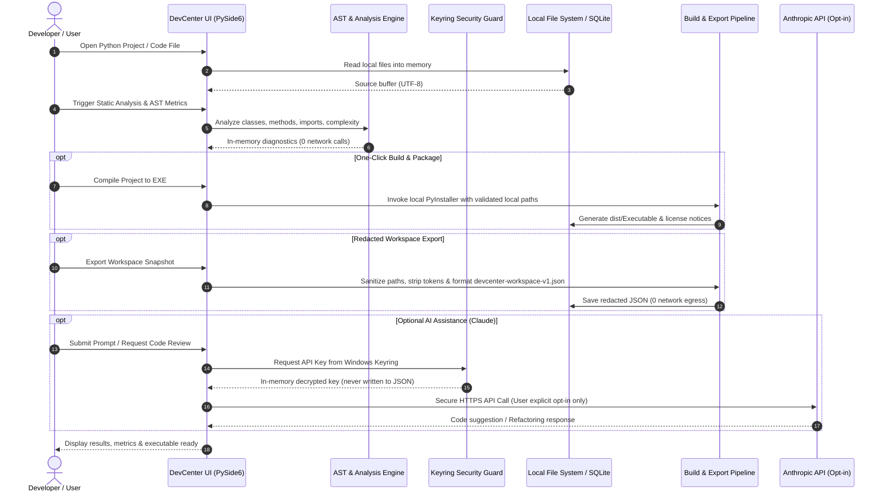

# DevCenter

**Local-first Python IDE and developer toolkit for Windows.** DevCenter combines a PySide6 code editor, AST static analyzer, PyInstaller build helper, icon converter, license collector, full-text SQLite file index, and optional Claude/Anthropic AI assistant in one cohesive desktop suite.

**[English](README.md) | [Deutsch](README_de.md)**

[](CHANGELOG.md)
[](https://python.org)
[](LICENSE)
[](https://github.com/dev-bricks/DevCenter)
[](https://www.qt.io/)
[](SECURITY.md)
[](SECURITY.md)
[](tests/)
[](llms.txt)
[](https://github.com/dev-bricks)
[](https://github.com/open-bricks)

> [!NOTE]
> **For AI Agents & LLM Tools:** This repository maintains an [`llms.txt`](llms.txt) machine-readable index for automated discovery, capability summaries, and CLI interfaces.

> **Not** Azure DevCenter, Microsoft Dev Box, Moderne DevCenter or Devbox. This is `dev-bricks/DevCenter` — an open-source Python desktop app.

---

## Start Here

| Need | Tool / Action | Interface |
|---|---|---|
| **Local Python IDE** | Code editor, syntax highlighting, AST analyzer, build helper | `python main.py` |
| **One-Click EXE Packaging** | PyInstaller build wizard (one-file / one-dir) | `build_exe.bat` / Build Tab |
| **Static Code Analysis** | Methods, classes, complexity, unused imports, TODOs | Analyze Tab |
| **Encoding Diagnostics & Repair** | BOM/mojibake detection, UTF-8 normalization | Analyze → Encoding Tab |
| **Full-Text File Index** | SQLite FTS5 file search, duplicate finder, backup sync | FileManager Tab |
| **Redacted Workspace Export** | Sanitized project metadata export for handoff | File → Export Workspace |
| **Windows Quick Launcher** | Direct desktop startup script | `START_DevCenter.bat` |

### Product Boundary

The PySide6 desktop application is the only shipped product and the authoritative runtime. `devcenter-workspace-v1.json` is a redacted local export for storage or explicit handoff; the repository contains no Web/PWA companion or hosted importer. See [DOCUMENTATION_STATUS.md](DOCUMENTATION_STATUS.md) for documentation hierarchy.


---

## System Architecture



---

## Data Flow & Privacy Isolation (Zero-Egress)



---

## Why DevCenter

- **Local-first workflow:** projects, indexes, settings and build artifacts stay on your machine by default.
- **Python desktop focus:** PySide6 interface, syntax highlighting, project explorer, terminal output and settings persistence.
- **Static analysis built in:** method/class detection, complexity checks, import analysis, TODO/FIXME detection and encoding repair helpers.
- **Build and release helpers:** PyInstaller wrapper, icon conversion, third-party license collection, release notes and export planning.
- **Optional AI assistant:** Claude/Anthropic integration is opt-in and uses local settings, keyring or environment variables.
- **Redacted workspace export:** writes a redacted `devcenter-workspace-v1.json` (see `EXPORTFORMAT.md`).

---

## Quick Start

```bash
git clone https://github.com/dev-bricks/DevCenter.git
cd DevCenter
pip install -r requirements.txt
python main.py
```

Windows batch launchers:

```batch
START_DevCenter.bat
build_exe.bat
```

---

## Features

### Editor
- Python syntax highlighting, line numbers, auto-indent, multi-tab interface.
- Comment toggle (`Ctrl+/`), drag-and-drop file loading.
- Code folding for indented code blocks (`Ctrl+Alt+[` / `Ctrl+Alt+]` / `Ctrl+Alt+0`).
- Non-modal search and replace with match navigation, case matching, whole words, and regex support (`Ctrl+F`).

### Static Analysis
- AST-based method and class detection.
- Cyclomatic complexity calculation and unused import detection.
- TODO/FIXME finder, encoding validation and automated UTF-8 repair.

### Build System
- One-click EXE compilation via PyInstaller (one-file / one-directory modes).
- ICO converter (PNG/JPG to multi-resolution Windows ICO).
- Third-party license collector for distribution compliance.

### AI Assistant (Opt-in)
- Claude/Anthropic API integration with secure Windows Keyring storage.
- Code generation, code review, explanation, and interactive refactoring loop.

### File Management
- SQLite file index with full-text search (FTS5).
- Hash-based duplicate file detection.
- Smart backup synchronization with automatic SQLite WAL checkpointing.

---

## Keyboard Shortcuts

| Shortcut | Action |
|---|---|
| `Ctrl+N` | New file |
| `Ctrl+O` | Open file |
| `Ctrl+S` | Save file |
| `Ctrl+Shift+N` | New project |
| `Ctrl+Shift+O` | Open project |
| `F5` | Run active Python script |
| `F6` | Build EXE via PyInstaller |
| `Ctrl+/` | Toggle comment |
| `Ctrl+F` | Open Search & Replace |
| `Ctrl+Alt+[` | Fold current code block |
| `Ctrl+Alt+]` | Unfold current code block |
| `Ctrl+Alt+0` | Unfold all code blocks |
| `Ctrl+Shift+A` | Toggle AI assistant |
| `Ctrl+,` | Open Settings |

---

## Sibling Tools & Ecosystem Matrix

DevCenter is part of the **dev-bricks** and **open-bricks** open-source ecosystem:

| Ecosystem | Tool | Primary Purpose | Interface |
|---|---|---|---|
| **dev-bricks** | **DevCenter** | **Local Python desktop IDE, static analyzer & PyInstaller build suite** | **PySide6 / Windows GUI** |
| **dev-bricks** | [MethodenAnalyser](https://github.com/dev-bricks/MethodenAnalyser) | Standalone AST method analyzer, complexity checker & auto-fixer | Tkinter / CLI |
| **dev-bricks** | [CodeBox](https://github.com/dev-bricks/CodeBox) | Fast desktop code viewer and editor with syntax highlighting | PySide6 GUI |
| **dev-bricks** | [pythonbox](https://github.com/dev-bricks/pythonbox) | Lightweight Python IDE and PDB debugger | PySide6 GUI |
| **dev-bricks** | [companion-for-agy](https://github.com/dev-bricks/companion-for-agy) | Interactive desktop companion & PTY bridge for Antigravity AI | Node.js / PTY |
| **dev-bricks** | [safe-start-for-codex](https://github.com/dev-bricks/safe-start-for-codex) | Preflight validation & secure bootloader for Codex | Python CLI |
| **file-bricks** | [ProFiler](https://github.com/file-bricks/ProFiler) | Multi-tab local desktop file manager and duplicate cleaner | PySide6 GUI |
| **file-bricks** | [ExplorerPro](https://github.com/file-bricks/ExplorerPro) | High-performance Windows Explorer companion & file indexing | PySide6 GUI |
| **doc-bricks** | [DokuZen](https://github.com/doc-bricks/DokuZen) | Markdown document manager, PDF converter & search engine | PySide6 GUI |
| **doc-bricks** | [PDFtoPDFocr](https://github.com/doc-bricks/PDFtoPDFocr) | Local OCR text layer injector for scanned PDF documents | PySide6 / CLI |
| **assistassets-ai** | [DEV_FullAssistantHub_SUITE](https://github.com/assistassets-ai/DEV_FullAssistantHub_SUITE) | System Tray modular hub & productivity suite launcher | PySide6 GUI |
| **ellmos-ai** | [ellmos-core](https://github.com/ellmos-ai/ellmos-core) | Multi-agent coordination kernel, MCP bridges & task runners | Python Core |
| **open-bricks** | [open-bricks](https://github.com/open-bricks/open-bricks) | Umbrella index for local-first, privacy-respecting software | Open Source |

---

## Installation & Testing

Requirements: Python 3.11+, Windows 10/11 (primary runtime).

```bash
# Clone & install dependencies
git clone https://github.com/dev-bricks/DevCenter.git
cd DevCenter
pip install -r requirements.txt

# Run test suite
python -m pytest
```

---

## Privacy & Security

DevCenter is a local-first desktop application. Projects, settings, file indexes and build artifacts stay on your machine by default. Network access occurs only when explicitly initiated by the user (such as the optional Claude API integration).

Anthropic API keys are stored exclusively in the system keyring and are never written to disk in unencrypted files.

Read the complete [SECURITY.md](SECURITY.md) and [PRIVACY_POLICY.md](PRIVACY_POLICY.md).

---

## License & Liability

- **License:** GPL v3 — see [LICENSE](LICENSE). PySide6 is LGPL.
- **Liability:** This project is an unpaid open-source donation. Liability is limited to intent and gross negligence (§ 521 German Civil Code / BGB). Use at your own risk.
