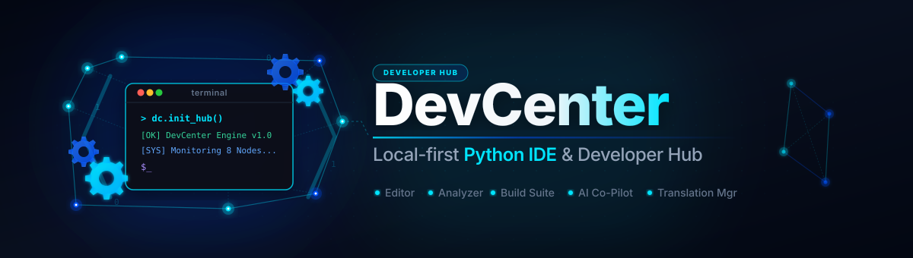

# DevCenter

**Local-first Python IDE and developer toolkit for Windows.** DevCenter combines a PySide6 code editor, static analyzer, PyInstaller build helper, license collector, file index and optional Claude/Anthropic assistant in one desktop suite.

[](CHANGELOG.md)
[](https://python.org)
[](LICENSE)
[](https://github.com/dev-bricks/DevCenter)

> **Not** Azure DevCenter, Microsoft Dev Box, Moderne DevCenter or Devbox. This is `dev-bricks/DevCenter` — an open-source Python desktop app.

## Start Here

| Need | Tool |
|---|---|
| Local Python IDE with editor, analyzer and build helper | `python main.py` |
| One-click EXE packaging | `build_exe.bat` / Build tab |
| Static code analysis | Analyze tab |
| Redacted workspace export for local handoff | File → Export workspace |
| Windows launcher | `START_DevCenter.bat` |

### Product boundary

The PySide6 desktop application is the only shipped product and the authoritative
runtime. `devcenter-workspace-v1.json` is a redacted local export for storage or
explicit handoff; the repository contains no Web/PWA companion or hosted importer.
See [DOCUMENTATION_STATUS.md](DOCUMENTATION_STATUS.md) for the documentation
hierarchy and historical-source boundary.


## Why DevCenter

- **Local-first workflow:** projects, indexes, settings and build artifacts stay on your machine by default.
- **Python desktop focus:** PySide6 interface, syntax highlighting, project explorer, terminal output and settings persistence.
- **Static analysis built in:** method/class detection, complexity checks, import analysis, TODO/FIXME detection and encoding repair helpers.
- **Build and release helpers:** PyInstaller wrapper, icon conversion, third-party license collection, release notes and export planning.
- **Optional AI assistant:** Claude/Anthropic integration is opt-in and uses local settings, keyring or environment variables.
- **Redacted workspace export:** writes a redacted `devcenter-workspace-v1.json` (see `EXPORTFORMAT.md`).

## Quick Start

```bash
git clone https://github.com/dev-bricks/DevCenter.git
cd DevCenter
pip install -r requirements.txt
python main.py
```

Windows helpers:

```batch
START_DevCenter.bat
build_exe.bat
```

## Features

### Editor
- Python syntax highlighting, line numbers, auto-indent, multi-tab
- Comment toggle (Ctrl+/), drag-and-drop files
- Code-Folding über den aktuellen Block (Ctrl+Alt+[ / Ctrl+Alt+] / Ctrl+Alt+0)
- Nicht-modale Suche mit Treffer-Navigation sowie Ersetzen/Alle ersetzen

### Static Analysis
- AST-based method and class detection
- Cyclomatic complexity, unused import detection
- TODO/FIXME finder, encoding checker and repair

### Build System
- One-click EXE via PyInstaller (one-file / one-directory)
- ICO converter (PNG/JPG to ICO)
- Third-party license collector for distributions

### AI Assistant
- Claude/Anthropic API integration — opt-in, key stays local
- Code generation, review, explanation, and development loop

### File Management
- SQLite file index with full-text search
- Duplicate detection (hash-based)
- Backup sync with automatic WAL checkpoint

### Settings and Persistence
- Structured JSON settings for editor, build, AI, sync and appearance
- Import/export support for reproducible setups
- Theme and window state restored on restart

## Installation

Requirements: Python 3.11+, Windows 10/11 (primary), Linux/macOS source-smoke only

```bash
git clone https://github.com/dev-bricks/DevCenter.git
cd DevCenter
pip install -r requirements.txt
python main.py
```

Dependencies (see `requirements.txt`):

```
PySide6>=6.5.0
pyinstaller>=5.0.0
Pillow>=12.2.0
anthropic>=0.18.0
keyring>=23.0.0
chardet>=5.0.0
ftfy>=6.1.0
pip-licenses>=4.0.0
watchdog>=3.0.0
```

`pyproject.toml` is the canonical package metadata and adds upper bounds plus
the optional `pytest`/`ruff` development tools. `requirements.txt` is the
convenience install list.

## Keyboard Shortcuts

| Shortcut | Action |
|---|---|
| Ctrl+N | New file |
| Ctrl+O | Open file |
| Ctrl+S | Save |
| Ctrl+Shift+N | New project |
| Ctrl+Shift+O | Open project |
| F5 | Run |
| F6 | Build |
| Ctrl+/ | Toggle comment |
| Ctrl+Shift+A | Toggle AI assistant |
| Ctrl+, | Settings |

## Tests

```bash
python -m unittest discover -s tests -v
python -m compileall -q main.py manage_translations.py translator.py src tests
```

GitHub Actions still runs smoke checks on Python 3.10, 3.11 and 3.12. The
supported package floor is the canonical `requires-python >=3.11` declaration;
the 3.10 job is a compatibility signal, not a promise that the package can be
installed on Python 3.10.

## Privacy

DevCenter is a local desktop application. Projects, settings, file indexes and build artifacts stay on your machine by default. Network access occurs only for explicitly configured integrations such as the optional Claude/Anthropic API or package installation commands started by the user.

API keys must not be committed to the repository. Use environment variables, the local keyring or the app settings.

Details: [PRIVACY_POLICY.md](PRIVACY_POLICY.md)

## Roadmap

### Version 1.1
- **Implementiert:** Code folding für eingerückte Blöcke
- **Implementiert:** Erweiterte Suche und Ersetzen (Dokument/Auswahl, Groß-/Kleinschreibung, ganze Wörter, Regex)
- Git integration
- Debugger support

#### Editor-Vertrag (Version 1.1)

- **Falten/Entfalten:** Der aktuelle eingerückte Block wird über das Menü
  „Ansicht” oder `Ctrl+Alt+[` gefaltet; `Ctrl+Alt+]` entfaltet ihn und
  `Ctrl+Alt+0` stellt alle Blöcke wieder her. Folding verändert keinen Text
  und ist daher unabhängig vom Undo-Verlauf.
- **Suchbereich:** `Ctrl+F` öffnet den nicht-modalen Dialog. Der Bereich ist
  standardmäßig das Dokument oder ausdrücklich die aktuelle Auswahl.
- **Treffer-Navigation:** „Nächster Treffer” und „Vorheriger Treffer” markieren
  Treffer zyklisch und zeigen Position und Anzahl an. Keine Treffer werden
  eindeutig gemeldet.
- **Ersetzen:** „Ersetzen” arbeitet am markierten Treffer, „Alle ersetzen”
  fasst den Lauf als eine Undo-Einheit zusammen. Abbrechen/Schließen beendet
  nur die Suchsitzung und schreibt nichts.
- **Inhalt/Zustand:** Änderungen laufen über `QTextCursor`; offene Tabs,
  Dateipfad, UTF-8-Inhalte und der Editorzustand bleiben erhalten. Es gibt
  keinen automatischen Dateischreibvorgang.

### Version 1.2
- Plugin system
- Additional themes
- MSIX packaging
- Auto-update

## Project Structure

```
DevCenter/
├── main.py                   # Entry point
├── requirements.txt
├── src/
│   ├── core/                 # Settings, event bus, project manager
│   ├── modules/
│   │   ├── editor/           # Code editor with syntax highlighting
│   │   ├── analyzer/         # AST analysis, encoding repair
│   │   ├── builder/          # PyInstaller wrapper, icon converter, license collector
│   │   ├── ai_assistant/     # Claude API integration
│   │   └── filemanager/      # File index, backup sync
│   └── gui/                  # Main window, panels, dialogs
└── tests/                    # Unit tests
```

## Documentation hierarchy

- Current user and agent contract: `README.md`, `llms.txt`,
  `ARCHITEKTUR_DevCenter.md`, `pyproject.toml`, `src/` and `tests/`.
- Release and platform boundaries: `CHANGELOG.md`, `EXPORTFORMAT.md`,
  `.github/workflows/tests.yml` and `PRIVACY_POLICY.md`.
- `SUITE_DEVCENTER_TEMPLATE.md` and `SUITE_ENTWICKLER_Fusionskonzept.md` are
  retained historical planning documents. They are not feature, dependency,
  version or license contracts.
- Host-specific `README-Mac Studio.md`, `AUFGABEN.txt`, `PORTIERUNGSPLAN.md`,
  `*-WORKSTATION-LG.*`, store notes and license inventories that exist only in
  an external OneDrive projection require an owner review before they can be
  treated as current repository documentation.

## License

GPL v3 — see [LICENSE](LICENSE). PySide6 is LGPL.

## Liability

This project is an unpaid open-source donation. Liability is limited to intent and gross negligence (§ 521 German Civil Code). Use at your own risk. No warranty, no maintenance guarantee, no fitness-for-purpose assumed.

---

## Deutsch / German

DevCenter ist eine lokale Desktop-Entwicklungsumgebung für Python-Projekte: **Code schreiben → Analysieren → Testen → Kompilieren → Veröffentlichen**. Kombiniert 11 spezialisierte Tools in einer kohärenten Suite. Die Desktop-App ist das einzige ausgelieferte Produkt; der redigierte Workspace-Export ist kein Web-/PWA-Produkt.

Nicht identisch mit Azure DevCenter, Microsoft Dev Box, Moderne DevCenter oder Devbox.

### Fusionierte Tools

| Ursprungstool | Modul | Funktion |
|---|---|---|
| PythonBox V8 | Editor | Code-Editor mit Syntax-Highlighting, Auto-Indent |
| MethodenAnalyser V3 | Analyzer | Statische Code-Analyse, Komplexitätsberechnung |
| EncodingFixer | Analyzer | Encoding-Erkennung und -Reparatur |
| UltimateKompilator V3.1 | Builder | Python → EXE Kompilierung via PyInstaller |
| IcoBuilder | Builder | Bild → ICO Konvertierung |
| ThirdPartyLicenses | Builder | Lizenz-Sammlung für Third-Party-Pakete |
| Entwicklerschleife V3 | AI Assistant | Claude API Integration für Code-Generierung |
| ProFiler V14 | FileManager | Datei-Indizierung und Volltext-Suche |
| ProSync V3.1 | FileManager | Intelligente Backup-Synchronisation |
### Produktgrenze

Die Desktop-Anwendung bleibt autoritativ. Der Workspace-Export redigiert lokale
Pfade und Geheimnisse für eine ausdrücklich freigegebene Übergabe; ein Web-/PWA-
Companion oder ein Browser-Importer gehört nicht zum aktuellen Produktstand.

### Konfiguration

Einstellungen werden gespeichert in:
- **Windows:** `%APPDATA%\DevCenter\settings.json`
- **Linux/macOS:** `~/.config/DevCenter/settings.json`

Wichtige Einstellungen:

```json
{
  "editor": { "font_family": "Consolas", "font_size": 11, "tab_size": 4 },
  "build": { "output_dir": "dist", "one_file": true },
  "ai": { "api_key": "", "model": "claude-sonnet-4-5", "max_tokens": 4096 },
  "sync": { "backup_path": "D:\\Backups\\DevCenter", "auto_backup": true }
}
```

### Datenschutz

DevCenter ist eine lokale Desktop-Anwendung. Projekte, Einstellungen, Datei-Indizes und Build-Artefakte bleiben standardmäßig auf dem lokalen Rechner. Netzwerkzugriffe entstehen nur durch explizit konfigurierte Integrationen.

API-Schlüssel gehören nicht in das Repository. Details: [PRIVACY_POLICY.md](PRIVACY_POLICY.md)

### Haftung

Dieses Projekt ist eine **unentgeltliche Open-Source-Schenkung** im Sinne der §§ 516 ff. BGB. Die Haftung des Urhebers ist gemäß **§ 521 BGB** auf **Vorsatz und grobe Fahrlässigkeit** beschränkt. Ergänzend gelten die Haftungsausschlüsse der GPL-3.0. Nutzung auf eigenes Risiko.
