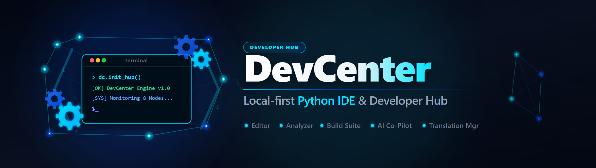
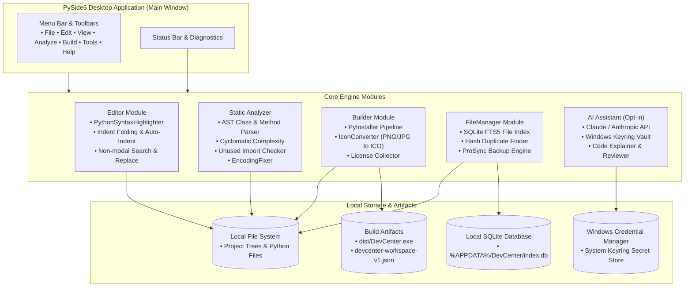
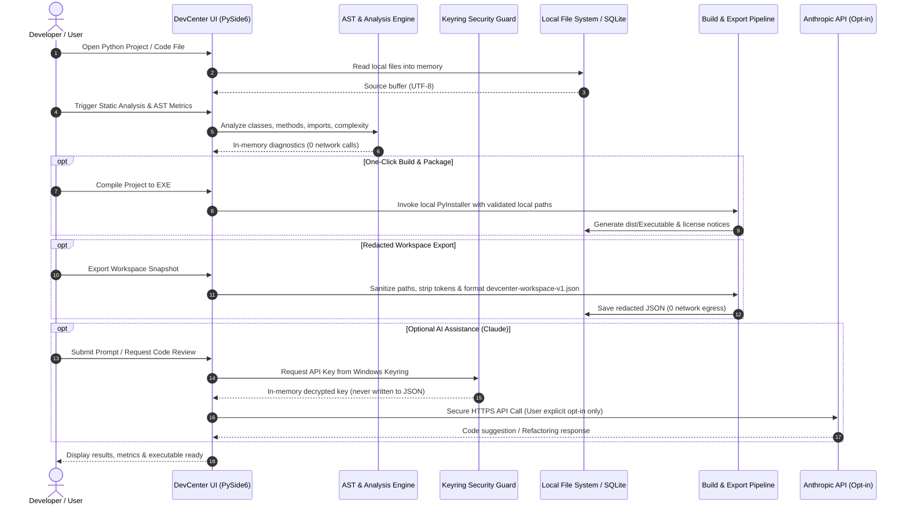

# DevCenter

**Local-first Python IDE and developer toolkit for Windows, Linux, and macOS.** DevCenter combines a PySide6 code editor, AST static analyzer, PyInstaller build helper, icon converter, license collector, full-text SQLite file index, and optional Claude/Anthropic AI assistant in one cohesive desktop suite.

[English](README.md) · [Deutsch](README_de.md)

[](CHANGELOG.md)
[](https://python.org)
[](LICENSE)
[](NOTICE)
[](https://github.com/dev-bricks/DevCenter)
[](https://www.qt.io/)
[](SECURITY.md)
[](SECURITY.md)
[](SECURITY.md)
[](SECURITY.md)
[](https://github.com/astral-sh/ruff)
[](THIRD_PARTY_LICENSES.md)
[](THIRD_PARTY_LICENSES.txt)
[](tests/)
[](MARKETING-LOG.txt)
[](llms.txt)
[](CHANGELOG.md)
[](https://github.com/dev-bricks)
[](https://github.com/open-bricks)

> [!NOTE]
> **For AI Agents & LLM Tools:** This repository maintains an [`llms.txt`](llms.txt) machine-readable index for automated discovery, capability summaries, and CLI interfaces. Last checked: **2026-10-04** (baseline: 2026-09-28).

> **Not** Azure DevCenter, Microsoft Dev Box, Moderne DevCenter or Devbox. This is `dev-bricks/DevCenter` — an open-source Python desktop suite.

---

## 🧭 Quick Navigation

- [1. Key Features & Highlights](#1-features)
- [2. System Architecture & PySide6 Design](#2-architecture)
- [3. Target Personas & Discoverability](#3-target-personas--discoverability)
- [4. Comparative Matrix vs. Alternatives](#4-comparative-matrix-vs-alternatives)
- [5. Dual Mermaid Diagrams & Data Flow](#5-dual-mermaid-diagrams--data-flow)
- [6. Governance & Runtime Invariants](#6-governance--runtime-invariants)
- [7. Editor & Code Ergonomics](#7-editor--code-ergonomics)
- [8. Static Analysis & AST Metrics](#8-static-analysis--ast-metrics)
- [9. PyInstaller Build Pipeline & Packaging](#9-pyinstaller-build-pipeline--packaging)
- [10. Full-Text Search & File Indexing](#10-full-text-search--file-indexing)
- [11. Optional AI Assistant & Keyring Security](#11-optional-ai-assistant--keyring-security)
- [12. Redacted Workspace Export & Interop](#12-redacted-workspace-export--interop)
- [13. Keyboard Shortcuts & User Controls](#13-keyboard-shortcuts--user-controls)
- [14. Repository Layout & Architecture](#14-repository-layout--architecture)
- [15. Quick Start & Batch Launchers](#15-quick-start--batch-launchers)
- [16. Testing & Quality Verification](#16-testing--quality-verification)
- [17. Third-Party Licenses & Level 1 SBOM](#17-third-party-licenses--level-1-sbom)
- [18. Security Policy, § 521 BGB & Sibling Ecosystem](#18-security-policy--sibling-ecosystem)

---

<a id="sec-01"></a>
<a id="1-features"></a>
<a id="features"></a>
<a id="1-merkmale"></a>
<a id="merkmale"></a>
<a id="start-here"></a>
<a id="schnelleinstieg"></a>
## 1. Key Features & Highlights

### ⚡ Quick Reference

| Property | Value |
|---|---|
| **Canonical Repository** | `dev-bricks/DevCenter` |
| **Umbrella Ecosystem** | `open-bricks` (dev-bricks organization) |
| **Language & Toolchain** | Python >=3.11, PySide6 (Qt6), PyInstaller |
| **Target Runtime** | Desktop Native: Windows 10/11, POSIX Linux, macOS |
| **Zero-Egress Invariant** | 100% Offline Default, Zero Telemetry, Zero Pingbacks |
| **Execution Boundary** | Strictly Unprivileged `RunAsInvoker` User Space |
| **Secret Management** | OS-Native Credential Store (Windows Credential Manager / Keyring) |
| **Security SLA** | 48h Response Acknowledgement / 5-Day Triage SLA |
| **Open Source License** | GNU General Public License v3.0 ([LICENSE](LICENSE)) |
| **Attribution Notice** | Canonical Open Source Attribution ([NOTICE](NOTICE)) |

### 🌟 Core Capabilities

| Need | Tool / Action | Interface |
|---|---|---|
| **Local Python IDE** | Code editor, syntax highlighting, AST analyzer, build helper | `python main.py` |
| **One-Click EXE Packaging** | PyInstaller build wizard (one-file / one-dir) | `build_exe.bat` / Build Tab |
| **Static Code Analysis** | Methods, classes, complexity, unused imports, TODOs | Analyze Tab |
| **Encoding Diagnostics & Repair** | BOM/mojibake detection, UTF-8 normalization (`ftfy`) | Analyze → Encoding Tab |
| **Full-Text File Index** | SQLite FTS5 file search, duplicate finder, backup sync | FileManager Tab |
| **Redacted Workspace Export** | Sanitized project metadata export for handoff | File → Export Workspace |
| **Multilingual UI** | UI in 6 languages (DE, EN, ES, ZH, JA, RU) with 4-stage fallback chain | Settings dialog |
| **Windows Quick Launcher** | Direct desktop startup script | `START_DevCenter.bat` |
| **Diagnostics & CLI Suite** | Automated health check, version, and headless AST inspection | `debug.bat` / `python main.py --check` |

### Product Boundary

The PySide6 desktop application is the only shipped product and the authoritative runtime. `devcenter-workspace-v1.json` is a redacted local export for storage or explicit handoff; the repository contains no Web/PWA companion or hosted importer. See [DOCUMENTATION_STATUS.md](DOCUMENTATION_STATUS.md) for documentation hierarchy.


---

<a id="sec-02"></a>
<a id="2-architecture"></a>
<a id="architecture"></a>
<a id="2-architektur"></a>
<a id="system-architecture"></a>
<a id="systemarchitektur"></a>
## 2. System Architecture & PySide6 Design

DevCenter is architected around a modular, event-driven PySide6 desktop engine. Core components maintain strict layer separation between user interface presentation, static code analysis, local file management, and optional AI services:

- **UI Presentation Layer (`src/gui/`)**: Houses `MainWindow`, tabbed editor panels, dockable tools, settings dialogs, and accessible keyboard shortcut controllers.
- **Static AST Engine (`src/modules/analyzer/`)**: Parses Python abstract syntax trees inertly without executing user code. Computes cyclomatic complexity, discovers classes and methods, and checks for unused imports.
- **Build & Packaging Engine (`src/modules/builder/`)**: Automates PyInstaller invocation, multi-resolution Windows ICO generation (`Pillow`), and automated third-party license extraction (`pip-licenses`).
- **File Management & Search (`src/modules/filemanager/`)**: Employs an embedded SQLite database with Full-Text Search (FTS5) and cryptographic file hashing for zero-latency project navigation and duplicate cleanup.
- **Security & Secret Vault (`src/core/ai_service.py`)**: Interacts with the native operating system keyring via `keyring` and `pywin32-ctypes`, ensuring API keys are never written to disk.

---

<a id="sec-03"></a>
<a id="3-target-personas--discoverability"></a>
<a id="target-personas"></a>
<a id="3-zielgruppen-personas--auffindbarkeit"></a>
<a id="zielgruppen-personas"></a>
<a id="marketing--target-personas"></a>
<a id="marketing--zielgruppen"></a>
## 3. Target Personas & Discoverability

DevCenter addresses four distinct developer profiles with specialized workflows and guarantees:

### 👤 `[PERSONA-01]` Windows Python Desktop App Developers & GUI Builders
- **Profile**: Python developers building Qt, PySide6, PyQt, or Tkinter desktop software for Windows.
- **Pain Points**: Complex PyInstaller command-line flags, manual multi-resolution ICO creation, scattered license files, and encoding corruption (mojibake).
- **DevCenter Solution**: One-click PyInstaller GUI wizard, built-in image-to-ICO converter, automated license notice collector, and automatic `ftfy` UTF-8 repair.
- **High-Intent Queries**: `"pyside6 python code editor desktop"`, `"pyinstaller exe packaging gui tool"`.

### 👤 `[PERSONA-02]` Solo Maintainers & Local-First Engineers
- **Profile**: Open-source maintainers and indie engineers building modular desktop and CLI utilities.
- **Pain Points**: Heavy IDE startup lag (Electron/JVM), opaque background daemons, and constant cloud account friction.
- **DevCenter Solution**: Instant native PySide6 desktop launch, lightning-fast SQLite FTS5 file indexing, and standalone project switching.
- **High-Intent Queries**: `"local-first python ide windows"`, `"lightweight python ide for windows 11"`.

### 👤 `[PERSONA-03]` Security-Conscious Enterprise & Air-Gapped Developers
- **Profile**: Developers operating in regulated, isolated, or corporate air-gapped environments.
- **Pain Points**: Mandatory cloud logins, background telemetry leaks, unvetted dependencies, and elevated privilege requirements.
- **DevCenter Solution**: Strict zero-egress default, non-elevated `RunAsInvoker` user space execution, vulnerability floors, and Level 1 SBOM transparency.
- **High-Intent Queries**: `"offline python ide without cloud login"`, `"zero-egress developer toolkit"`.

### 👤 `[PERSONA-04]` AI-Assisted Prompt Engineers & Agent Builders
- **Profile**: Engineers collaborating with LLM coding assistants (Claude, GPT, Gemini) for rapid software prototyping.
- **Pain Points**: Accidental leakage of API keys, cumbersome copy-pasting of whole project trees, and noisy prompt contexts.
- **DevCenter Solution**: Redacted workspace exports (`devcenter-workspace-v1.json`), OS-native keyring credential vault, and machine-readable `llms.txt`.
- **High-Intent Queries**: `"redacted workspace export python ide"`, `"dev-bricks devcenter python development suite"`.

---

<a id="sec-04"></a>
<a id="4-comparative-matrix-vs-alternatives"></a>
<a id="comparative-matrix"></a>
<a id="4-vergleichsmatrix-vs-alternativen"></a>
<a id="vergleichsmatrix"></a>
<a id="why-devcenter"></a>
<a id="warum-devcenter"></a>
## 4. Comparative Matrix vs. Alternatives

The following 10-dimension comparative matrix contrasts DevCenter against standard Python development environments, directly mapped to our Governance & Runtime Invariants (`INV-LOCAL-01` to `INV-SLA-10`):

| Evaluation Dimension | DevCenter | VS Code | PyCharm Comm. | Thonny | CLI Toolchains | Invariant Link |
|---|---|---|---|---|---|---|
| **100% Offline / Zero-Egress** | **YES (Strict)** | Config Needed | Telemetry Active | YES | YES | `INV-LOCAL-01` |
| **Native Qt/PySide6 Desktop UI** | **YES** | NO (Electron) | NO (JVM) | NO (Tk) | N/A | `INV-USER-08` |
| **Integrated PyInstaller GUI** | **YES (Built-in)** | Plugin Needed | Plugin Needed | NO | Manual CLI | `INV-PERM-07` |
| **Multi-Resolution ICO Converter** | **YES (Pillow)** | NO | NO | NO | Separate Tool | `INV-SECURITY-06` |
| **Automated License SBOM Extraction** | **YES (Built-in)** | NO | NO | NO | Separate Tool | `INV-PERM-07` |
| **Non-Executing AST Complexity Parser** | **YES (ast)** | Plugin Needed | Built-in | Basic | CLI Only | `INV-STATIC-05` |
| **Automated Encoding Repair (ftfy)** | **YES (Built-in)** | Manual | Manual | Basic | CLI Only | `INV-LOCAL-01` |
| **Native Keyring Secret Vault** | **YES (keyring)** | Plugin Needed | Plugin Needed | NO | N/A | `INV-KEYRING-03` |
| **Redacted Workspace Export** | **YES (JSON v1)** | NO | NO | NO | Manual Script | `INV-EXPORT-04` |
| **Security SLA & Patch Floors** | **YES (48h / 5d)** | General SLA | General SLA | Community | Unmanaged | `INV-SLA-10` |

---

<a id="sec-05"></a>
<a id="5-dual-mermaid-diagrams--data-flow"></a>
<a id="dual-mermaid-diagrams"></a>
<a id="5-duale-mermaid-diagramme--datenfluss"></a>
<a id="duale-mermaid-diagramme"></a>
<a id="data-flow--privacy-isolation-zero-egress"></a>
<a id="datenfluss--datenschutz-isolation-zero-egress"></a>
## 5. Dual Mermaid Diagrams & Data Flow

### 🏗️ System Architecture Topology


```mermaid
graph TB
    subgraph UI ["PySide6 Desktop Application (Main Window)"]
        TOP["Menu Bar & Toolbars<br/>• File • Edit • View • Analyze • Build • Tools • Help"]
        STATUS["Status Bar & Diagnostics"]
    end

    subgraph MODULES ["Core Engine Modules"]
        EDITOR["Editor Module<br/>• PythonSyntaxHighlighter<br/>• Indent Folding & Auto-Indent<br/>• Non-modal Search & Replace"]
        ANALYZER["Static Analyzer<br/>• AST Class & Method Parser<br/>• Cyclomatic Complexity<br/>• Unused Import Checker<br/>• EncodingFixer"]
        BUILDER["Builder Module<br/>• PyInstaller Pipeline<br/>• IconConverter (PNG/JPG to ICO)<br/>• License Collector"]
        FILEMGR["FileManager Module<br/>• SQLite FTS5 File Index<br/>• Hash Duplicate Finder<br/>• ProSync Backup Engine"]
        AI["AI Assistant (Opt-in)<br/>• Claude / Anthropic API<br/>• Windows Keyring Vault<br/>• Code Explainer & Reviewer"]
    end

    subgraph STORAGE ["Local Storage & Artifacts"]
        FS[("Local File System<br/>• Project Trees & Python Files")]
        DB[("Local SQLite Database<br/>• %APPDATA%/DevCenter/index.db")]
        KEYRING[("Windows Credential Manager<br/>• System Keyring Secret Store")]
        DIST[("Build Artifacts<br/>• dist/DevCenter.exe<br/>• devcenter-workspace-v1.json")]
    end

    UI --> MODULES
    EDITOR --> FS
    ANALYZER --> FS
    BUILDER --> FS
    BUILDER --> DIST
    FILEMGR --> FS
    FILEMGR --> DB
    AI --> KEYRING
    STATUS --> MODULES
```

### 🔒 Data Flow & Privacy Isolation (Zero-Egress Lifecycle)


```mermaid
sequenceDiagram
    autonumber
    actor Dev as Developer / User
    participant App as DevCenter UI (PySide6)
    participant Core as AST & Analysis Engine
    participant Sec as Keyring Security Guard
    participant Disk as Local File System / SQLite
    participant Dist as Build & Export Pipeline
    participant Ext as Anthropic API (Opt-in)

    Dev->>App: Open Python Project / Code File
    App->>Disk: Read local files into memory
    Disk-->>App: Source buffer (UTF-8)

    Dev->>App: Trigger Static Analysis & AST Metrics
    App->>Core: Analyze classes, methods, imports, complexity
    Core-->>App: In-memory diagnostics (0 network calls)

    opt One-Click Build & Package
        Dev->>App: Compile Project to EXE
        App->>Dist: Invoke local PyInstaller with validated local paths
        Dist->>Disk: Generate dist/Executable & license notices
    end

    opt Redacted Workspace Export
        Dev->>App: Export Workspace Snapshot
        App->>Dist: Sanitize paths, strip tokens & format devcenter-workspace-v1.json
        Dist->>Disk: Save redacted JSON (0 network egress)
    end

    opt Optional AI Assistance (Claude)
        Dev->>App: Submit Prompt / Request Code Review
        App->>Sec: Request API Key from Windows Keyring
        Sec-->>App: In-memory decrypted key (never written to JSON)
        App->>Ext: Secure HTTPS API Call (User explicit opt-in only)
        Ext-->>App: Code suggestion / Refactoring response
    end

    App-->>Dev: Display results, metrics & executable ready
```

---

<a id="sec-06"></a>
<a id="6-governance--runtime-invariants"></a>
<a id="governance-invariants"></a>
<a id="6-governance--laufzeit-invarianten"></a>
<a id="laufzeit-invarianten"></a>
<a id="governance--runtime-invariants"></a>
<a id="governance--laufzeit-invarianten"></a>
## 6. Governance & Runtime Invariants

DevCenter strictly enforces 10 architectural, security, and supply chain invariants across its entire lifecycle:

| Invariant ID | Name | Operational Scope | Guarantee & Verification |
|---|---|---|---|
| `INV-LOCAL-01` | **Zero-Egress Default** | Network & Telemetry | 100% offline operation by default; zero telemetry, zero analytics, zero background phone-home calls. |
| `INV-OPTIN-02` | **Opt-In AI Boundary** | External AI Services | Claude/Anthropic API calls execute only upon explicit user prompt submission; prompt text is never transmitted passively. |
| `INV-KEYRING-03` | **Keyring Secret Vault** | Credential Management | API credentials stored exclusively in native OS credential stores (Windows Credential Manager); zero plaintext disk persistence. |
| `INV-EXPORT-04` | **Redacted Workspace Export** | Metadata Serialization | `devcenter-workspace-v1.json` exports strip API tokens, credentials, and absolute personal paths; safe for team handoff. |
| `INV-STATIC-05` | **Inert AST Inspection** | Static Analysis | Code analysis inspects AST tokens and syntax trees inertly without executing or importing target user code. |
| `INV-SECURITY-06` | **Vulnerability Floors** | Supply Chain Security | Runtime dependencies enforce strict vulnerability floors (Pillow >=12.3.0, keyring >=25.0.0, pytest >=9.1.1). |
| `INV-PERM-07` | **100% Permissive / Separation** | Licensing & Compliance | GPLv3 suite with dynamic LGPL Qt linking and PyInstaller Bootloader Exception; bundled user apps retain freedom. |
| `INV-USER-08` | **Unprivileged RunAsInvoker** | Operating System Security | DevCenter operates strictly in unprivileged user space; no administrative privileges, UAC prompts, or drivers required. |
| `INV-MULTI-09` | **Multi-Host Sync Discipline** | Repository Hygiene | Git repositories strictly follow Plan D standards; `.gitignore` blocks cloud-sync conflicts, locks, and temporary artifacts. |
| `INV-SLA-10` | **48h / 5d Security SLA** | Vulnerability Disclosure | Dedicated security response channels with guaranteed 48-hour initial response and 5-business-day triage commitment. |

---

<a id="sec-07"></a>
<a id="7-editor--code-ergonomics"></a>
<a id="editor-features"></a>
<a id="7-editor--code-ergonomie"></a>
<a id="editor-funktionen"></a>
## 7. Editor & Code Ergonomics

The DevCenter editor provides a responsive, native coding experience built on PySide6:

- **Syntax Highlighting & Visual Styling**: Python syntax highlighter with custom color schemes for keywords, docstrings, decorators, and built-in functions.
- **Code Folding**: Indent-level folding for functions, classes, and nested blocks (`Ctrl+Alt+[` / `Ctrl+Alt+]` / `Ctrl+Alt+0`).
- **Non-Modal Search & Replace**: In-editor search bar supporting case matching, whole words, and regular expressions without blocking the editor view (`Ctrl+F`).
- **Encoding Diagnostics & Repair**: Real-time detection of UTF-8 BOM, ISO-8859-1, and mojibake with automatic one-click normalization via `ftfy`.

---

<a id="sec-08"></a>
<a id="8-static-analysis--ast-metrics"></a>
<a id="static-analysis"></a>
<a id="8-statische-analyse--ast-metriken"></a>
<a id="statische-analyse"></a>
## 8. Static Analysis & AST Metrics

DevCenter inspects code inertly using Python's standard library `ast` module:

- **Class & Method Detection**: Discovers all class structures, inheritance graphs, functions, and method signatures without importing the module.
- **Cyclomatic Complexity**: Evaluates decision points (`if`, `for`, `while`, `try`, boolean operators) to assign complexity ratings per function.
- **Unused Import & Variable Detection**: Tracks symbol references and aliased imports, flagging redundant dependencies.
- **TODO/FIXME Aggregator**: Collects and categorizes actionable developer annotations across the entire project tree.

---

<a id="sec-09"></a>
<a id="9-pyinstaller-build-pipeline--packaging"></a>
<a id="build-system"></a>
<a id="9-pyinstaller-build-pipeline--packaging"></a>
<a id="build-assistent"></a>
## 9. PyInstaller Build Pipeline & Packaging

Turn any Python script into a standalone Windows executable with zero manual CLI scripting:

- **One-File vs. One-Directory Packaging**: Toggle between monolithic single-file executables and directory distributions.
- **Automated Windows ICO Generation**: Built-in converter transforms PNG or JPG images into multi-resolution Windows icons (`16x16`, `32x32`, `48x48`, `64x64`, `128x128`, `256x256`) using high-quality Lanczos resampling.
- **Third-Party License Bundling**: Uses `pip-licenses` to aggregate licenses of all installed dependencies into a compliance notice file automatically included in the build distribution.

---

<a id="sec-10"></a>
<a id="10-full-text-search--file-indexing"></a>
<a id="file-management"></a>
<a id="10-volltext-dateisuche--sqlite-index"></a>
<a id="dateiverwaltung"></a>
## 10. Full-Text Search & File Indexing

Embedded SQLite indexing ensures instant retrieval and storage hygiene:

- **Full-Text Search (FTS5)**: Fast content searching across all source files, documentation, and notes in your project folder.
- **Duplicate File Detection**: Cryptographic hash matching identifies redundant files, temp snapshots, and abandoned copies.
- **ProSync Backup Engine**: Lightweight, SQLite-aware backup synchronization keeping local development snapshots safe.

---

<a id="sec-11"></a>
<a id="11-optional-ai-assistant--keyring-security"></a>
<a id="ai-assistant"></a>
<a id="11-optionaler-ki-assistent--keyring-sicherheit"></a>
<a id="ki-assistent"></a>
## 11. Optional AI Assistant & Keyring Security

DevCenter provides an optional Claude/Anthropic AI companion designed with strict zero-leakage principles:

- **OS Keyring Secret Isolation**: API keys are securely stored in the native Windows Credential Manager via `keyring` and `pywin32-ctypes`. Keys are never written to settings JSON files, logs, or workspace exports.
- **Explicit Action Boundary**: The AI assistant never scans or transmits code in the background. Network requests occur solely when the developer explicitly triggers a prompt or code review action.
- **Prompt Engineering Context**: Quick tools for code explanation, refactoring suggestions, docstring generation, and bug diagnosis.

---

<a id="sec-12"></a>
<a id="12-redacted-workspace-export--interop"></a>
<a id="workspace-export"></a>
<a id="12-redigierter-workspace-export--interoperabilität"></a>
<a id="workspace-export-de"></a>
## 12. Redacted Workspace Export & Interop

Export project state safely for cross-agent collaboration and team handoffs:

- **Redacted Schema (`devcenter-workspace-v1.json`)**: Generates a standardized JSON metadata snapshot detailing project structure, detected frameworks, open tasks, and dependencies.
- **Automatic Privacy Scrubbing**: Strips all absolute personal file paths, API tokens, passwords, and sensitive environment keys.
- **Interop Standard**: Facilitates handoffs to agent tools (Codex, Claude Desktop, Antigravity) without whole-repository egress. See [EXPORTFORMAT.md](EXPORTFORMAT.md).

---

<a id="sec-13"></a>
<a id="13-keyboard-shortcuts--user-controls"></a>
<a id="keyboard-shortcuts"></a>
<a id="13-tastenkombinationen--steuerung"></a>
<a id="tastenkombinationen"></a>
## 13. Keyboard Shortcuts & User Controls

| Shortcut | Action |
|---|---|
| `Ctrl+N` | New file |
| `Ctrl+O` | Open file |
| `Ctrl+S` | Save file |
| `Ctrl+Shift+N` | New project wizard |
| `Ctrl+Shift+O` | Open existing project |
| `F5` | Run active Python script |
| `F6` | Build EXE via PyInstaller wizard |
| `Ctrl+/` | Toggle comment on selected lines |
| `Ctrl+F` | Open Search & Replace bar |
| `Ctrl+Alt+[` | Fold current code block |
| `Ctrl+Alt+]` | Unfold current code block |
| `Ctrl+Alt+0` | Unfold all code blocks |
| `Ctrl+Shift+A` | Toggle AI assistant panel |
| `Ctrl+,` | Open Settings dialog |

---

<a id="sec-14"></a>
<a id="14-repository-layout--architecture"></a>
<a id="repository-layout"></a>
<a id="14-repository-struktur--aufbau"></a>
<a id="repository-struktur"></a>
## 14. Repository Layout & Architecture

```
DevCenter/
├── assets/                     # Visual assets (banner, logos, graphics)
├── locales/                    # Tier-2 translations (DE, EN, ES, ZH, JA, RU)
├── resources/                  # Windows Store packager and templates
├── src/                        # Authoritative application source tree
│   ├── core/                   # ProjectManager, SettingsManager, EventBus, CLI, Logging
│   ├── gui/                    # MainWindow, Editor, DockPanels, Dialogs
│   └── modules/                # Analyzer, Builder, FileManager, EncodingFixer
├── tests/                      # Automated unit, accessibility, and metadata contract tests
├── .gitignore                  # Multi-host lock and cloud-sync defense rules
├── CHANGELOG.md                # Release history and unreleased change ledger
├── DOCUMENTATION_STATUS.md     # Documentation hierarchy and boundary specifications
├── EXPORTFORMAT.md             # Specification of devcenter-workspace-v1.json
├── LICENSE                     # GNU General Public License v3.0 (GPLv3)
├── llms.txt                    # Machine-readable LLM context specification
├── main.py                     # Primary desktop entry point & CLI dispatcher
├── MARKETING-LOG.txt           # Local marketing intelligence and persona ledger
├── NOTICE                      # Canonical open-source attribution notice
├── pyproject.toml              # PEP 621 package metadata, 20 keywords, pytest config
├── README.md                   # English project documentation & architecture guide
├── README_de.md                # German project documentation & architecture guide
├── requirements.txt            # Pinned runtime dependencies
├── SECURITY.md                 # Bilingual security policy & 48h response SLA
├── THIRD_PARTY_LICENSES.md     # Level 1 SBOM and Invariant Cross-Reference Matrix
└── translator.py               # Tier-2 multi-language translation engine
```

---

<a id="sec-15"></a>
<a id="15-quick-start--batch-launchers"></a>
<a id="quick-start"></a>
<a id="15-schnellstart--batch-starter"></a>
<a id="schnellstart"></a>
## 15. Quick Start & Batch Launchers

### Standard Installation

```bash
git clone https://github.com/dev-bricks/DevCenter.git
cd DevCenter
pip install -r requirements.txt
python main.py
```

### Windows Batch Starters

```batch
# Quick GUI Launcher
START_DevCenter.bat

# Diagnostic & Debug Launcher (with console output and UTF-8 code page)
debug.bat

# Automated PyInstaller Compilation Script
build_exe.bat
```

### CLI Diagnostics & Headless Operations

```bash
# Verify system dependencies, PySide6, AST analyzer, and storage paths
python main.py --check

# Run headless AST analysis on a file or folder with JSON output
python main.py --analyze src/modules/analyzer/method_analyzer.py --output report.json

# Generate a sanitized workspace export headless
python main.py --export-workspace
```

---

<a id="sec-16"></a>
<a id="16-testing--quality-verification"></a>
<a id="installation--testing"></a>
<a id="16-testsuite--qualitätsverifikation"></a>
<a id="installation--testausführung"></a>
## 16. Testing & Quality Verification

DevCenter maintains a rigorous test suite covering core logic, accessibility, encoding repair, and metadata parity:

```bash
# Run complete test suite with standardized options
python -m pytest

# Run Ruff linter and static verification
ruff check .

# Validate bytecode compilation
python -m compileall -q .
```

CI verification (**2026-10-04**): `python -m pytest -q` passed **250 tests** (100% green) on Python 3.11 and 3.12. Continuous Integration validates the test matrix across Python 3.11 and 3.12 on Windows, Linux, and macOS.

---

<a id="sec-17"></a>
<a id="17-third-party-licenses--level-1-sbom"></a>
<a id="third-party-licenses--transparency"></a>
<a id="17-drittanbieter-lizenzen--level-1-sbom"></a>
<a id="drittanbieter-lizenzen--transparenz"></a>
## 17. Third-Party Licenses & Level 1 SBOM

DevCenter maintains a comprehensive Level 1 Software Bill of Materials (SBOM) and license transparency audit:

- Detailed breakdown of all 20 direct, transitive, build, and test packages: [THIRD_PARTY_LICENSES.md](THIRD_PARTY_LICENSES.md).
- Canonical attribution notice: [NOTICE](NOTICE).
- Machine-readable license mapping: [THIRD_PARTY_LICENSES.txt](THIRD_PARTY_LICENSES.txt).
- All packages are audited under permissive open-source licenses (MIT, Apache-2.0, BSD-3-Clause, BSD-2-Clause, HPND-sell-variant) or standard copyleft with linking/bootloader exceptions (LGPL-3.0, LGPL-2.1, GPL-2.0 with Bootloader exception).

---

<a id="sec-18"></a>
<a id="18-security-policy--sibling-ecosystem"></a>
<a id="security-policy"></a>
<a id="privacy--security"></a>
<a id="18-sicherheitsrichtlinie--521-bgb--ökosystem"></a>
<a id="datenschutz--sicherheit"></a>
<a id="sibling-tools--ecosystem-matrix"></a>
<a id="geschwister-tools--ökosystem-matrix"></a>
<a id="license--liability"></a>
<a id="lizenz--haftung"></a>
## 18. Security Policy, § 521 BGB & Sibling Ecosystem

### 🛡️ Security Policy & Statutory Disclaimer

DevCenter operates strictly local-first and unprivileged (`RunAsInvoker`). Network access occurs solely upon explicit user initiation.

- **Vulnerability Disclosure**: 48-hour response acknowledgement and 5-business-day triage commitment.
- **Reporting Contacts**: `security@dev-bricks.org`, `security@open-bricks.org`, `security@ellmos.ai`.
- **Statutory Liability Disclaimer (§ 521 BGB)**: DevCenter is provided free of charge as open-source software under the GNU General Public License v3.0. In accordance with statutory German gratuitous contract law (§ 521 BGB / Gefälligkeitsrecht), liability of the author is limited to intent and gross negligence. Use at your own risk.

### 🌐 Sibling Tools & Ecosystem Matrix

DevCenter is the flagship Python IDE and packaging center within the **dev-bricks** ecosystem under the **open-bricks** umbrella:

| Ecosystem | Tool | Primary Purpose | Interface |
|---|---|---|---|
| **dev-bricks** | **DevCenter** | **Local Python desktop IDE, static analyzer & PyInstaller build suite** | **PySide6 / Windows GUI** |
| **dev-bricks** | [MethodenAnalyser](https://github.com/dev-bricks/MethodenAnalyser) | Standalone AST method analyzer, complexity checker & auto-fixer | Tkinter / CLI |
| **dev-bricks** | [CodeBox](https://github.com/dev-bricks/CodeBox) | Fast desktop code viewer and editor with syntax highlighting | PySide6 GUI |
| **dev-bricks** | [pythonbox](https://github.com/dev-bricks/pythonbox) | Lightweight Python IDE and interactive PDB debugger | PySide6 GUI |
| **dev-bricks** | [safe-start-for-codex](https://github.com/dev-bricks/safe-start-for-codex) | Preflight validation & secure bootloader for Codex | Python CLI |
| **dev-bricks** | [automizer-for-claude-desktop](https://github.com/dev-bricks/automizer-for-claude-desktop) | Automation bridge and launcher for Claude Desktop | Python GUI |
| **ellmos-ai** | [clutch](https://github.com/ellmos-ai/clutch) | Subprocess management & PTY terminal bridge | Python CLI |
| **ellmos-ai** | [coma](https://github.com/ellmos-ai/coma) | Multi-host conflict resolution & distributed state sync | Python CLI |
| **ellmos-ai** | [swarm-ai](https://github.com/ellmos-ai/swarm-ai) | Distributed agent swarm coordination & consensus engine | Python Core |
| **ellmos-ai** | [ellmos-controlcenter-mcp](https://github.com/ellmos-ai/ellmos-controlcenter-mcp) | MCP fleet governance, bundle resolution & access control | MCP Server |
| **file-bricks** | [ProFiler](https://github.com/file-bricks/ProFiler) | Multi-tab local desktop file manager and duplicate cleaner | PySide6 GUI |
| **file-bricks** | [ExplorerPro](https://github.com/file-bricks/ExplorerPro) | High-performance Windows Explorer companion & file indexing | PySide6 GUI |
| **file-bricks** | [ProSync](https://github.com/file-bricks/ProSync) | SQLite-aware backup engine & multi-target sync manager | PySide6 GUI |
| **doc-bricks** | [DokuZen](https://github.com/doc-bricks/DokuZen) | Markdown document manager, PDF converter & search engine | PySide6 GUI |
| **doc-bricks** | [PDFtoPDFocr](https://github.com/doc-bricks/PDFtoPDFocr) | Local OCR text layer injector for scanned PDF documents | PySide6 / CLI |
| **open-bricks** | [open-bricks](https://github.com/open-bricks) | Umbrella index for local-first, privacy-respecting software | Open Source |
