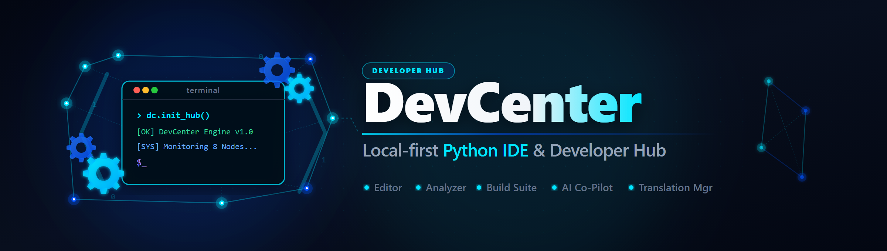
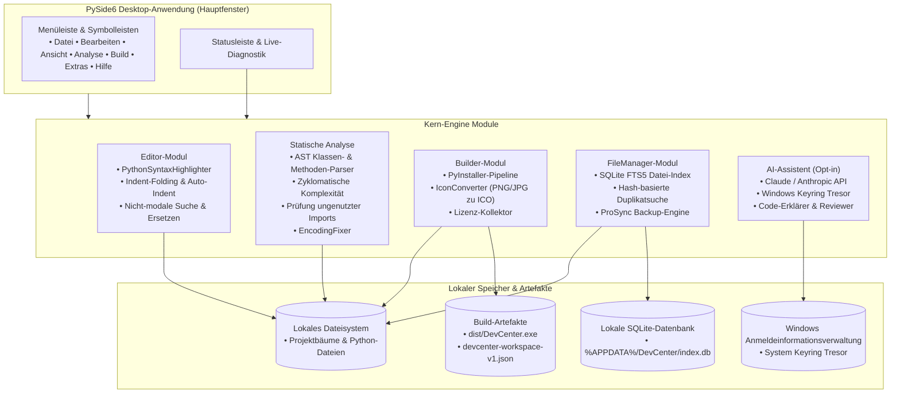
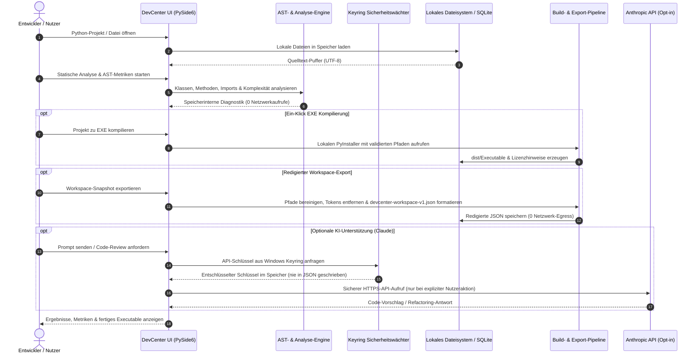

# DevCenter

**Lokale Desktop-Entwicklungsumgebung und Entwickler-Zentrale für Windows, Linux und macOS.** DevCenter vereint einen PySide6-Code-Editor, statische AST-Code-Analyse, PyInstaller-EXE-Kompilierung, Icon-Konvertierung, Lizenz-Sammlung, Volltext-SQLite-Dateisuche und einen optionalen Claude/Anthropic AI-Assistenten in einer kohärenten Desktop-Suite.

**[English](README.md) | [Deutsch](README_de.md)**

[](CHANGELOG.md)
[](https://python.org)
[](LICENSE)
[](https://github.com/dev-bricks/DevCenter)
[](https://www.qt.io/)
[](SECURITY.md)
[](SECURITY.md)
[](SECURITY.md)
[](THIRD_PARTY_LICENSES.md)
[](tests/)
[](MARKETING-LOG.txt)
[](llms.txt)
[](https://github.com/dev-bricks)
[](https://github.com/open-bricks)

> [!NOTE]
> **Für KI-Agenten & LLM-Tools:** Dieses Repository stellt mit [`llms.txt`](llms.txt) einen maschinenlesbaren Index für automatisierte Erkennung, Funktionsübersichten und CLI-Schnittstellen bereit.

> **Nicht identisch** mit Azure DevCenter, Microsoft Dev Box, Moderne DevCenter oder Devbox. Dies ist `dev-bricks/DevCenter` — eine quelloffene Python Desktop-Suite.

---

## Schnelleinstieg & Navigation

1. [Schnelleinstieg & Produktgrenze](#schnelleinstieg)
2. [Systemarchitektur](#systemarchitektur)
3. [Datenfluss & Datenschutz-Isolation (Zero-Egress)](#datenfluss--datenschutz-isolation-zero-egress)
4. [Governance & Laufzeit-Invarianten](#governance--laufzeit-invarianten)
5. [Warum DevCenter](#warum-devcenter)
6. [Schnellstart](#schnellstart)
7. [Funktionen & Fähigkeiten](#funktionen)
8. [Tastenkombinationen](#tastenkombinationen)
9. [Geschwister-Tools & Ökosystem-Matrix](#geschwister-tools--ökosystem-matrix)
10. [Drittanbieter-Lizenzen & Transparenz](#drittanbieter-lizenzen--transparenz)
11. [Marketing & Zielgruppen](#marketing--zielgruppen)
12. [Installation & Testausführung](#installation--testausführung)
13. [Datenschutz & Sicherheit](#datenschutz--sicherheit)
14. [Mitwirken & Entwicklung](#mitwirken)
15. [Lizenz & Haftung](#lizenz--haftung)

---

## Schnelleinstieg

| Anforderung | Werkzeug / Aktion | Oberfläche / Befehl |
|---|---|---|
| **Lokale Python-IDE** | Code-Editor, Syntax-Highlighting, AST-Analyse, Build-Assistent | `python main.py` |
| **Ein-Klick EXE-Kompilierung** | PyInstaller-Build-Assistent (One-File / One-Directory) | `build_exe.bat` / Build-Reiter |
| **Statische Code-Analyse** | Methoden, Klassen, Komplexität, ungenutzte Imports, TODOs | Analyse-Reiter |
| **Encoding-Diagnostik & Reparatur** | BOM-/Mojibake-Erkennung, automatische UTF-8-Bereinigung | Analyse → Encoding-Reiter |
| **Volltext-Dateisuche** | SQLite FTS5-Suche, Duplikaterkennung, Backup-Sync | FileManager-Reiter |
| **Redigierter Workspace-Export** | Bereinigter Projekt-Metadaten-Export für Handoff | Datei → Workspace exportieren |
| **Windows Schnellstarter** | Direkter Desktop-Start über Skript | `START_DevCenter.bat` |

### Produktgrenze

Die PySide6 Desktop-Anwendung ist das einzige ausgelieferte Produkt und die maßgebliche Runtime. `devcenter-workspace-v1.json` ist ein redigierter lokaler Export für Archivierung oder explizite Übergabe; das Repository enthält keinen Web-/PWA-Begleiter oder gehosteten Importer. Siehe [DOCUMENTATION_STATUS.md](DOCUMENTATION_STATUS.md) für die Dokumentenhierarchie.


---

## Systemarchitektur



---

## Datenfluss & Datenschutz-Isolation (Zero-Egress)



---

## Governance & Laufzeit-Invarianten

DevCenter garantiert 10 verbindliche Architektur-, Sicherheits- und Lieferketten-Invarianten:

| Invarianten-ID | Name | Operativer Bereich | Garantie & Überprüfung |
|---|---|---|---|
| `INV-LOCAL-01` | **Zero-Egress Standard** | Netzwerk & Telemetrie | 100% Offline-Betrieb als Standard; keine Telemetrie, keine Nutzungsdaten, keine Hintergrundaufrufe. |
| `INV-OPTIN-02` | **Opt-In KI-Grenze** | Externe KI-Dienste | Claude/Anthropic API-Aufrufe erfolgen ausschließlich nach expliziter Nutzeraktion; kein stiller Datenabfluss. |
| `INV-KEYRING-03` | **Keyring Secret Vault** | Credential-Speicherung | API-Schlüssel werden ausschließlich im nativen OS-Tresor (Windows Credential Manager) verschlüsselt gespeichert. |
| `INV-EXPORT-04` | **Redigierter Workspace-Export** | Serialisierung | `devcenter-workspace-v1.json` bereinigt Tokens, Passwörter und absolute Pfade; sichere Weitergabe an Teams. |
| `INV-STATIC-05` | **Inerte AST-Analyse** | Code-Analyse | Statische Analysen prüfen Syntaxbäume und AST-Tokens inert, ohne fremden Benutzercode auszuführen. |
| `INV-SECURITY-06` | **Vulnerability Floors** | Lieferkettensicherheit | Erzwingt strikte Mindestversionen (Pillow >=12.3.0, keyring >=25.0.0, pytest >=9.1.1) gegen bekannte CVEs. |
| `INV-PERM-07` | **100% Permissiv / Trennung** | Lizenzierung | GPLv3-Suite mit dynamischer LGPL-Qt-Bindung und PyInstaller-Ausnahme; erstellte Benutzer-EXEs bleiben lizenzfrei. |
| `INV-USER-08` | **Unprivilegiertes RunAsInvoker** | Betriebssystemsicherheit | DevCenter läuft vollständig im Standard-Benutzerkontext; keine Administratorrechte, Treiber oder UAC-Prompts nötig. |
| `INV-MULTI-09` | **Multi-Host Sync-Disziplin** | Repository-Hygiene | Git-Repositories folgen strikt Plan D; `.gitignore` blockiert Cloud-Sync-Konflikte, Locks und temporäre Caches. |
| `INV-SLA-10` | **48h / 5d Sicherheits-SLA** | Schwachstellenmeldung | Verbindliche Sicherheitskanäle mit garantierter Erstreaktion innerhalb 48 Stunden und 5 Tagen Triage. |

---

## Warum DevCenter

- **Lokaler Arbeitsablauf:** Projekte, Indizes, Konfigurationen und Build-Artefakte verbleiben standardmäßig auf Ihrem Rechner.
- **Python-Desktop-Fokus:** PySide6-Oberfläche, Syntax-Highlighting, Projekt-Explorer, Terminalausgabe und persistente Einstellungen.
- **Integrierte statische Analyse:** Erkennung von Methoden/Klassen, Komplexitätsprüfung, Importanalyse, TODO/FIXME-Suche und Encoding-Reparatur.
- **Build- und Release-Assistenten:** PyInstaller-Wrapper, Icon-Konvertierung, Drittanbieter-Lizenzsammlung, Release-Notizen und Exportplanung.
- **Optionaler AI-Assistent:** Claude/Anthropic-Integration ist opt-in und nutzt lokale Konfigurationen, Keyring oder Umgebungsvariablen.
- **Redigierter Workspace-Export:** Erzeugt ein bereinigtes `devcenter-workspace-v1.json` (siehe [EXPORTFORMAT.md](EXPORTFORMAT.md)).

---

## Schnellstart

```bash
git clone https://github.com/dev-bricks/DevCenter.git
cd DevCenter
pip install -r requirements.txt
python main.py
```

Windows-Startskripte:

```batch
START_DevCenter.bat
build_exe.bat
```

---

## Funktionen

### Editor
- Python-Syntax-Highlighting, Zeilennummern, Auto-Indent, Multi-Tab-Oberfläche.
- Kommentar-Umschaltung (`Strg+/`), Drag-and-Drop Dateiladen.
- Code-Faltung für eingerückte Codeblöcke (`Strg+Alt+[` / `Strg+Alt+]` / `Strg+Alt+0`).
- Nicht-modale Suche und Ersetzen mit Treffernavigation, Groß-/Kleinschreibung, ganzen Wörtern und Regex (`Strg+F`).

### Statische Analyse
- AST-basierte Erkennung von Methoden und Klassen.
- Berechnung der zyklomatischen Komplexität und Prüfung ungenutzter Imports.
- TODO/FIXME-Finder, Kodierungsvalidierung und automatische UTF-8-Reparatur (`ftfy`).

### Build-System
- Ein-Klick EXE-Kompilierung via PyInstaller (One-File / One-Directory Modi).
- ICO-Konverter (PNG/JPG zu Multi-Resolution Windows ICO).
- Drittanbieter-Lizenz-Kollektor für rechtssichere Distributionen.

### AI-Assistent (Opt-in)
- Claude/Anthropic API-Integration mit sicherer Windows Keyring-Speicherung.
- Code-Generierung, Code-Review, Erklärung und interaktive Refactoring-Schleife.

### Dateiverwaltung
- SQLite-Dateiindex mit Volltextsuche (FTS5).
- Hash-basierte Erkennung doppelter Dateien.
- Intelligente Backup-Synchronisation mit automatischen SQLite WAL-Checkpoints.

---

## Tastenkombinationen

| Tastenkürzel | Aktion |
|---|---|
| `Strg+N` | Neue Datei |
| `Strg+O` | Datei öffnen |
| `Strg+S` | Datei speichern |
| `Strg+Umschalt+N` | Neues Projekt |
| `Strg+Umschalt+O` | Projekt öffnen |
| `F5` | Aktives Python-Skript ausführen |
| `F6` | EXE über PyInstaller kompilieren |
| `Strg+/` | Kommentar umschalten |
| `Strg+F` | Suchen & Ersetzen öffnen |
| `Strg+Alt+[` | Aktuellen Codeblock falten |
| `Strg+Alt+]` | Aktuellen Codeblock entfalten |
| `Strg+Alt+0` | Alle Codeblöcke entfalten |
| `Strg+Umschalt+A` | AI-Assistent umschalten |
| `Strg+,` | Einstellungen öffnen |

---

## Geschwister-Tools & Ökosystem-Matrix

DevCenter ist das Flaggschiff für Python-Desktop-Entwicklung im **dev-bricks** Ökosystem unter dem **open-bricks** Dachverband:

| Ökosystem | Tool | Primärer Zweck | Benutzeroberfläche |
|---|---|---|---|
| **dev-bricks** | **DevCenter** | **Lokale Python-IDE, statische Analyse & PyInstaller-Build-Suite** | **PySide6 / Windows GUI** |
| **dev-bricks** | [MethodenAnalyser](https://github.com/dev-bricks/MethodenAnalyser) | Eigenständiger AST-Methodenanalysator, Komplexitätsprüfer & Fixer | Tkinter / CLI |
| **dev-bricks** | [CodeBox](https://github.com/dev-bricks/CodeBox) | Schneller Desktop-Code-Betrachter und Editor mit Syntax-Highlighting | PySide6 GUI |
| **dev-bricks** | [pythonbox](https://github.com/dev-bricks/pythonbox) | Schlanke interaktive Python-IDE mit PDB-Debugger | PySide6 GUI |
| **dev-bricks** | [safe-start-for-codex](https://github.com/dev-bricks/safe-start-for-codex) | Preflight-Validierung & sicherer Bootloader für Codex | Python CLI |
| **dev-bricks** | [automizer-for-claude-desktop](https://github.com/dev-bricks/automizer-for-claude-desktop) | Automationsbrücke und Startumgebung für Claude Desktop | Python GUI |
| **dev-bricks** | [automation-master](https://github.com/dev-bricks/automation-master) | Flottenweite Automationsorchestrierung & Task-Scheduler | Python Core |
| **ellmos-ai** | [ellmos-core](https://github.com/ellmos-ai/ellmos-core) | Multi-Agenten-Koordinationskern, MCP-Brücken & Task-Runner | Python Core |
| **ellmos-ai** | [clutch](https://github.com/ellmos-ai/clutch) | Subprozess-Management & PTY-Terminalbrücke | Python CLI |
| **ellmos-ai** | [coma](https://github.com/ellmos-ai/coma) | Multi-Host Konfliktlösung & verteilte Zustandssynchronisation | Python CLI |
| **ellmos-ai** | [swarm-ai](https://github.com/ellmos-ai/swarm-ai) | Verteilte Agentenschwarm-Koordination & Konsens-Engine | Python Core |
| **ellmos-ai** | [ellmos-controlcenter-mcp](https://github.com/ellmos-ai/ellmos-controlcenter-mcp) | MCP-Flottenverwaltung, Bundle-Auflösung & Zugriffskontrolle | MCP Server |
| **file-bricks** | [ProFiler](https://github.com/file-bricks/ProFiler) | Multi-Tab lokaler Desktop-Dateimanager und Duplikatbereiniger | PySide6 GUI |
| **file-bricks** | [ExplorerPro](https://github.com/file-bricks/ExplorerPro) | Hochleistungs-Windows-Explorer-Erweiterung & Datei-Indexierung | PySide6 GUI |
| **file-bricks** | [ProSync](https://github.com/file-bricks/ProSync) | SQLite-bewusste Backup-Engine & Multi-Ziel-Synchronisation | PySide6 GUI |
| **doc-bricks** | [DokuZen](https://github.com/doc-bricks/DokuZen) | Markdown-Dokumentenmanager, PDF-Konverter & Suchmaschine | PySide6 GUI |
| **doc-bricks** | [PDFtoPDFocr](https://github.com/doc-bricks/PDFtoPDFocr) | Lokaler OCR-Textebenen-Injektor für gescannte PDF-Dokumente | PySide6 / CLI |
| **open-bricks** | [open-bricks](https://github.com/open-bricks/open-bricks) | Dachverband für lokale, privatsphäreschützende Software | Open Source |

---

## Drittanbieter-Lizenzen & Transparenz

DevCenter führt ein lückenloses Software-Inventar (SBOM) und eine Lizenztransparenzprüfung:
- Detaillierte Übersicht aller 20 direkten, transitiven, Build- und Test-Pakete: [THIRD_PARTY_LICENSES.md](THIRD_PARTY_LICENSES.md).
- Maschinenlesbare Lizenzzuordnung: [THIRD_PARTY_LICENSES.txt](THIRD_PARTY_LICENSES.txt).
- Alle Pakete sind unter permissiven Lizenzen (MIT, Apache-2.0, BSD-3-Clause, BSD-2-Clause, HPND-sell-variant) oder Standard-Copyleft mit Linking-/Bootloader-Ausnahme auditiert.

---

## Marketing & Zielgruppen

Für ausführliche Zielgruppenprofile, High-Intent-Suchbegriffe, die Wettbewerbsmatrix gegenüber VS Code und PyCharm sowie die Ökosystem-Synergien siehe [MARKETING-LOG.txt](MARKETING-LOG.txt).

Haupt-Zielgruppen:
1. **Windows Python Desktop-Entwickler & GUI-Builder**: Benötigen nahtlose PyInstaller-Paketierung, ICO-Generierung und automatische Encoding-Reparatur.
2. **Solo-Maintainer & Local-First-Ingenieure**: Schätzen sofortigen Start, reaktive PySide6-Bedienung und null Hintergrund-Telemetrie.
3. **Sicherheitsbewusste Unternehmens- & Offline-Entwickler**: Verlangen strikten Zero-Egress, unprivilegierten Betrieb und geprüfte Sicherheitsuntergrenzen.
4. **KI-unterstützte Python Prompt-Engineers**: Profitieren von redigierten Workspace-Snapshots und nativer Keyring-Geheimnis-Isolation.

---

## Installation & Testausführung

Voraussetzungen: Python 3.11+, Windows 10/11 (primäre Laufzeitumgebung; lauffähig auch unter Linux und macOS).

```bash
# Repository klonen & Abhängigkeiten installieren
git clone https://github.com/dev-bricks/DevCenter.git
cd DevCenter
pip install -r requirements.txt

# Automatisierte Testsuite ausführen
python -m pytest
```

---

## Datenschutz & Sicherheit

DevCenter ist eine lokale Desktop-Anwendung. Projekte, Konfigurationen, Dateiindizes und Build-Ergebnisse verbleiben standardmäßig auf Ihrem Computer. Netzwerkzugriffe erfolgen ausschließlich dann, wenn sie vom Nutzer ausdrücklich angestoßen wurden (wie z. B. die optionale Claude-API).

Anthropic API-Schlüssel werden ausschließlich im nativen Betriebssystem-Schlüsselspeicher (Windows Credential Manager) hinterlegt und niemals unverschlüsselt auf Datenträgern gespeichert.

Vollständige Details unter [SECURITY.md](SECURITY.md) und [PRIVACY_POLICY.md](PRIVACY_POLICY.md).

---

## Mitwirken

Beiträge sind herzlich willkommen! Bitte beachten Sie folgende Richtlinien:
- Lesen Sie [CONTRIBUTING.md](CONTRIBUTING.md) für Code-Standards und Commit-Konventionen.
- Beachten Sie den [CODE_OF_CONDUCT.md](CODE_OF_CONDUCT.md).
- Führen Sie vor Pull-Requests `ruff check .` und `pytest` aus.

---

## Lizenz & Haftung

- **Lizenz:** GPL v3 — siehe [LICENSE](LICENSE). PySide6 steht unter LGPL v3.
- **Haftungsausschluss:** Dieses Projekt ist eine unentgeltliche Open-Source-Schenkung. Die Haftung ist auf Vorsatz und grobe Fahrlässigkeit beschränkt (§ 521 BGB). Die Nutzung erfolgt auf eigenes Risiko.
