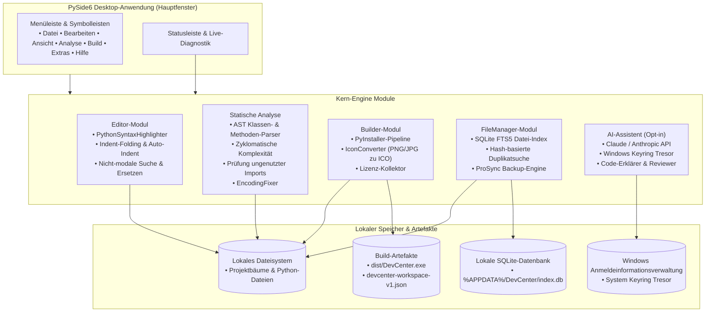
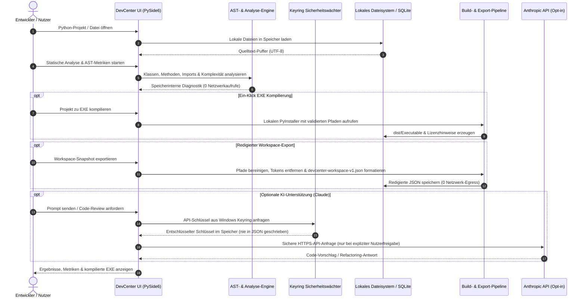

# DevCenter

**Lokale Desktop-Entwicklungsumgebung und Entwickler-Zentrale für Windows.** DevCenter vereint einen PySide6-Code-Editor, statische AST-Code-Analyse, PyInstaller-EXE-Kompilierung, Icon-Konvertierung, Lizenz-Sammlung, Volltext-SQLite-Dateisuche und einen optionalen Claude/Anthropic AI-Assistenten in einer kohärenten Desktop-Suite.

**[English](README.md) | [Deutsch](README_de.md)**

[](CHANGELOG.md)
[](https://python.org)
[](LICENSE)
[](https://github.com/dev-bricks/DevCenter)
[](https://www.qt.io/)
[](SECURITY.md)
[](SECURITY.md)
[](tests/)
[](llms.txt)
[](https://github.com/dev-bricks)
[](https://github.com/open-bricks)

> [!NOTE]
> **Für KI-Agenten & LLM-Tools:** Dieses Repository stellt mit [`llms.txt`](llms.txt) einen maschinenlesbaren Index für automatisierte Erkennung, Funktionsübersichten und CLI-Schnittstellen bereit.

> **Nicht identisch** mit Azure DevCenter, Microsoft Dev Box, Moderne DevCenter oder Devbox. Dies ist `dev-bricks/DevCenter` — eine Open-Source Python Desktop-Anwendung.

---

## Schnelleinstieg

| Anforderung | Werkzeug / Aktion | Oberfläche / Befehl |
|---|---|---|
| **Lokale Python-IDE** | Code-Editor, Syntax-Highlighting, AST-Analyse, Build-Assistent | `python main.py` |
| **Ein-Klick EXE-Kompilierung** | PyInstaller-Build-Assistent (One-File / One-Directory) | `build_exe.bat` / Build-Reiter |
| **Statische Code-Analyse** | Methoden, Klassen, Komplexität, ungenutzte Imports, TODOs | Analyse-Reiter |
| **Encoding-Diagnostik & Reparatur** | BOM-/Mojibake-Erkennung, automatische UTF-8-Bereinigung | Analyse → Encoding-Reiter |
| **Volltext-Dateisuche** | SQLite FTS5-Suche, Duplikaterkennung, Backup-Sync | FileManager-Reiter |
| **Redigierter Workspace-Export** | Bereinigter Projekt-Metadaten-Export für Handoff | Datei → Workspace exportieren |
| **Windows Schnellstarter** | Direkter Desktop-Start über Skript | `START_DevCenter.bat` |

### Produktgrenze

Die PySide6 Desktop-Anwendung ist das einzige ausgelieferte Produkt und die maßgebliche Runtime. `devcenter-workspace-v1.json` ist ein redigierter lokaler Export für Archivierung oder explizite Übergabe; das Repository enthält keinen Web-/PWA-Begleiter oder gehosteten Importer. Siehe [DOCUMENTATION_STATUS.md](DOCUMENTATION_STATUS.md) für die Dokumentenhierarchie.


---

## Systemarchitektur



---

## Datenfluss & Datenschutz-Isolation (Zero-Egress)



---

## Warum DevCenter

- **Local-First Arbeitsablauf:** Projekte, Indizes, Einstellungen und Build-Artefakte verbleiben standardmäßig vollständig auf Ihrem System.
- **Python Desktop-Fokus:** PySide6-Oberfläche, Syntax-Hervorhebung, Projekt-Explorer, Terminal-Ausgabe und zuverlässige Zustandswiederherstellung.
- **Integrierte statische Analyse:** Methoden-/Klassenerkennung, Komplexitätsprüfung, Importanalyse, TODO/FIXME-Suche und Encoding-Reparatur.
- **Build- & Release-Helfer:** PyInstaller-Wrapper, Icon-Konvertierung, Lizenzsammlung für Drittanbieterpakete und Release-Planung.
- **Optionaler KI-Assistent:** Claude/Anthropic-Integration ist rein optional und nutzt den sicheren Windows-Keyring.
- **Redigierter Workspace-Export:** Erzeugt standardisierte `devcenter-workspace-v1.json` Exporte ohne Geheimnisse.

---

## Installation & Schnellstart

```bash
git clone https://github.com/dev-bricks/DevCenter.git
cd DevCenter
pip install -r requirements.txt
python main.py
```

Windows-Starter:

```batch
START_DevCenter.bat
build_exe.bat
```

---

## Funktionen

### Editor
- Python Syntax-Highlighting, Zeilennummern, Auto-Einrückung, Multi-Tab-Verwaltung.
- Kommentar-Umschaltung (`Ctrl+/`), Drag-and-Drop Dateiladen.
- Code-Folding für eingerückte Blöcke (`Ctrl+Alt+[` / `Ctrl+Alt+]` / `Ctrl+Alt+0`).
- Nicht-modale Suche und Ersetzen mit Treffernavigation, Groß-/Kleinschreibung, ganzen Wörtern und Regex (`Ctrl+F`).

### Statische Analyse
- AST-basierte Methoden- und Klassenerkennung.
- Zyklomatische Komplexitätsberechnung und Erkennung ungenutzter Imports.
- TODO/FIXME-Finder, Encoding-Prüfung und automatische UTF-8-Reparatur.

### Build-System
- Ein-Klick EXE-Erstellung via PyInstaller (One-File / One-Directory).
- ICO-Konverter (PNG/JPG zu Multi-Resolution Windows ICO).
- Lizenzsammler für Drittanbieter-Bibliotheken zur Einhaltung von Open-Source-Lizenzen.

### AI-Assistent (Opt-in)
- Claude/Anthropic API-Anbindung mit sicherer Speicherung im Windows-Keyring.
- Code-Generierung, Code-Reviews, Erklärungen und interaktive Entwicklerschleife.

### Dateiverwaltung
- SQLite-Datei-Index mit Volltextsuche (FTS5).
- Hash-basierte Duplikaterkennung.
- Intelligente Backup-Synchronisation mit automatischem WAL-Checkpointing.

---

## Tastenkombinationen

| Tastenkürzel | Aktion |
|---|---|
| `Ctrl+N` | Neue Datei |
| `Ctrl+O` | Datei öffnen |
| `Ctrl+S` | Datei speichern |
| `Ctrl+Shift+N` | Neues Projekt |
| `Ctrl+Shift+O` | Projekt öffnen |
| `F5` | Aktives Skript ausführen |
| `F6` | EXE über PyInstaller bauen |
| `Ctrl+/` | Kommentar umschalten |
| `Ctrl+F` | Suchen & Ersetzen öffnen |
| `Ctrl+Alt+[` | Aktuellen Block falten |
| `Ctrl+Alt+]` | Aktuellen Block entfalten |
| `Ctrl+Alt+0` | Alle Blöcke entfalten |
| `Ctrl+Shift+A` | AI-Assistent umschalten |
| `Ctrl+,` | Einstellungen öffnen |

---

## Geschwister-Werkzeuge & Ökosystem-Matrix

DevCenter ist Teil des **dev-bricks** und **open-bricks** Open-Source-Ökosystems:

| Ökosystem | Werkzeug | Hauptzweck | Schnittstelle |
|---|---|---|---|
| **dev-bricks** | **DevCenter** | **Lokale Python Desktop-IDE, statische Analyse & PyInstaller Build-Suite** | **PySide6 / Windows GUI** |
| **dev-bricks** | [MethodenAnalyser](https://github.com/dev-bricks/MethodenAnalyser) | Eigenständige AST-Methodenanalyse, Komplexitätsprüfung & Auto-Fixer | Tkinter / CLI |
| **dev-bricks** | [CodeBox](https://github.com/dev-bricks/CodeBox) | Schneller Desktop-Code-Betrachter und -Editor mit Highlighting | PySide6 GUI |
| **dev-bricks** | [pythonbox](https://github.com/dev-bricks/pythonbox) | Schlanke Python-IDE und PDB-Debugger | PySide6 GUI |
| **dev-bricks** | [companion-for-agy](https://github.com/dev-bricks/companion-for-agy) | Interaktiver Desktop-Begleiter & PTY-Bridge für Antigravity AI | Node.js / PTY |
| **dev-bricks** | [safe-start-for-codex](https://github.com/dev-bricks/safe-start-for-codex) | Preflight-Validierung & sicherer Bootloader für Codex | Python CLI |
| **file-bricks** | [ProFiler](https://github.com/file-bricks/ProFiler) | Multi-Tab Desktop-Dateimanager und Duplikatbereinigung | PySide6 GUI |
| **file-bricks** | [ExplorerPro](https://github.com/file-bricks/ExplorerPro) | Performanter Windows Explorer Begleiter & Dateiindizierung | PySide6 GUI |
| **doc-bricks** | [DokuZen](https://github.com/doc-bricks/DokuZen) | Markdown-Dokumentenverwaltung, PDF-Konverter & Suchmaschine | PySide6 GUI |
| **doc-bricks** | [PDFtoPDFocr](https://github.com/doc-bricks/PDFtoPDFocr) | Lokale OCR-Textebenen-Injektion für gescannte PDF-Dokumente | PySide6 / CLI |
| **assistassets-ai** | [DEV_FullAssistantHub_SUITE](https://github.com/assistassets-ai/DEV_FullAssistantHub_SUITE) | System-Tray Suite-Hub & modularer Produktivitäts-Launcher | PySide6 GUI |
| **ellmos-ai** | [ellmos-core](https://github.com/ellmos-ai/ellmos-core) | Multi-Agenten-Koordinationskern, MCP-Bridges & Task-Runner | Python Core |
| **open-bricks** | [open-bricks](https://github.com/open-bricks/open-bricks) | Dachorganisation für lokale, datenschutzfreundliche Software | Open Source |

---

## Tests & Qualitätssicherung

```bash
# Testsuite ausführen
python -m pytest
```

---

## Datenschutz & Sicherheit

DevCenter ist eine lokale Desktop-Anwendung. Projekte, Einstellungen, Datei-Indizes und Build-Artefakte verbleiben standardmäßig auf Ihrem lokalen Rechner. Netzwerkzugriffe entstehen ausschließlich bei expliziter Nutzerfreigabe (wie dem optionalen KI-Assistenten).

API-Schlüssel werden ausschließlich im Windows-Keyring verschlüsselt gespeichert und gelangen niemals im Klartext in Konfigurationsdateien.

Lesen Sie die vollständige [SECURITY.md](SECURITY.md) und [PRIVACY_POLICY.md](PRIVACY_POLICY.md).

---

## Lizenz & Haftung

- **Lizenz:** GPL v3 — siehe [LICENSE](LICENSE). PySide6 steht unter der LGPL.
- **Haftung:** Dieses Projekt ist eine **unentgeltliche Open-Source-Schenkung** im Sinne der §§ 516 ff. BGB. Die Haftung ist gemäß **§ 521 BGB** auf **Vorsatz und grobe Fahrlässigkeit** beschränkt.
