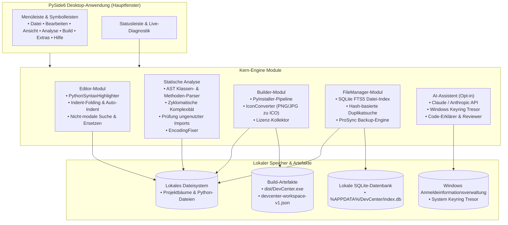
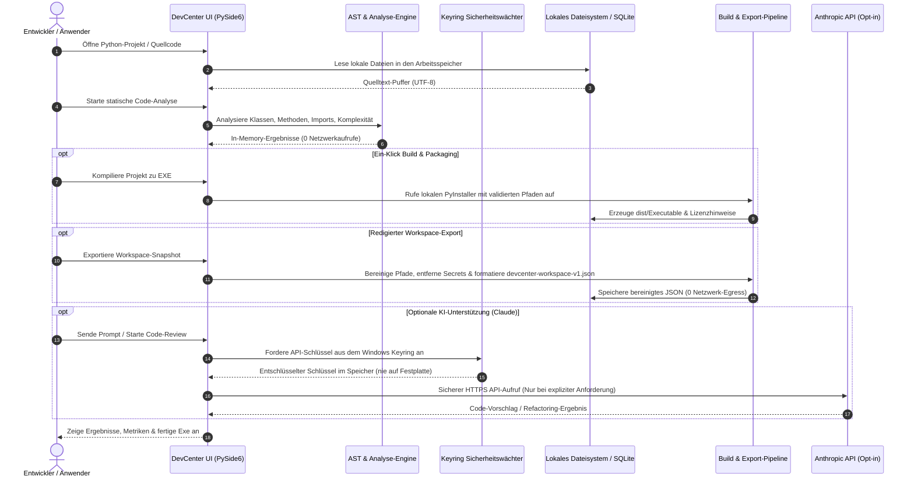

# DevCenter

**Lokale Desktop-Entwicklungsumgebung und Entwickler-Zentrale für Windows, Linux und macOS.** DevCenter vereint einen PySide6-Code-Editor, statische AST-Code-Analyse, PyInstaller-EXE-Kompilierung, Icon-Konvertierung, Lizenz-Sammlung, Volltext-SQLite-Dateisuche und einen optionalen Claude/Anthropic AI-Assistenten in einer kohärenten Desktop-Suite.

[English](README.md) · [Deutsch](README_de.md) · [Español](README_es.md) · [简体中文](README_zh.md) · [日本語](README_ja.md) · [Русский](README_ru.md)

[](CHANGELOG.md)
[](https://python.org)
[](LICENSE)
[](NOTICE)
[](https://github.com/dev-bricks/DevCenter)
[](https://www.qt.io/)
[](SECURITY.md)
[](SECURITY.md)
[](SECURITY.md)
[](SECURITY.md)
[](https://github.com/astral-sh/ruff)
[](THIRD_PARTY_LICENSES.md)
[](THIRD_PARTY_LICENSES.txt)
[](tests/)
[](MARKETING-LOG.txt)
[](llms.txt)
[](CHANGELOG.md)
[](https://github.com/dev-bricks)
[](https://github.com/open-bricks)

> [!NOTE]
> **Für KI-Agenten & LLM-Tools:** Dieses Repository stellt mit [`llms.txt`](llms.txt) einen maschinenlesbaren Index für automatisierte Erkennung, Funktionsübersichten und CLI-Schnittstellen bereit. Letzte Prüfung: **2026-10-04** (Baseline: 2026-09-28).

> **Nicht identisch** mit Azure DevCenter, Microsoft Dev Box, Moderne DevCenter oder Devbox. Dies ist `dev-bricks/DevCenter` — eine quelloffene Python Desktop-Suite.

---

## 🧭 Schnelleinstieg & Navigation

- [1. Hauptmerkmale & Highlights](#1-merkmale)
- [2. Systemarchitektur & PySide6-Design](#2-architektur)
- [3. Zielgruppen-Personas & Auffindbarkeit](#3-zielgruppen-personas--auffindbarkeit)
- [4. Vergleichsmatrix vs. Alternativen](#4-vergleichsmatrix-vs-alternativen)
- [5. Duale Mermaid-Diagramme & Datenfluss](#5-duale-mermaid-diagramme--datenfluss)
- [6. Governance & Laufzeit-Invarianten](#6-governance--laufzeit-invarianten)
- [7. Editor & Code-Ergonomie](#7-editor--code-ergonomie)
- [8. Statische Analyse & AST-Metriken](#8-statische-analyse--ast-metriken)
- [9. PyInstaller Build-Pipeline & Packaging](#9-pyinstaller-build-pipeline--packaging)
- [10. Volltext-Dateisuche & SQLite-Index](#10-volltext-dateisuche--sqlite-index)
- [11. Optionaler KI-Assistent & Keyring-Sicherheit](#11-optionaler-ki-assistent--keyring-sicherheit)
- [12. Redigierter Workspace-Export & Interoperabilität](#12-redigierter-workspace-export--interoperabilität)
- [13. Tastenkombinationen & Steuerung](#13-tastenkombinationen--steuerung)
- [14. Repository-Struktur & Aufbau](#14-repository-struktur--aufbau)
- [15. Schnellstart & Batch-Starter](#15-schnellstart--batch-starter)
- [16. Testsuite & Qualitätsverifikation](#16-testsuite--qualitätsverifikation)
- [17. Drittanbieter-Lizenzen & Level 1 SBOM](#17-drittanbieter-lizenzen--level-1-sbom)
- [18. Sicherheitsrichtlinie, § 521 BGB & Ökosystem](#18-sicherheitsrichtlinie--521-bgb--ökosystem)

---

<a id="sec-01"></a>
<a id="1-features"></a>
<a id="features"></a>
<a id="1-merkmale"></a>
<a id="merkmale"></a>
<a id="start-here"></a>
<a id="schnelleinstieg"></a>
## 1. Hauptmerkmale & Highlights

### ⚡ Schnellübersicht

| Eigenschaft | Wert |
|---|---|
| **Kanonisches Repository** | `dev-bricks/DevCenter` |
| **Dach-Ökosystem** | `open-bricks` (Organisation dev-bricks) |
| **Sprache & Toolchain** | Python >=3.11, PySide6 (Qt6), PyInstaller |
| **Ziel-Plattformen** | Desktop Native: Windows 10/11, POSIX Linux, macOS |
| **Zero-Egress-Invariante** | 100% Offline-Standard, null Telemetrie, null Pingbacks |
| **Ausführungsgrenze** | Strikt unprivilegierter `RunAsInvoker`-Benutzerbereich |
| **Schlüsselverwaltung** | Betriebssystem-nativer Tresor (Windows Credential Manager / Keyring) |
| **Sicherheits-SLA** | 48h Reaktionsbestätigung / 5 Werktage Triage-Zusage |
| **Open-Source-Lizenz** | GNU General Public License v3.0 ([LICENSE](LICENSE)) |
| **Attributions-Hinweis** | Kanonische Open-Source-Attribution ([NOTICE](NOTICE)) |

### 🌟 Kernfähigkeiten

| Anforderung | Werkzeug / Aktion | Oberfläche / Befehl |
|---|---|---|
| **Lokale Python-IDE** | Code-Editor, Syntax-Highlighting, AST-Analyse, Build-Assistent | `python main.py` |
| **Ein-Klick EXE-Kompilierung** | PyInstaller-Build-Assistent (One-File / One-Directory) | `build_exe.bat` / Build-Reiter |
| **Statische Code-Analyse** | Methoden, Klassen, Komplexität, ungenutzte Imports, TODOs | Analyse-Reiter |
| **Encoding-Diagnostik & Reparatur** | BOM-/Mojibake-Erkennung, automatische UTF-8-Bereinigung (`ftfy`) | Analyse → Encoding-Reiter |
| **Volltext-Dateisuche** | SQLite FTS5-Suche, Duplikaterkennung, Backup-Sync | FileManager-Reiter |
| **Redigierter Workspace-Export** | Bereinigter Projekt-Metadaten-Export für Handoff | Datei → Workspace exportieren |
| **Mehrsprachige Oberfläche** | Oberfläche in 6 Sprachen (DE, EN, ES, ZH, JA, RU) mit 4-stufiger Fallback-Kette | Einstellungsdialog |
| **Windows Schnellstarter** | Direkter Desktop-Start über Skript | `START_DevCenter.bat` |
| **Diagnose- & CLI-Suite** | Automatischer Integritäts-Check, Version und Headless-AST-Prüfung | `debug.bat` / `python main.py --check` |

### Produktgrenze

Die PySide6 Desktop-Anwendung ist das einzige ausgelieferte Produkt und die maßgebliche Runtime. `devcenter-workspace-v1.json` ist ein redigierter lokaler Export für Archivierung oder explizite Übergabe; das Repository enthält keinen Web-/PWA-Begleiter oder gehosteten Importer. Siehe [DOCUMENTATION_STATUS.md](DOCUMENTATION_STATUS.md) für die Dokumentenhierarchie.


---

<a id="sec-02"></a>
<a id="2-architecture"></a>
<a id="architecture"></a>
<a id="2-architektur"></a>
<a id="system-architecture"></a>
<a id="systemarchitektur"></a>
## 2. Systemarchitektur & PySide6-Design

DevCenter basiert auf einer modularen, ereignisgesteuerten PySide6-Desktop-Architektur. Die Kernkomponenten wahren eine strikte Schichtentrennung zwischen Benutzeroberfläche, statischer Code-Analyse, Dateiverwaltung und optionalen KI-Diensten:

- **UI-Präsentationsschicht (`src/gui/`)**: Enthält `MainWindow`, tabellarische Editor-Panels, andockbare Werkzeugleisten, Einstellungsdialoge und tastaturzugängliche Controller.
- **Statische AST-Engine (`src/modules/analyzer/`)**: Analysiert abstrakte Syntaxbäume rein inert, ohne Zielcode auszuführen oder zu importieren. Ermittelt zyklomatische Komplexität, Klassen-/Methodenstrukturen und ungenutzte Imports.
- **Build- & Packaging-Engine (`src/modules/builder/`)**: Automatisiert die PyInstaller-Kompilierung, hochqualitative Windows-ICO-Generierung (`Pillow`) und automatisierte Lizenzextraktion (`pip-licenses`).
- **Dateimanagement & Suche (`src/modules/filemanager/`)**: Nutzt eine eingebettete SQLite-Datenbank mit FTS5-Volltextsuche und kryptographischem Datei-Hashing für latenzfreie Projektnavigation und Duplikatreinigung.
- **Sicherheits- & Secret-Tresor (`src/core/ai_service.py`)**: Kommuniziert über `keyring` und `pywin32-ctypes` direkt mit der Windows-Anmeldeinformationsverwaltung; Schlüssel werden niemals im Klartext persistiert.

---

<a id="sec-03"></a>
<a id="3-target-personas--discoverability"></a>
<a id="target-personas"></a>
<a id="3-zielgruppen-personas--auffindbarkeit"></a>
<a id="zielgruppen-personas"></a>
<a id="marketing--target-personas"></a>
<a id="marketing--zielgruppen"></a>
## 3. Zielgruppen-Personas & Auffindbarkeit

DevCenter richtet sich gezielt an vier Entwickler-Profile mit spezialisierten Anforderungen:

### 👤 `[PERSONA-01]` Windows Python Desktop-App-Entwickler & GUI-Builder
- **Profil**: Entwickler von Qt-, PySide6-, PyQt- oder Tkinter-Desktop-Anwendungen unter Windows.
- **Herausforderungen**: Komplexe PyInstaller-Kommandozeilen, manuelle Multi-Resolution ICO-Erstellung, verstreute Lizenzdateien und Zeichenkodierungsfehler (Mojibake).
- **DevCenter Lösung**: Integrierter PyInstaller-Kompilierungsassistent, automatischer Icon-Konverter, Lizenzsammler und automatische `ftfy`-UTF-8-Reparatur.
- **Suchbegriffe**: `"pyside6 python code editor desktop"`, `"pyinstaller exe packaging gui tool"`.

### 👤 `[PERSONA-02]` Solo-Maintainer & Local-First Entwickler
- **Profil**: Open-Source-Maintainer und Indie-Entwickler mit modularen Python-Werkzeugen und Desktop-Apps.
- **Herausforderungen**: Hohe Startlatenzen schwerer IDEs (Electron/JVM), undurchsichtige Hintergrundprozesse und ständige Cloud-Login-Zwänge.
- **DevCenter Lösung**: Blitzschneller nativer PySide6-Start, latenzfreier SQLite-FTS5-Dateiindex und isoliertes Projektmanagement.
- **Suchbegriffe**: `"local-first python ide windows"`, `"lightweight python ide for windows 11"`.

### 👤 `[PERSONA-03]` Sicherheitsbewusste Enterprise- & Air-Gapped-Entwickler
- **Profil**: Software-Ingenieure in regulierten, isolierten oder unternehmensweiten Offline-Netzwerken.
- **Herausforderungen**: Cloud-Zwang, Hintergrundtelemetrie, ungeprüfte transitive Abhängigkeiten und Administrator-Rechteanforderungen.
- **DevCenter Lösung**: Striktes Zero-Egress per Default, unprivilegierte `RunAsInvoker`-Ausführung, gehärtete Vulnerability-Floors und Level 1 SBOM-Transparenz.
- **Suchbegriffe**: `"offline python ide without cloud login"`, `"zero-egress developer toolkit"`.

### 👤 `[PERSONA-04]` KI-unterstützte Prompt-Engineers & Agenten-Entwickler
- **Profil**: Entwickler, die mit modernen LLMs (Claude, GPT, Gemini) interaktiv Code entwerfen.
- **Herausforderungen**: Versehentlicher API-Schlüssel-Leak, mühsames Kopieren ganzer Verzeichnisbäume und unstrukturierter Prompt-Kontext.
- **DevCenter Lösung**: Redigierter Workspace-Export (`devcenter-workspace-v1.json`), sicherer OS-Keyring-Tresor und maschinenlesbare `llms.txt`.
- **Suchbegriffe**: `"redacted workspace export python ide"`, `"dev-bricks devcenter python development suite"`.

---

<a id="sec-04"></a>
<a id="4-comparative-matrix-vs-alternatives"></a>
<a id="comparative-matrix"></a>
<a id="4-vergleichsmatrix-vs-alternativen"></a>
<a id="vergleichsmatrix"></a>
<a id="why-devcenter"></a>
<a id="warum-devcenter"></a>
## 4. Vergleichsmatrix vs. Alternativen

Die folgende 10-dimensionale Vergleichsmatrix stellt DevCenter gängigen Entwicklungsumgebungen gegenüber, verknüpft mit unseren Governance- & Laufzeit-Invarianten (`INV-LOCAL-01` bis `INV-SLA-10`):

| Bewertungsdimension | DevCenter | VS Code | PyCharm Comm. | Thonny | CLI-Werkzeuge | Invarianten-Bezug |
|---|---|---|---|---|---|---|
| **100% Offline / Zero-Egress** | **JA (Strikt)** | Konfiguration nötig | Telemetrie aktiv | JA | JA | `INV-LOCAL-01` |
| **Native Qt/PySide6 Desktop-UI** | **JA** | NEIN (Electron) | NEIN (JVM) | NEIN (Tk) | N/A | `INV-USER-08` |
| **Integrierte PyInstaller-GUI** | **JA (Eingebaut)** | Plugin nötig | Plugin nötig | NEIN | Manuell CLI | `INV-PERM-07` |
| **Multi-Resolution ICO-Konverter** | **JA (Pillow)** | NEIN | NEIN | NEIN | Separates Tool | `INV-SECURITY-06` |
| **Automatisierte Lizenz-SBOM** | **JA (Eingebaut)** | NEIN | NEIN | NEIN | Separates Tool | `INV-PERM-07` |
| **Inerter AST-Komplexitäts-Parser** | **JA (ast)** | Plugin nötig | Eingebaut | Basis | Nur CLI | `INV-STATIC-05` |
| **Automatische UTF-8-Reparatur (ftfy)** | **JA (Eingebaut)** | Manuell | Manuell | Basis | Nur CLI | `INV-LOCAL-01` |
| **Nativer Keyring-Geheimnistresor** | **JA (keyring)** | Plugin-abhängig | Plugin-abhängig | NEIN | N/A | `INV-KEYRING-03` |
| **Redigierter Workspace-Export** | **JA (JSON v1)** | NEIN | NEIN | NEIN | Manuelles Skript | `INV-EXPORT-04` |
| **Sicherheits-SLA & Patch-Floors** | **JA (48h / 5d)** | Allgemeines SLA | Allgemeines SLA | Community | Unverwaltet | `INV-SLA-10` |

---

<a id="sec-05"></a>
<a id="5-dual-mermaid-diagrams--data-flow"></a>
<a id="dual-mermaid-diagrams"></a>
<a id="5-duale-mermaid-diagramme--datenfluss"></a>
<a id="duale-mermaid-diagramme"></a>
<a id="data-flow--privacy-isolation-zero-egress"></a>
<a id="datenfluss--datenschutz-isolation-zero-egress"></a>
## 5. Duale Mermaid-Diagramme & Datenfluss

### 🏗️ Systemarchitektur-Topologie


```mermaid
graph TB
    subgraph UI ["PySide6 Desktop-Anwendung (Hauptfenster)"]
        TOP["Menüleiste & Symbolleisten<br/>• Datei • Bearbeiten • Ansicht • Analyse • Build • Extras • Hilfe"]
        STATUS["Statusleiste & Live-Diagnostik"]
    end

    subgraph MODULES ["Kern-Engine Module"]
        EDITOR["Editor-Modul<br/>• PythonSyntaxHighlighter<br/>• Indent-Folding & Auto-Indent<br/>• Nicht-modale Suche & Ersetzen"]
        ANALYZER["Statische Analyse<br/>• AST Klassen- & Methoden-Parser<br/>• Zyklomatische Komplexität<br/>• Prüfung ungenutzter Imports<br/>• EncodingFixer"]
        BUILDER["Builder-Modul<br/>• PyInstaller-Pipeline<br/>• IconConverter (PNG/JPG zu ICO)<br/>• Lizenz-Kollektor"]
        FILEMGR["FileManager-Modul<br/>• SQLite FTS5 Datei-Index<br/>• Hash-basierte Duplikatsuche<br/>• ProSync Backup-Engine"]
        AI["AI-Assistent (Opt-in)<br/>• Claude / Anthropic API<br/>• Windows Keyring Tresor<br/>• Code-Erklärer & Reviewer"]
    end

    subgraph STORAGE ["Lokaler Speicher & Artefakte"]
        FS[("Lokales Dateisystem<br/>• Projektbäume & Python-Dateien")]
        DB[("Lokale SQLite-Datenbank<br/>• %APPDATA%/DevCenter/index.db")]
        KEYRING[("Windows Anmeldeinformationsverwaltung<br/>• System Keyring Tresor")]
        DIST[("Build-Artefakte<br/>• dist/DevCenter.exe<br/>• devcenter-workspace-v1.json")]
    end

    UI --> MODULES
    EDITOR --> FS
    ANALYZER --> FS
    BUILDER --> FS
    BUILDER --> DIST
    FILEMGR --> FS
    FILEMGR --> DB
    AI --> KEYRING
    STATUS --> MODULES
```

### 🔒 Datenfluss & Datenschutz-Isolation (Zero-Egress Lebenszyklus)


```mermaid
sequenceDiagram
    autonumber
    actor Dev as Entwickler / Anwender
    participant App as DevCenter UI (PySide6)
    participant Core as AST & Analyse-Engine
    participant Sec as Keyring Sicherheitswächter
    participant Disk as Lokales Dateisystem / SQLite
    participant Dist as Build & Export-Pipeline
    participant Ext as Anthropic API (Opt-in)

    Dev->>App: Öffne Python-Projekt / Quellcode
    App->>Disk: Lese lokale Dateien in den Arbeitsspeicher
    Disk-->>App: Quelltext-Puffer (UTF-8)

    Dev->>App: Starte statische Code-Analyse
    App->>Core: Analysiere Klassen, Methoden, Imports, Komplexität
    Core-->>App: In-Memory-Ergebnisse (0 Netzwerkaufrufe)

    opt Ein-Klick Build & Packaging
        Dev->>App: Kompiliere Projekt zu EXE
        App->>Dist: Rufe lokalen PyInstaller mit validierten Pfaden auf
        Dist->>Disk: Erzeuge dist/Executable & Lizenzhinweise
    end

    opt Redigierter Workspace-Export
        Dev->>App: Exportiere Workspace-Snapshot
        App->>Dist: Bereinige Pfade, entferne Secrets & formatiere devcenter-workspace-v1.json
        Dist->>Disk: Speichere bereinigtes JSON (0 Netzwerk-Egress)
    end

    opt Optionale KI-Unterstützung (Claude)
        Dev->>App: Sende Prompt / Starte Code-Review
        App->>Sec: Fordere API-Schlüssel aus dem Windows Keyring an
        Sec-->>App: Entschlüsselter Schlüssel im Speicher (nie auf Festplatte)
        App->>Ext: Sicherer HTTPS API-Aufruf (Nur bei expliziter Anforderung)
        Ext-->>App: Code-Vorschlag / Refactoring-Ergebnis
    end

    App-->>Dev: Zeige Ergebnisse, Metriken & fertige Exe an
```

---

<a id="sec-06"></a>
<a id="6-governance--runtime-invariants"></a>
<a id="governance-invariants"></a>
<a id="6-governance--laufzeit-invarianten"></a>
<a id="laufzeit-invarianten"></a>
<a id="governance--runtime-invariants"></a>
<a id="governance--laufzeit-invarianten"></a>
## 6. Governance & Laufzeit-Invarianten

DevCenter garantiert 10 strikte Architektur-, Sicherheits- und Lieferketten-Invarianten:

| Invarianten-ID | Name | Operativer Bereich | Garantie & Absicherung |
|---|---|---|---|
| `INV-LOCAL-01` | **Zero-Egress Default** | Netzwerk & Telemetrie | 100% Offline-Betrieb als Standard; null Telemetrie, null Analyse-Daten, null Hintergrundverbindungen. |
| `INV-OPTIN-02` | **Opt-In AI Boundary** | Externe KI-Dienste | Claude/Anthropic-Aufrufe erfolgen ausschließlich nach expliziter Nutzereingabe; Prompts werden niemals passiv versendet. |
| `INV-KEYRING-03` | **Keyring Secret Vault** | Anmeldedaten | API-Schlüssel werden ausschließlich im nativen OS-Tresor (Windows Anmeldeinformationsverwaltung) gespeichert. |
| `INV-EXPORT-04` | **Redacted Workspace Export** | Metadaten-Serialisierung | `devcenter-workspace-v1.json` entfernt API-Schlüssel, Passwörter und absolute Pfade für sichere Übergaben. |
| `INV-STATIC-05` | **Inert AST Inspection** | Statische Code-Analyse | Analyse liest AST-Token rein deklarativ, ohne Zielcode auszuführen oder dynamisch zu importieren. |
| `INV-SECURITY-06` | **Vulnerability Floors** | Software-Lieferkette | Strikte Minimalversionen für Abhängigkeiten (Pillow >=12.3.0, keyring >=25.0.0, pytest >=9.1.1). |
| `INV-PERM-07` | **100% Permissive / Separation** | Lizenzierung | GPLv3-Suite mit dynamischer LGPL-Qt-Verlinkung und PyInstaller Bootloader Exception; Anwender-Code bleibt frei. |
| `INV-USER-08` | **Unprivileged RunAsInvoker** | Betriebssystemsicherheit | DevCenter läuft vollständig im unprivilegierten Standard-Benutzerbereich; keine UAC-Prompts oder Treiber nötig. |
| `INV-MULTI-09` | **Multi-Host Sync Discipline** | Repository-Hygiene | Konforme Plan-D-Git-Struktur; `.gitignore` blockiert Cloud-Sync-Konflikte, Locks und temporäre Build-Dateien. |
| `INV-SLA-10` | **48h / 5d Security SLA** | Sicherheitsmeldungen | Dedizierte Sicherheitskontakte mit 48h Eingangsbestätigung und 5 Werktagen technischer Triage-Zusage. |

---

<a id="sec-07"></a>
<a id="7-editor--code-ergonomics"></a>
<a id="editor-features"></a>
<a id="7-editor--code-ergonomie"></a>
<a id="editor-funktionen"></a>
## 7. Editor & Code-Ergonomie

Der DevCenter-Editor bietet ein reaktionsschnelles, natives Arbeitsumfeld auf Basis von PySide6:

- **Syntax-Hervorhebung & Design**: Python-Highlighter mit angepassten Farbschemata für Schlüsselwörter, Docstrings, Dekoratoren und Standardfunktionen.
- **Code-Folding**: Intelligentes Ein- und Ausklappen von Funktionen, Klassen und eingerückten Blöcken (`Ctrl+Alt+[` / `Ctrl+Alt+]` / `Ctrl+Alt+0`).
- **Nicht-modale Suche & Ersetzen**: Integrierte Suchleiste mit Groß-/Kleinschreibung, ganzen Wörtern und regulären Ausdrücken ohne Blockierung des Editors (`Ctrl+F`).
- **Encoding-Diagnostik & Reparatur**: Live-Erkennung von UTF-8 BOM, ISO-8859-1 und Mojibake-Fehlern mit Ein-Klick-Normalisierung via `ftfy`.

---

<a id="sec-08"></a>
<a id="8-static-analysis--ast-metrics"></a>
<a id="static-analysis"></a>
<a id="8-statische-analyse--ast-metriken"></a>
<a id="statische-analyse"></a>
## 8. Statische Analyse & AST-Metriken

DevCenter inspiziert Code-Strukturen rein inert über das Python Standardmodul `ast`:

- **Klassen- & Methodenerkennung**: Erfasst alle Klassenstrukturen, Vererbungshierarchien und Methodensignaturen ohne Modulimport.
- **Zyklomatische Komplexität**: Bewertet Verzweigungen (`if`, `for`, `while`, `try`, boolesche Operatoren) zur Ermittlung von Komplexitätsbewertungen je Funktion.
- **Prüfung ungenutzter Imports & Variablen**: Verfolgt Symbolreferenzen und Import-Aliase zur Identifikation überflüssiger Abhängigkeiten.
- **TODO/FIXME-Sammlung**: Findet und strukturiert Entwickler-Kommentare im gesamten Projektbaum.

---

<a id="sec-09"></a>
<a id="9-pyinstaller-build-pipeline--packaging"></a>
<a id="build-system"></a>
<a id="9-pyinstaller-build-pipeline--packaging"></a>
<a id="build-assistent"></a>
## 9. PyInstaller Build-Pipeline & Packaging

Kompilieren Sie beliebige Python-Skripte mit wenigen Klicks in eigenständige Windows-Executables:

- **One-File vs. One-Directory Modus**: Umschalten zwischen monolithischen Einzeldateien und übersichtlichen Verzeichnis-Auslieferungen.
- **Automatische Windows-ICO-Erstellung**: Integrierter Konverter transformiert PNG- und JPG-Bilder in Multi-Resolution-Icons (`16x16`, `32x32`, `48x48`, `64x64`, `128x128`, `256x256`) mittels Lanczos-Resampling.
- **Drittanbieter-Lizenzsammlung**: Extrahiert über `pip-licenses` automatisch alle Lizenzen installierter Bibliotheken in eine verteilbare Konformitätsdatei.

---

<a id="sec-10"></a>
<a id="10-full-text-search--file-indexing"></a>
<a id="file-management"></a>
<a id="10-volltext-dateisuche--sqlite-index"></a>
<a id="dateiverwaltung"></a>
## 10. Volltext-Dateisuche & SQLite-Index

Eingebettete SQLite-Indizierung sorgt für sofortige Auffindbarkeit und sauberen Speicherplatz:

- **Volltextsuche (FTS5)**: Blitzschnelle Textsuche über sämtliche Quellcodedateien, Dokumentationen und Notizen im Projektordner.
- **Duplikatsuche über Datei-Hashes**: Identifiziert redundante Kopien, temporäre Snapshots und verwaiste Stände.
- **ProSync Backup-Engine**: SQLite-bewusste Datensicherung zum Schutz lokaler Entwicklungsschnappschüsse.

---

<a id="sec-11"></a>
<a id="11-optional-ai-assistant--keyring-security"></a>
<a id="ai-assistant"></a>
<a id="11-optionaler-ki-assistent--keyring-sicherheit"></a>
<a id="ki-assistent"></a>
## 11. Optionaler KI-Assistent & Keyring-Sicherheit

Der optionale Claude/Anthropic-Assistent arbeitet nach strengen Sicherheits- und Isolationsstandards:

- **OS-Keyring-Geheimnistresor**: API-Schlüssel liegen geschützt in der nativen Windows Anmeldeinformationsverwaltung (`keyring`, `pywin32-ctypes`) und werden niemals in JSON-Konfigurationen oder Logs geschrieben.
- **Explizite Aktionsgrenze**: Kein stiller Scan oder unbemerkter Hintergrundversand von Quellcode. Datenübertragung erfolgt nur bei explizitem Klick auf Analyse- oder Prompt-Befehle.
- **Entwickler-Unterstützung**: Vordefinierte Aktionen für Code-Erklärungen, Refactoring-Vorschläge, Docstring-Generierung und Fehlerdiagnose.

---

<a id="sec-12"></a>
<a id="12-redacted-workspace-export--interop"></a>
<a id="workspace-export"></a>
<a id="12-redigierter-workspace-export--interoperabilität"></a>
<a id="workspace-export-de"></a>
## 12. Redigierter Workspace-Export & Interoperabilität

Sicherer Austausch von Projektzuständen für KI-Agenten und Teamkollegen:

- **Redigiertes Schema (`devcenter-workspace-v1.json`)**: Erzeugt einen bereinigten JSON-Snapshot mit Projektstruktur, Frameworks, offenen Aufgaben und Abhängigkeiten.
- **Automatische Anonymisierung**: Entfernt zuverlässig persönliche absolute Pfade, Passwörter, Tokens und Umgebungsvariablen.
- **Agenten-Interoperabilität**: Ermöglicht nahtlose Übergaben an KI-Werkzeuge (Codex, Claude Desktop, Antigravity) ohne Egress ganzer Repositories. Siehe [EXPORTFORMAT.md](EXPORTFORMAT.md).

---

<a id="sec-13"></a>
<a id="13-keyboard-shortcuts--user-controls"></a>
<a id="keyboard-shortcuts"></a>
<a id="13-tastenkombinationen--steuerung"></a>
<a id="tastenkombinationen"></a>
## 13. Tastenkombinationen & Steuerung

| Tastenkombination | Aktion |
|---|---|
| `Ctrl+N` | Neue Datei erstellen |
| `Ctrl+O` | Datei öffnen |
| `Ctrl+S` | Datei speichern |
| `Ctrl+Shift+N` | Neues Projekt anlegen |
| `Ctrl+Shift+O` | Bestehendes Projekt öffnen |
| `F5` | Aktives Python-Skript ausführen |
| `F6` | EXE-Build-Assistenten starten |
| `Ctrl+/` | Kommentarzeilen umschalten |
| `Ctrl+F` | Suche & Ersetzen Leiste öffnen |
| `Ctrl+Alt+[` | Aktuellen Code-Block einklappen |
| `Ctrl+Alt+]` | Aktuellen Code-Block ausklappen |
| `Ctrl+Alt+0` | Alle Code-Blöcke ausklappen |
| `Ctrl+Shift+A` | KI-Assistenten ein-/ausblenden |
| `Ctrl+,` | Einstellungen öffnen |

---

<a id="sec-14"></a>
<a id="14-repository-layout--architecture"></a>
<a id="repository-layout"></a>
<a id="14-repository-struktur--aufbau"></a>
<a id="repository-struktur"></a>
## 14. Repository-Struktur & Aufbau

```
DevCenter/
├── assets/                     # Grafische Assets (Banner, Icons, Bildschirmfotos)
├── locales/                    # Tier-2 Übersetzungen (DE, EN, ES, ZH, JA, RU)
├── resources/                  # Windows Store Packager und Vorlagen
├── src/                        # Maßgeblicher Quellcode der Desktop-Anwendung
│   ├── core/                   # ProjectManager, SettingsManager, EventBus, CLI, Logging
│   ├── gui/                    # MainWindow, Editor, DockPanels, Dialoge
│   └── modules/                # Analyzer, Builder, FileManager, EncodingFixer
├── tests/                      # Automatisierte Unit-, A11y- und Metadaten-Vertragstests
├── .gitignore                  # Multi-Host Lock- und Cloud-Sync Abwehrregeln
├── CHANGELOG.md                # Versionshistorie und Änderungsprotokoll
├── DOCUMENTATION_STATUS.md     # Dokumentationshierarchie und Grenzvorgaben
├── EXPORTFORMAT.md             # Spezifikation für devcenter-workspace-v1.json
├── LICENSE                     # GNU General Public License v3.0 (GPLv3)
├── llms.txt                    # Maschinenlesbarer Kontext für KI-Modelle
├── main.py                     # Haupteinstiegspunkt & CLI-Dispatcher
├── MARKETING-LOG.txt           # Lokales Marketing-Register und Persona-Ledger
├── NOTICE                      # Formelle Open-Source Attributions-Notiz
├── pyproject.toml              # PEP 621 Metadaten, 20 Keywords, Pytest-Konfiguration
├── README.md                   # Englische Hauptdokumentation
├── README_de.md                # Deutsche Hauptdokumentation
├── requirements.txt            # Festgepinnte Laufzeit-Abhängigkeiten
├── SECURITY.md                 # Zweisprachige Sicherheitsrichtlinie & 48h SLA
├── THIRD_PARTY_LICENSES.md     # Level 1 SBOM und Invarianten-Kreuztabelle
└── translator.py               # Tier-2 Mehrsprachen-Übersetzungs-Engine
```

---

<a id="sec-15"></a>
<a id="15-quick-start--batch-launchers"></a>
<a id="quick-start"></a>
<a id="15-schnellstart--batch-starter"></a>
<a id="schnellstart"></a>
## 15. Schnellstart & Batch-Starter

### Standard-Installation

```bash
git clone https://github.com/dev-bricks/DevCenter.git
cd DevCenter
pip install -r requirements.txt
python main.py
```

### Windows Batch-Starter

```batch
# Schnellstarter für die Desktop-GUI
START_DevCenter.bat

# Diagnose- und Debug-Starter (mit Konsolen-Logging und UTF-8 Codepage)
debug.bat

# Automatisiertes PyInstaller Build-Skript
build_exe.bat
```

### CLI-Diagnose & Headless-Betrieb

```bash
# Überprüfe Python, PySide6, AST-Analyzer und Speicherpfade
python main.py --check

# Führe eine Headless-AST-Analyse mit JSON-Ausgabe durch
python main.py --analyze src/modules/analyzer/method_analyzer.py --output report.json

# Erzeuge einen redigierten Workspace-Export ohne GUI
python main.py --export-workspace
```

---

<a id="sec-16"></a>
<a id="16-testing--quality-verification"></a>
<a id="installation--testing"></a>
<a id="16-testsuite--qualitätsverifikation"></a>
<a id="installation--testausführung"></a>
## 16. Testsuite & Qualitätsverifikation

DevCenter wird durch eine umfassende Testsuite mit strikten Qualitätsgrenzen abgesichert:

```bash
# Gesamte Testsuite mit standardisierten Parametern ausführen
python -m pytest

# Ruff Linter und statische Prüfung ausführen
ruff check .

# Bytecode-Kompilierung validieren
python -m compileall -q .
```

CI-Prüfstand (**2026-10-04**): `python -m pytest -q` hat **250 Tests** unter Python 3.11 und 3.12 erfolgreich bestanden (100% grün). Continuous Integration validiert die Multi-OS-Matrix unter Python 3.11 und 3.12 auf Windows, Linux und macOS.

---

<a id="sec-17"></a>
<a id="17-third-party-licenses--level-1-sbom"></a>
<a id="third-party-licenses--transparency"></a>
<a id="17-drittanbieter-lizenzen--level-1-sbom"></a>
<a id="drittanbieter-lizenzen--transparenz"></a>
## 17. Drittanbieter-Lizenzen & Level 1 SBOM

DevCenter pflegt ein lückenloses Level 1 Software Bill of Materials (SBOM) und ein vollständiges Lizenz-Audit:

- Detaillierte Übersicht aller 20 direkten, transitiven, Build- und Test-Abhängigkeiten: [THIRD_PARTY_LICENSES.md](THIRD_PARTY_LICENSES.md).
- Formelle Attributions-Notiz: [NOTICE](NOTICE).
- Maschinenlesbare Lizenz-Zuordnung: [THIRD_PARTY_LICENSES.txt](THIRD_PARTY_LICENSES.txt).
- Alle Komponenten stehen unter permissiven Lizenzen (MIT, Apache-2.0, BSD-3-Clause, BSD-2-Clause, HPND-sell-variant) oder Copyleft-Lizenzen mit Verlinkungs-/Bootloader-Ausnahme (LGPL-3.0, LGPL-2.1, GPL-2.0 mit Bootloader-Exception).

---

<a id="sec-18"></a>
<a id="18-security-policy--sibling-ecosystem"></a>
<a id="security-policy"></a>
<a id="privacy--security"></a>
<a id="18-sicherheitsrichtlinie--521-bgb--ökosystem"></a>
<a id="datenschutz--sicherheit"></a>
<a id="sibling-tools--ecosystem-matrix"></a>
<a id="geschwister-tools--ökosystem-matrix"></a>
<a id="license--liability"></a>
<a id="lizenz--haftung"></a>
## 18. Sicherheitsrichtlinie, § 521 BGB & Ökosystem

### 🛡️ Sicherheitsrichtlinie & Gesetzlicher Haftungsausschluss

DevCenter arbeitet strikt offline und unprivilegiert (`RunAsInvoker`). Netzwerkverbindungen erfolgen ausschließlich auf ausdrückliche Anforderung des Nutzers.

- **Schwachstellenmeldung**: 48 Stunden Eingangsbestätigung und 5 Werktage technische Triage-Zusage.
- **Sicherheitskontakte**: `security@dev-bricks.org`, `security@open-bricks.org`, `security@ellmos.ai`.
- **Gesetzlicher Haftungsausschluss (§ 521 BGB)**: DevCenter wird unentgeltlich als Open-Source-Software unter der GNU General Public License v3.0 bereitgestellt. Gemäß den gesetzlichen Bestimmungen des deutschen Schenkungs- und Gefälligkeitsrechts (§ 521 BGB) ist die Haftung des Autors auf Vorsatz und grobe Fahrlässigkeit beschränkt. Die Nutzung erfolgt auf eigenes Risiko.

### 🌐 Geschwister-Werkzeuge & Ökosystem-Matrix

DevCenter ist das zentrale Flaggschiff für Desktop-Entwicklung innerhalb des **dev-bricks**-Ökosystems unter dem **open-bricks**-Dach:

| Ökosystem | Werkzeug | Hauptzweck | Schnittstelle |
|---|---|---|---|
| **dev-bricks** | **DevCenter** | **Lokale Python Desktop-IDE, statischer Analyzer & Build-Suite** | **PySide6 / Windows GUI** |
| **dev-bricks** | [MethodenAnalyser](https://github.com/dev-bricks/MethodenAnalyser) | Standalone AST-Methoden-Analyzer & Komplexitätsprüfer | Tkinter / CLI |
| **dev-bricks** | [CodeBox](https://github.com/dev-bricks/CodeBox) | Schneller Desktop-Codebetrachter mit Syntaxhervorhebung | PySide6 GUI |
| **dev-bricks** | [pythonbox](https://github.com/dev-bricks/pythonbox) | Kompakte Python-IDE und interaktiver PDB-Debugger | PySide6 GUI |
| **dev-bricks** | [safe-start-for-codex](https://github.com/dev-bricks/safe-start-for-codex) | Preflight-Validierung und sicherer Starter für Codex | Python CLI |
| **dev-bricks** | [automizer-for-claude-desktop](https://github.com/dev-bricks/automizer-for-claude-desktop) | Automationsbrücke und Launcher für Claude Desktop | Python GUI |
| **ellmos-ai** | [clutch](https://github.com/ellmos-ai/clutch) | Subprozess-Verwaltung und PTY-Terminal-Bridge | Python CLI |
| **ellmos-ai** | [coma](https://github.com/ellmos-ai/coma) | Multi-Host Konfliktauflösung und verteilter State-Sync | Python CLI |
| **ellmos-ai** | [swarm-ai](https://github.com/ellmos-ai/swarm-ai) | Verteilte Agentenschwarm-Koordination & Konsens-Engine | Python Core |
| **ellmos-ai** | [ellmos-controlcenter-mcp](https://github.com/ellmos-ai/ellmos-controlcenter-mcp) | MCP-Flottengovernance, Bundle-Resolution & Zugriffssteuerung | MCP Server |
| **file-bricks** | [ProFiler](https://github.com/file-bricks/ProFiler) | Multi-Tab Desktop-Dateimanager und Duplikat-Bereiniger | PySide6 GUI |
| **file-bricks** | [ExplorerPro](https://github.com/file-bricks/ExplorerPro) | Performanter Windows-Explorer-Begleiter & Datei-Index | PySide6 GUI |
| **file-bricks** | [ProSync](https://github.com/file-bricks/ProSync) | SQLite-fähige Backup-Engine & Synchronisationsmanager | PySide6 GUI |
| **doc-bricks** | [DokuZen](https://github.com/doc-bricks/DokuZen) | Markdown-Dokumentenmanager, PDF-Konverter & Suche | PySide6 GUI |
| **doc-bricks** | [PDFtoPDFocr](https://github.com/doc-bricks/PDFtoPDFocr) | Lokale OCR-Textebenen-Injektion für PDF-Dokumente | PySide6 / CLI |
| **open-bricks** | [open-bricks](https://github.com/open-bricks) | Dachverband für lokale, datenschutzfreundliche Software | Open Source |
