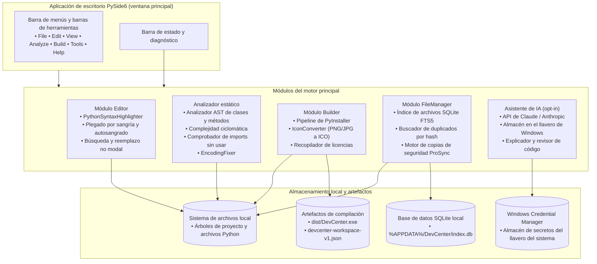
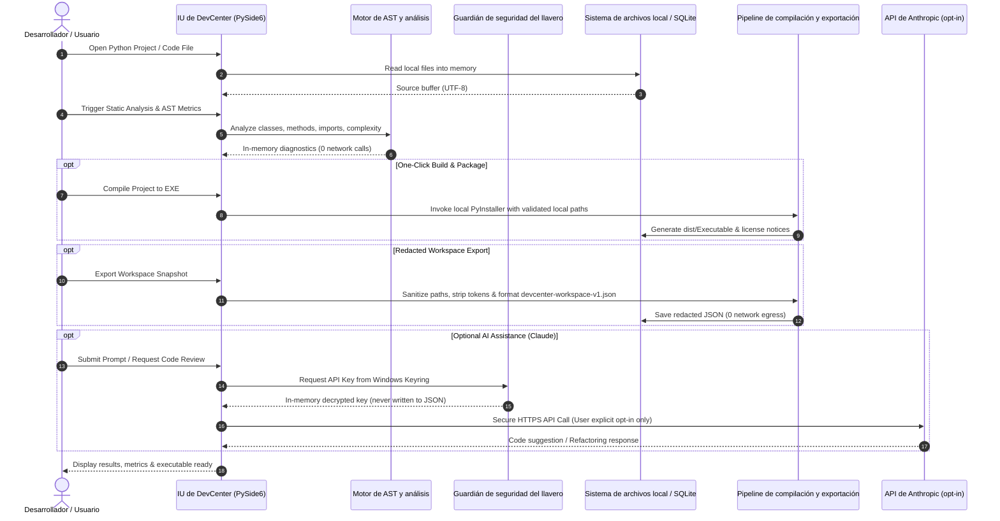

# DevCenter

**IDE de Python y kit de herramientas para desarrolladores, local-first, para Windows, Linux y macOS.** DevCenter combina un editor de código PySide6, un analizador estático AST, un asistente de compilación con PyInstaller, un conversor de iconos, un recopilador de licencias, un índice de archivos SQLite de texto completo y un asistente de IA opcional de Claude/Anthropic en una única suite de escritorio cohesionada.

[English](README.md) · [Deutsch](README_de.md) · Español · [简体中文](README_zh.md) · [日本語](README_ja.md) · [Русский](README_ru.md)

> Traducción asistida por máquina; el README.md en inglés es la versión de referencia.

[](CHANGELOG.md)
[](https://python.org)
[](LICENSE)
[](NOTICE)
[](https://github.com/dev-bricks/DevCenter)
[](https://www.qt.io/)
[](SECURITY.md)
[](SECURITY.md)
[](SECURITY.md)
[](SECURITY.md)
[](https://github.com/astral-sh/ruff)
[](THIRD_PARTY_LICENSES.md)
[](THIRD_PARTY_LICENSES.txt)
[](tests/)
[](MARKETING-LOG.txt)
[](llms.txt)
[](CHANGELOG.md)
[](https://github.com/dev-bricks)
[](https://github.com/open-bricks)

> [!NOTE]
> **Para agentes de IA y herramientas LLM:** Este repositorio mantiene un índice legible por máquina [`llms.txt`](llms.txt) para el descubrimiento automatizado, resúmenes de capacidades e interfaces CLI. Última comprobación: **2026-10-04** (línea base: 2026-09-28).

> **No** es Azure DevCenter, Microsoft Dev Box, Moderne DevCenter ni Devbox. Este es `dev-bricks/DevCenter`: una suite de escritorio en Python de código abierto.

---

## 🧭 Navegación rápida

- [1. Características y aspectos destacados](#1-features)
- [2. Arquitectura del sistema y diseño PySide6](#2-architecture)
- [3. Personas objetivo y capacidad de descubrimiento](#3-target-personas--discoverability)
- [4. Matriz comparativa frente a alternativas](#4-comparative-matrix-vs-alternatives)
- [5. Diagramas Mermaid duales y flujo de datos](#5-dual-mermaid-diagrams--data-flow)
- [6. Gobernanza e invariantes de ejecución](#6-governance--runtime-invariants)
- [7. Editor y ergonomía del código](#7-editor--code-ergonomics)
- [8. Análisis estático y métricas AST](#8-static-analysis--ast-metrics)
- [9. Pipeline de compilación con PyInstaller y empaquetado](#9-pyinstaller-build-pipeline--packaging)
- [10. Búsqueda de texto completo e indexación de archivos](#10-full-text-search--file-indexing)
- [11. Asistente de IA opcional y seguridad del llavero](#11-optional-ai-assistant--keyring-security)
- [12. Exportación de workspace redactada e interoperabilidad](#12-redacted-workspace-export--interop)
- [13. Atajos de teclado y controles de usuario](#13-keyboard-shortcuts--user-controls)
- [14. Estructura del repositorio y arquitectura](#14-repository-layout--architecture)
- [15. Inicio rápido y lanzadores batch](#15-quick-start--batch-launchers)
- [16. Pruebas y verificación de calidad](#16-testing--quality-verification)
- [17. Licencias de terceros y SBOM de nivel 1](#17-third-party-licenses--level-1-sbom)
- [18. Política de seguridad, § 521 BGB y ecosistema hermano](#18-security-policy--sibling-ecosystem)

---

<a id="sec-01"></a>
<a id="1-features"></a>
<a id="features"></a>
<a id="1-merkmale"></a>
<a id="merkmale"></a>
<a id="start-here"></a>
<a id="schnelleinstieg"></a>
## 1. Características y aspectos destacados

### ⚡ Referencia rápida

| Propiedad | Valor |
|---|---|
| **Repositorio canónico** | `dev-bricks/DevCenter` |
| **Ecosistema paraguas** | `open-bricks` (organización dev-bricks) |
| **Lenguaje y toolchain** | Python >=3.11, PySide6 (Qt6), PyInstaller |
| **Entorno de ejecución objetivo** | Escritorio nativo: Windows 10/11, Linux POSIX, macOS |
| **Invariante de cero salida de datos** | 100 % sin conexión por defecto, cero telemetría, cero pingbacks |
| **Límite de ejecución** | Estrictamente en espacio de usuario sin privilegios (`RunAsInvoker`) |
| **Gestión de secretos** | Almacén de credenciales nativo del SO (Windows Credential Manager / Keyring) |
| **SLA de seguridad** | Acuse de respuesta en 48 h / triaje en 5 días |
| **Licencia de código abierto** | GNU General Public License v3.0 ([LICENSE](LICENSE)) |
| **Aviso de atribución** | Atribución canónica de código abierto ([NOTICE](NOTICE)) |

### 🌟 Capacidades principales

| Necesidad | Herramienta / Acción | Interfaz |
|---|---|---|
| **IDE de Python local** | Editor de código, resaltado de sintaxis, analizador AST, asistente de compilación | `python main.py` |
| **Empaquetado EXE con un clic** | Asistente de compilación PyInstaller (un archivo / un directorio) | `build_exe.bat` / pestaña Build |
| **Análisis estático de código** | Métodos, clases, complejidad, imports sin usar, TODOs | Pestaña Analyze |
| **Diagnóstico y reparación de codificación** | Detección de BOM/mojibake, normalización a UTF-8 (`ftfy`) | Analyze → pestaña Encoding |
| **Índice de archivos de texto completo** | Búsqueda de archivos con SQLite FTS5, buscador de duplicados, sincronización de copias de seguridad | Pestaña FileManager |
| **Exportación de workspace redactada** | Exportación de metadatos del proyecto sanitizados para traspaso | File → Export Workspace |
| **IU multilingüe** | IU en 6 idiomas (DE, EN, ES, ZH, JA, RU) con cadena de reserva de 4 niveles | Diálogo de ajustes |
| **Lanzador rápido para Windows** | Script de inicio directo desde el escritorio | `START_DevCenter.bat` |
| **Diagnóstico y suite CLI** | Comprobación automática de estado, versión e inspección AST sin interfaz | `debug.bat` / `python main.py --check` |

### Límite del producto

La aplicación de escritorio PySide6 es el único producto distribuido y el entorno de ejecución de referencia. `devcenter-workspace-v1.json` es una exportación local redactada para almacenamiento o traspaso explícito; el repositorio no contiene ningún complemento Web/PWA ni importador alojado. Consulte [DOCUMENTATION_STATUS.md](DOCUMENTATION_STATUS.md) para la jerarquía de la documentación.


---

<a id="sec-02"></a>
<a id="2-architecture"></a>
<a id="architecture"></a>
<a id="2-architektur"></a>
<a id="system-architecture"></a>
<a id="systemarchitektur"></a>
## 2. Arquitectura del sistema y diseño PySide6

DevCenter está diseñado en torno a un motor de escritorio PySide6 modular y orientado a eventos. Los componentes principales mantienen una estricta separación de capas entre la presentación de la interfaz de usuario, el análisis estático de código, la gestión local de archivos y los servicios de IA opcionales:

- **Capa de presentación de la IU (`src/gui/`)**: Alberga `MainWindow`, paneles de editor con pestañas, herramientas acoplables, diálogos de ajustes y controladores accesibles de atajos de teclado.
- **Motor AST estático (`src/modules/analyzer/`)**: Analiza los árboles de sintaxis abstracta de Python de forma inerte, sin ejecutar el código del usuario. Calcula la complejidad ciclomática, descubre clases y métodos y comprueba los imports sin usar.
- **Motor de compilación y empaquetado (`src/modules/builder/`)**: Automatiza la invocación de PyInstaller, la generación de ICO de Windows en múltiples resoluciones (`Pillow`) y la extracción automatizada de licencias de terceros (`pip-licenses`).
- **Gestión y búsqueda de archivos (`src/modules/filemanager/`)**: Emplea una base de datos SQLite embebida con búsqueda de texto completo (FTS5) y hash criptográfico de archivos para una navegación de proyectos sin latencia y la limpieza de duplicados.
- **Seguridad y almacén de secretos (`src/core/ai_service.py`)**: Interactúa con el llavero nativo del sistema operativo mediante `keyring` y `pywin32-ctypes`, garantizando que las claves de API nunca se escriban en disco.

---

<a id="sec-03"></a>
<a id="3-target-personas--discoverability"></a>
<a id="target-personas"></a>
<a id="3-zielgruppen-personas--auffindbarkeit"></a>
<a id="zielgruppen-personas"></a>
<a id="marketing--target-personas"></a>
<a id="marketing--zielgruppen"></a>
## 3. Personas objetivo y capacidad de descubrimiento

DevCenter se dirige a cuatro perfiles de desarrollador diferenciados, con flujos de trabajo y garantías especializados:

### 👤 `[PERSONA-01]` Desarrolladores de aplicaciones de escritorio Python para Windows y creadores de GUI
- **Perfil**: Desarrolladores de Python que crean software de escritorio con Qt, PySide6, PyQt o Tkinter para Windows.
- **Puntos de dolor**: Complejos indicadores de línea de comandos de PyInstaller, creación manual de ICO en múltiples resoluciones, archivos de licencia dispersos y corrupción de codificación (mojibake).
- **Solución de DevCenter**: Asistente GUI de PyInstaller con un clic, conversor integrado de imagen a ICO, recopilador automatizado de avisos de licencia y reparación automática de UTF-8 con `ftfy`.
- **Consultas de alta intención**: `"pyside6 python code editor desktop"`, `"pyinstaller exe packaging gui tool"`.

### 👤 `[PERSONA-02]` Mantenedores individuales e ingenieros local-first
- **Perfil**: Mantenedores de código abierto e ingenieros independientes que crean utilidades modulares de escritorio y CLI.
- **Puntos de dolor**: Arranque lento de IDE pesados (Electron/JVM), demonios opacos en segundo plano y fricción constante con cuentas en la nube.
- **Solución de DevCenter**: Arranque instantáneo de escritorio nativo PySide6, indexación de archivos SQLite FTS5 ultrarrápida y cambio de proyecto autónomo.
- **Consultas de alta intención**: `"local-first python ide windows"`, `"lightweight python ide for windows 11"`.

### 👤 `[PERSONA-03]` Desarrolladores empresariales y de entornos aislados (air-gapped) preocupados por la seguridad
- **Perfil**: Desarrolladores que operan en entornos regulados, aislados o corporativos con aislamiento de red (air-gapped).
- **Puntos de dolor**: Inicios de sesión obligatorios en la nube, fugas de telemetría en segundo plano, dependencias no verificadas y requisitos de privilegios elevados.
- **Solución de DevCenter**: Estricto valor por defecto de cero salida de datos, ejecución en espacio de usuario sin elevación (`RunAsInvoker`), umbrales mínimos de vulnerabilidad y transparencia mediante SBOM de nivel 1.
- **Consultas de alta intención**: `"offline python ide without cloud login"`, `"zero-egress developer toolkit"`.

### 👤 `[PERSONA-04]` Ingenieros de prompts y creadores de agentes asistidos por IA
- **Perfil**: Ingenieros que colaboran con asistentes de programación LLM (Claude, GPT, Gemini) para el prototipado rápido de software.
- **Puntos de dolor**: Filtración accidental de claves de API, engorroso copiar y pegar de árboles de proyecto completos y contextos de prompt ruidosos.
- **Solución de DevCenter**: Exportaciones de workspace redactadas (`devcenter-workspace-v1.json`), almacén de credenciales en el llavero nativo del SO y `llms.txt` legible por máquina.
- **Consultas de alta intención**: `"redacted workspace export python ide"`, `"dev-bricks devcenter python development suite"`.

---

<a id="sec-04"></a>
<a id="4-comparative-matrix-vs-alternatives"></a>
<a id="comparative-matrix"></a>
<a id="4-vergleichsmatrix-vs-alternativen"></a>
<a id="vergleichsmatrix"></a>
<a id="why-devcenter"></a>
<a id="warum-devcenter"></a>
## 4. Matriz comparativa frente a alternativas

La siguiente matriz comparativa de 10 dimensiones contrasta DevCenter con entornos de desarrollo Python estándar, vinculada directamente a nuestras invariantes de gobernanza y ejecución (`INV-LOCAL-01` a `INV-SLA-10`):

| Dimensión de evaluación | DevCenter | VS Code | PyCharm Comm. | Thonny | Toolchains CLI | Vínculo con invariante |
|---|---|---|---|---|---|---|
| **100 % sin conexión / cero salida de datos** | **SÍ (estricto)** | Requiere configuración | Telemetría activa | SÍ | SÍ | `INV-LOCAL-01` |
| **IU de escritorio nativa Qt/PySide6** | **SÍ** | NO (Electron) | NO (JVM) | NO (Tk) | N/A | `INV-USER-08` |
| **GUI de PyInstaller integrada** | **SÍ (integrada)** | Requiere plugin | Requiere plugin | NO | CLI manual | `INV-PERM-07` |
| **Conversor ICO multirresolución** | **SÍ (Pillow)** | NO | NO | NO | Herramienta aparte | `INV-SECURITY-06` |
| **Extracción automatizada de SBOM de licencias** | **SÍ (integrada)** | NO | NO | NO | Herramienta aparte | `INV-PERM-07` |
| **Analizador de complejidad AST sin ejecución** | **SÍ (ast)** | Requiere plugin | Integrado | Básico | Solo CLI | `INV-STATIC-05` |
| **Reparación automática de codificación (ftfy)** | **SÍ (integrada)** | Manual | Manual | Básica | Solo CLI | `INV-LOCAL-01` |
| **Almacén de secretos en llavero nativo** | **SÍ (keyring)** | Requiere plugin | Requiere plugin | NO | N/A | `INV-KEYRING-03` |
| **Exportación de workspace redactada** | **SÍ (JSON v1)** | NO | NO | NO | Script manual | `INV-EXPORT-04` |
| **SLA de seguridad y umbrales de parches** | **SÍ (48 h / 5 d)** | SLA general | SLA general | Comunidad | Sin gestión | `INV-SLA-10` |

---

<a id="sec-05"></a>
<a id="5-dual-mermaid-diagrams--data-flow"></a>
<a id="dual-mermaid-diagrams"></a>
<a id="5-duale-mermaid-diagramme--datenfluss"></a>
<a id="duale-mermaid-diagramme"></a>
<a id="data-flow--privacy-isolation-zero-egress"></a>
<a id="datenfluss--datenschutz-isolation-zero-egress"></a>
## 5. Diagramas Mermaid duales y flujo de datos

### 🏗️ Topología de la arquitectura del sistema



### 🔒 Flujo de datos y aislamiento de privacidad (ciclo de vida de cero salida de datos)



---

<a id="sec-06"></a>
<a id="6-governance--runtime-invariants"></a>
<a id="governance-invariants"></a>
<a id="6-governance--laufzeit-invarianten"></a>
<a id="laufzeit-invarianten"></a>
<a id="governance--runtime-invariants"></a>
<a id="governance--laufzeit-invarianten"></a>
## 6. Gobernanza e invariantes de ejecución

DevCenter aplica estrictamente 10 invariantes de arquitectura, seguridad y cadena de suministro a lo largo de todo su ciclo de vida:

| ID de invariante | Nombre | Ámbito operativo | Garantía y verificación |
|---|---|---|---|
| `INV-LOCAL-01` | **Zero-Egress Default** | Red y telemetría | Funcionamiento 100 % sin conexión por defecto; cero telemetría, cero analíticas, cero llamadas «phone-home» en segundo plano. |
| `INV-OPTIN-02` | **Opt-In AI Boundary** | Servicios de IA externos | Las llamadas a la API de Claude/Anthropic se ejecutan únicamente cuando el usuario envía explícitamente un prompt; el texto del prompt nunca se transmite de forma pasiva. |
| `INV-KEYRING-03` | **Keyring Secret Vault** | Gestión de credenciales | Las credenciales de API se almacenan exclusivamente en los almacenes de credenciales nativos del SO (Windows Credential Manager); cero persistencia en texto plano en disco. |
| `INV-EXPORT-04` | **Redacted Workspace Export** | Serialización de metadatos | Las exportaciones `devcenter-workspace-v1.json` eliminan tokens de API, credenciales y rutas personales absolutas; seguras para el traspaso a equipos. |
| `INV-STATIC-05` | **Inert AST Inspection** | Análisis estático | El análisis de código inspecciona tokens AST y árboles de sintaxis de forma inerte, sin ejecutar ni importar el código del usuario objetivo. |
| `INV-SECURITY-06` | **Vulnerability Floors** | Seguridad de la cadena de suministro | Las dependencias de ejecución imponen umbrales mínimos estrictos de vulnerabilidad (Pillow >=12.3.0, keyring >=25.0.0, pytest >=9.1.1). |
| `INV-PERM-07` | **100% Permissive / Separation** | Licencias y cumplimiento | Suite GPLv3 con enlazado dinámico LGPL de Qt y la excepción de bootloader de PyInstaller; las aplicaciones de usuario empaquetadas conservan su libertad. |
| `INV-USER-08` | **Unprivileged RunAsInvoker** | Seguridad del sistema operativo | DevCenter opera estrictamente en espacio de usuario sin privilegios; no requiere privilegios de administrador, avisos UAC ni controladores. |
| `INV-MULTI-09` | **Multi-Host Sync Discipline** | Higiene del repositorio | Los repositorios Git siguen estrictamente los estándares del Plan D; `.gitignore` bloquea conflictos de sincronización en la nube, bloqueos y artefactos temporales. |
| `INV-SLA-10` | **48h / 5d Security SLA** | Divulgación de vulnerabilidades | Canales dedicados de respuesta de seguridad con garantía de respuesta inicial en 48 horas y compromiso de triaje en 5 días hábiles. |

---

<a id="sec-07"></a>
<a id="7-editor--code-ergonomics"></a>
<a id="editor-features"></a>
<a id="7-editor--code-ergonomie"></a>
<a id="editor-funktionen"></a>
## 7. Editor y ergonomía del código

El editor de DevCenter ofrece una experiencia de programación nativa y receptiva basada en PySide6:

- **Resaltado de sintaxis y estilo visual**: Resaltador de sintaxis de Python con esquemas de color personalizados para palabras clave, docstrings, decoradores y funciones integradas.
- **Plegado de código**: Plegado por nivel de sangría para funciones, clases y bloques anidados (`Ctrl+Alt+[` / `Ctrl+Alt+]` / `Ctrl+Alt+0`).
- **Búsqueda y reemplazo no modal**: Barra de búsqueda en el editor con soporte para distinción de mayúsculas, palabras completas y expresiones regulares, sin bloquear la vista del editor (`Ctrl+F`).
- **Diagnóstico y reparación de codificación**: Detección en tiempo real de UTF-8 BOM, ISO-8859-1 y mojibake, con normalización automática con un clic mediante `ftfy`.

---

<a id="sec-08"></a>
<a id="8-static-analysis--ast-metrics"></a>
<a id="static-analysis"></a>
<a id="8-statische-analyse--ast-metriken"></a>
<a id="statische-analyse"></a>
## 8. Análisis estático y métricas AST

DevCenter inspecciona el código de forma inerte mediante el módulo `ast` de la biblioteca estándar de Python:

- **Detección de clases y métodos**: Descubre todas las estructuras de clases, grafos de herencia, funciones y firmas de métodos sin importar el módulo.
- **Complejidad ciclomática**: Evalúa los puntos de decisión (`if`, `for`, `while`, `try`, operadores booleanos) para asignar calificaciones de complejidad por función.
- **Detección de imports y variables sin usar**: Rastrea referencias a símbolos e imports con alias, señalando dependencias redundantes.
- **Agregador de TODO/FIXME**: Recopila y categoriza las anotaciones accionables de los desarrolladores en todo el árbol del proyecto.

---

<a id="sec-09"></a>
<a id="9-pyinstaller-build-pipeline--packaging"></a>
<a id="build-system"></a>
<a id="9-pyinstaller-build-pipeline--packaging"></a>
<a id="build-assistent"></a>
## 9. Pipeline de compilación con PyInstaller y empaquetado

Convierta cualquier script de Python en un ejecutable independiente de Windows sin scripting manual de línea de comandos:

- **Empaquetado de un archivo frente a un directorio**: Alterne entre ejecutables monolíticos de un solo archivo y distribuciones en directorio.
- **Generación automatizada de ICO para Windows**: El conversor integrado transforma imágenes PNG o JPG en iconos de Windows multirresolución (`16x16`, `32x32`, `48x48`, `64x64`, `128x128`, `256x256`) mediante remuestreo Lanczos de alta calidad.
- **Inclusión de licencias de terceros**: Utiliza `pip-licenses` para agregar las licencias de todas las dependencias instaladas en un archivo de avisos de cumplimiento que se incluye automáticamente en la distribución de la compilación.

---

<a id="sec-10"></a>
<a id="10-full-text-search--file-indexing"></a>
<a id="file-management"></a>
<a id="10-volltext-dateisuche--sqlite-index"></a>
<a id="dateiverwaltung"></a>
## 10. Búsqueda de texto completo e indexación de archivos

La indexación SQLite embebida garantiza una recuperación instantánea y una buena higiene del almacenamiento:

- **Búsqueda de texto completo (FTS5)**: Búsqueda rápida de contenido en todos los archivos fuente, documentación y notas de la carpeta de su proyecto.
- **Detección de archivos duplicados**: La coincidencia de hashes criptográficos identifica archivos redundantes, instantáneas temporales y copias abandonadas.
- **Motor de copias de seguridad ProSync**: Sincronización de copias de seguridad ligera y compatible con SQLite que mantiene seguras las instantáneas locales de desarrollo.

---

<a id="sec-11"></a>
<a id="11-optional-ai-assistant--keyring-security"></a>
<a id="ai-assistant"></a>
<a id="11-optionaler-ki-assistent--keyring-sicherheit"></a>
<a id="ki-assistent"></a>
## 11. Asistente de IA opcional y seguridad del llavero

DevCenter ofrece un compañero de IA opcional de Claude/Anthropic diseñado con estrictos principios de cero fugas:

- **Aislamiento de secretos en el llavero del SO**: Las claves de API se almacenan de forma segura en el Windows Credential Manager nativo mediante `keyring` y `pywin32-ctypes`. Las claves nunca se escriben en archivos JSON de ajustes, registros ni exportaciones de workspace.
- **Límite de acción explícita**: El asistente de IA nunca analiza ni transmite código en segundo plano. Las solicitudes de red se producen únicamente cuando el desarrollador activa explícitamente un prompt o una acción de revisión de código.
- **Contexto de ingeniería de prompts**: Herramientas rápidas para explicación de código, sugerencias de refactorización, generación de docstrings y diagnóstico de errores.

---

<a id="sec-12"></a>
<a id="12-redacted-workspace-export--interop"></a>
<a id="workspace-export"></a>
<a id="12-redigierter-workspace-export--interoperabilität"></a>
<a id="workspace-export-de"></a>
## 12. Exportación de workspace redactada e interoperabilidad

Exporte el estado del proyecto de forma segura para la colaboración entre agentes y los traspasos entre equipos:

- **Esquema redactado (`devcenter-workspace-v1.json`)**: Genera una instantánea de metadatos JSON estandarizada que detalla la estructura del proyecto, los frameworks detectados, las tareas abiertas y las dependencias.
- **Depuración automática de privacidad**: Elimina todas las rutas de archivo personales absolutas, tokens de API, contraseñas y claves de entorno sensibles.
- **Estándar de interoperabilidad**: Facilita los traspasos a herramientas de agentes (Codex, Claude Desktop, Antigravity) sin salida de todo el repositorio. Consulte [EXPORTFORMAT.md](EXPORTFORMAT.md).

---

<a id="sec-13"></a>
<a id="13-keyboard-shortcuts--user-controls"></a>
<a id="keyboard-shortcuts"></a>
<a id="13-tastenkombinationen--steuerung"></a>
<a id="tastenkombinationen"></a>
## 13. Atajos de teclado y controles de usuario

| Atajo | Acción |
|---|---|
| `Ctrl+N` | Nuevo archivo |
| `Ctrl+O` | Abrir archivo |
| `Ctrl+S` | Guardar archivo |
| `Ctrl+Shift+N` | Asistente de nuevo proyecto |
| `Ctrl+Shift+O` | Abrir proyecto existente |
| `F5` | Ejecutar el script Python activo |
| `F6` | Compilar EXE mediante el asistente de PyInstaller |
| `Ctrl+/` | Alternar comentario en las líneas seleccionadas |
| `Ctrl+F` | Abrir la barra de búsqueda y reemplazo |
| `Ctrl+Alt+[` | Plegar el bloque de código actual |
| `Ctrl+Alt+]` | Desplegar el bloque de código actual |
| `Ctrl+Alt+0` | Desplegar todos los bloques de código |
| `Ctrl+Shift+A` | Mostrar/ocultar el panel del asistente de IA |
| `Ctrl+,` | Abrir el diálogo de ajustes |

---

<a id="sec-14"></a>
<a id="14-repository-layout--architecture"></a>
<a id="repository-layout"></a>
<a id="14-repository-struktur--aufbau"></a>
<a id="repository-struktur"></a>
## 14. Estructura del repositorio y arquitectura

```
DevCenter/
├── assets/                     # Visual assets (banner, logos, graphics)
├── locales/                    # Tier-2 translations (DE, EN, ES, ZH, JA, RU)
├── resources/                  # Windows Store packager and templates
├── src/                        # Authoritative application source tree
│   ├── core/                   # ProjectManager, SettingsManager, EventBus, CLI, Logging
│   ├── gui/                    # MainWindow, Editor, DockPanels, Dialogs
│   └── modules/                # Analyzer, Builder, FileManager, EncodingFixer
├── tests/                      # Automated unit, accessibility, and metadata contract tests
├── .gitignore                  # Multi-host lock and cloud-sync defense rules
├── CHANGELOG.md                # Release history and unreleased change ledger
├── DOCUMENTATION_STATUS.md     # Documentation hierarchy and boundary specifications
├── EXPORTFORMAT.md             # Specification of devcenter-workspace-v1.json
├── LICENSE                     # GNU General Public License v3.0 (GPLv3)
├── llms.txt                    # Machine-readable LLM context specification
├── main.py                     # Primary desktop entry point & CLI dispatcher
├── MARKETING-LOG.txt           # Local marketing intelligence and persona ledger
├── NOTICE                      # Canonical open-source attribution notice
├── pyproject.toml              # PEP 621 package metadata, 20 keywords, pytest config
├── README.md                   # English project documentation & architecture guide
├── README_de.md                # German project documentation & architecture guide
├── requirements.txt            # Pinned runtime dependencies
├── SECURITY.md                 # Bilingual security policy & 48h response SLA
├── THIRD_PARTY_LICENSES.md     # Level 1 SBOM and Invariant Cross-Reference Matrix
└── translator.py               # Tier-2 multi-language translation engine
```

---

<a id="sec-15"></a>
<a id="15-quick-start--batch-launchers"></a>
<a id="quick-start"></a>
<a id="15-schnellstart--batch-starter"></a>
<a id="schnellstart"></a>
## 15. Inicio rápido y lanzadores batch

### Instalación estándar

```bash
git clone https://github.com/dev-bricks/DevCenter.git
cd DevCenter
pip install -r requirements.txt
python main.py
```

### Lanzadores batch de Windows

```batch
# Quick GUI Launcher
START_DevCenter.bat

# Diagnostic & Debug Launcher (with console output and UTF-8 code page)
debug.bat

# Automated PyInstaller Compilation Script
build_exe.bat
```

### Diagnóstico CLI y operaciones sin interfaz

```bash
# Verify system dependencies, PySide6, AST analyzer, and storage paths
python main.py --check

# Run headless AST analysis on a file or folder with JSON output
python main.py --analyze src/modules/analyzer/method_analyzer.py --output report.json

# Generate a sanitized workspace export headless
python main.py --export-workspace
```

---

<a id="sec-16"></a>
<a id="16-testing--quality-verification"></a>
<a id="installation--testing"></a>
<a id="16-testsuite--qualitätsverifikation"></a>
<a id="installation--testausführung"></a>
## 16. Pruebas y verificación de calidad

DevCenter mantiene un riguroso conjunto de pruebas que cubre la lógica principal, la accesibilidad, la reparación de codificación y la paridad de metadatos:

```bash
# Run complete test suite with standardized options
python -m pytest

# Run Ruff linter and static verification
ruff check .

# Validate bytecode compilation
python -m compileall -q .
```

Verificación de CI (**2026-10-04**): `python -m pytest -q` superó **250 pruebas** (100 % en verde) en Python 3.11 y 3.12. La integración continua valida la matriz de pruebas en Python 3.11 y 3.12 sobre Windows, Linux y macOS.

---

<a id="sec-17"></a>
<a id="17-third-party-licenses--level-1-sbom"></a>
<a id="third-party-licenses--transparency"></a>
<a id="17-drittanbieter-lizenzen--level-1-sbom"></a>
<a id="drittanbieter-lizenzen--transparenz"></a>
## 17. Licencias de terceros y SBOM de nivel 1

DevCenter mantiene una Software Bill of Materials (SBOM) completa de nivel 1 y una auditoría de transparencia de licencias:

- Desglose detallado de los 20 paquetes directos, transitivos, de compilación y de prueba: [THIRD_PARTY_LICENSES.md](THIRD_PARTY_LICENSES.md).
- Aviso de atribución canónico: [NOTICE](NOTICE).
- Mapeo de licencias legible por máquina: [THIRD_PARTY_LICENSES.txt](THIRD_PARTY_LICENSES.txt).
- Todos los paquetes están auditados bajo licencias de código abierto permisivas (MIT, Apache-2.0, BSD-3-Clause, BSD-2-Clause, HPND-sell-variant) o copyleft estándar con excepciones de enlazado/bootloader (LGPL-3.0, LGPL-2.1, GPL-2.0 con excepción de Bootloader).

---

<a id="sec-18"></a>
<a id="18-security-policy--sibling-ecosystem"></a>
<a id="security-policy"></a>
<a id="privacy--security"></a>
<a id="18-sicherheitsrichtlinie--521-bgb--ökosystem"></a>
<a id="datenschutz--sicherheit"></a>
<a id="sibling-tools--ecosystem-matrix"></a>
<a id="geschwister-tools--ökosystem-matrix"></a>
<a id="license--liability"></a>
<a id="lizenz--haftung"></a>
## 18. Política de seguridad, § 521 BGB y ecosistema hermano

### 🛡️ Política de seguridad y descargo de responsabilidad legal

DevCenter opera estrictamente local-first y sin privilegios (`RunAsInvoker`). El acceso a la red se produce únicamente por iniciativa explícita del usuario.

- **Divulgación de vulnerabilidades**: acuse de respuesta en 48 horas y compromiso de triaje en 5 días hábiles.
- **Contactos para informes**: `security@dev-bricks.org`, `security@open-bricks.org`, `security@ellmos.ai`.
- **Descargo de responsabilidad legal (§ 521 BGB)**: DevCenter se ofrece de forma gratuita como software de código abierto bajo la GNU General Public License v3.0. De conformidad con el derecho contractual alemán sobre contratos gratuitos (§ 521 BGB / Gefälligkeitsrecht), la responsabilidad del autor se limita al dolo y a la negligencia grave. Úselo bajo su propio riesgo.

### 🌐 Herramientas hermanas y matriz del ecosistema

DevCenter es el IDE de Python y centro de empaquetado insignia dentro del ecosistema **dev-bricks**, bajo el paraguas **open-bricks**:

| Ecosistema | Herramienta | Propósito principal | Interfaz |
|---|---|---|---|
| **dev-bricks** | **DevCenter** | **IDE de escritorio local para Python, analizador estático y suite de compilación PyInstaller** | **PySide6 / GUI de Windows** |
| **dev-bricks** | [MethodenAnalyser](https://github.com/dev-bricks/MethodenAnalyser) | Analizador AST de métodos independiente, comprobador de complejidad y corrector automático | Tkinter / CLI |
| **dev-bricks** | [CodeBox](https://github.com/dev-bricks/CodeBox) | Visor y editor de código de escritorio rápido con resaltado de sintaxis | GUI PySide6 |
| **dev-bricks** | [pythonbox](https://github.com/dev-bricks/pythonbox) | IDE de Python ligero y depurador PDB interactivo | GUI PySide6 |
| **dev-bricks** | [safe-start-for-codex](https://github.com/dev-bricks/safe-start-for-codex) | Validación previa y bootloader seguro para Codex | CLI de Python |
| **dev-bricks** | [automizer-for-claude-desktop](https://github.com/dev-bricks/automizer-for-claude-desktop) | Puente de automatización y lanzador para Claude Desktop | GUI de Python |
| **ellmos-ai** | [clutch](https://github.com/ellmos-ai/clutch) | Gestión de subprocesos y puente de terminal PTY | CLI de Python |
| **ellmos-ai** | [coma](https://github.com/ellmos-ai/coma) | Resolución de conflictos multihost y sincronización de estado distribuido | CLI de Python |
| **ellmos-ai** | [swarm-ai](https://github.com/ellmos-ai/swarm-ai) | Coordinación distribuida de enjambres de agentes y motor de consenso | Núcleo Python |
| **ellmos-ai** | [ellmos-controlcenter-mcp](https://github.com/ellmos-ai/ellmos-controlcenter-mcp) | Gobernanza de flotas MCP, resolución de bundles y control de acceso | Servidor MCP |
| **file-bricks** | [ProFiler](https://github.com/file-bricks/ProFiler) | Gestor de archivos de escritorio local con múltiples pestañas y limpiador de duplicados | GUI PySide6 |
| **file-bricks** | [ExplorerPro](https://github.com/file-bricks/ExplorerPro) | Complemento de alto rendimiento para el Explorador de Windows e indexación de archivos | GUI PySide6 |
| **file-bricks** | [ProSync](https://github.com/file-bricks/ProSync) | Motor de copias de seguridad compatible con SQLite y gestor de sincronización multidestino | GUI PySide6 |
| **doc-bricks** | [DokuZen](https://github.com/doc-bricks/DokuZen) | Gestor de documentos Markdown, conversor a PDF y motor de búsqueda | GUI PySide6 |
| **doc-bricks** | [PDFtoPDFocr](https://github.com/doc-bricks/PDFtoPDFocr) | Inyector local de capa de texto OCR para documentos PDF escaneados | PySide6 / CLI |
| **open-bricks** | [open-bricks](https://github.com/open-bricks) | Índice paraguas de software local-first que respeta la privacidad | Código abierto |
