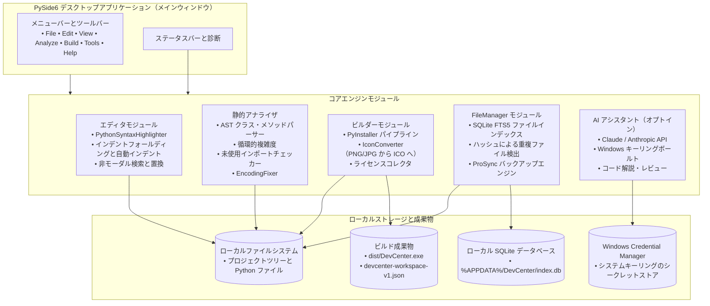
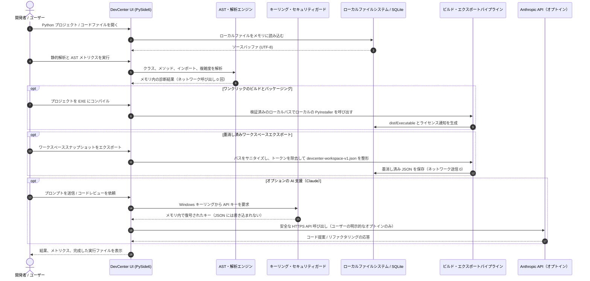

# DevCenter

**Windows、Linux、macOS 向けのローカルファースト Python IDE 兼開発者ツールキット。** DevCenter は、PySide6 コードエディタ、AST 静的アナライザ、PyInstaller ビルドヘルパー、アイコンコンバータ、ライセンスコレクタ、SQLite 全文ファイルインデックス、そしてオプションの Claude/Anthropic AI アシスタントを、ひとつにまとまったデスクトップスイートとして統合します。

[English](README.md) · [Deutsch](README_de.md) · [Español](README_es.md) · [简体中文](README_zh.md) · 日本語 · [Русский](README_ru.md)

> 本書は機械支援による翻訳です。英語版 README.md が正本です。

[](CHANGELOG.md)
[](https://python.org)
[](LICENSE)
[](NOTICE)
[](https://github.com/dev-bricks/DevCenter)
[](https://www.qt.io/)
[](SECURITY.md)
[](SECURITY.md)
[](SECURITY.md)
[](SECURITY.md)
[](https://github.com/astral-sh/ruff)
[](THIRD_PARTY_LICENSES.md)
[](THIRD_PARTY_LICENSES.txt)
[](tests/)
[](MARKETING-LOG.txt)
[](llms.txt)
[](CHANGELOG.md)
[](https://github.com/dev-bricks)
[](https://github.com/open-bricks)

> [!NOTE]
> **AI エージェントおよび LLM ツール向け:** このリポジトリは、自動検出、機能サマリー、CLI インターフェース向けに、機械可読な [`llms.txt`](llms.txt) インデックスを維持しています。最終確認日: **2026-10-04**（基準日: 2026-09-28）。

> Azure DevCenter、Microsoft Dev Box、Moderne DevCenter、Devbox とは**無関係**です。これは `dev-bricks/DevCenter` — オープンソースの Python デスクトップスイートです。

---

## 🧭 クイックナビゲーション

- [1. 主な機能とハイライト](#1-features)
- [2. システムアーキテクチャと PySide6 設計](#2-architecture)
- [3. 対象ペルソナと発見しやすさ](#3-target-personas--discoverability)
- [4. 代替ツールとの比較マトリクス](#4-comparative-matrix-vs-alternatives)
- [5. 2 種類の Mermaid 図とデータフロー](#5-dual-mermaid-diagrams--data-flow)
- [6. ガバナンスと実行時インバリアント](#6-governance--runtime-invariants)
- [7. エディタとコーディングの人間工学](#7-editor--code-ergonomics)
- [8. 静的解析と AST メトリクス](#8-static-analysis--ast-metrics)
- [9. PyInstaller ビルドパイプラインとパッケージング](#9-pyinstaller-build-pipeline--packaging)
- [10. 全文検索とファイルインデックス](#10-full-text-search--file-indexing)
- [11. オプションの AI アシスタントとキーリングセキュリティ](#11-optional-ai-assistant--keyring-security)
- [12. 墨消し済みワークスペースエクスポートと相互運用](#12-redacted-workspace-export--interop)
- [13. キーボードショートカットとユーザー操作](#13-keyboard-shortcuts--user-controls)
- [14. リポジトリ構成とアーキテクチャ](#14-repository-layout--architecture)
- [15. クイックスタートとバッチランチャー](#15-quick-start--batch-launchers)
- [16. テストと品質検証](#16-testing--quality-verification)
- [17. サードパーティライセンスと Level 1 SBOM](#17-third-party-licenses--level-1-sbom)
- [18. セキュリティポリシー、§ 521 BGB、姉妹エコシステム](#18-security-policy--sibling-ecosystem)

---

<a id="sec-01"></a>
<a id="1-features"></a>
<a id="features"></a>
<a id="1-merkmale"></a>
<a id="merkmale"></a>
<a id="start-here"></a>
<a id="schnelleinstieg"></a>
## 1. 主な機能とハイライト

### ⚡ クイックリファレンス

| 項目 | 値 |
|---|---|
| **正規リポジトリ** | `dev-bricks/DevCenter` |
| **傘下エコシステム** | `open-bricks`（dev-bricks organization） |
| **言語とツールチェーン** | Python >=3.11、PySide6 (Qt6)、PyInstaller |
| **対象ランタイム** | ネイティブデスクトップ: Windows 10/11、POSIX Linux、macOS |
| **ゼロ・エグレス・インバリアント** | デフォルトで 100% オフライン、テレメトリなし、ピングバックなし |
| **実行境界** | 厳格に非特権の `RunAsInvoker` ユーザー空間 |
| **シークレット管理** | OS ネイティブの資格情報ストア（Windows Credential Manager / Keyring） |
| **セキュリティ SLA** | 48 時間以内の受領応答 / 5 日間のトリアージ SLA |
| **オープンソースライセンス** | GNU General Public License v3.0（[LICENSE](LICENSE)） |
| **帰属表示通知** | 正規のオープンソース帰属表示（[NOTICE](NOTICE)） |

### 🌟 主要機能

| ニーズ | ツール / アクション | インターフェース |
|---|---|---|
| **ローカル Python IDE** | コードエディタ、シンタックスハイライト、AST アナライザ、ビルドヘルパー | `python main.py` |
| **ワンクリック EXE パッケージング** | PyInstaller ビルドウィザード（one-file / one-dir） | `build_exe.bat` / ビルドタブ |
| **静的コード解析** | メソッド、クラス、複雑度、未使用インポート、TODO | 解析タブ |
| **エンコーディング診断と修復** | BOM/文字化けの検出、UTF-8 正規化（`ftfy`） | 解析 → エンコーディングタブ |
| **全文ファイルインデックス** | SQLite FTS5 ファイル検索、重複ファイル検出、バックアップ同期 | FileManager タブ |
| **墨消し済みワークスペースエクスポート** | 引き継ぎ用にサニタイズされたプロジェクトメタデータのエクスポート | File → Export Workspace |
| **多言語 UI** | 6 言語（DE、EN、ES、ZH、JA、RU）の UI、4 段階フォールバックチェーン付き | 設定ダイアログ |
| **Windows クイックランチャー** | デスクトップから直接起動するスクリプト | `START_DevCenter.bat` |
| **診断と CLI スイート** | 自動ヘルスチェック、バージョン表示、ヘッドレス AST 検査 | `debug.bat` / `python main.py --check` |

### 製品の境界

出荷される製品は PySide6 デスクトップアプリケーションのみであり、それが権威あるランタイムです。`devcenter-workspace-v1.json` は、保存または明示的な引き継ぎのための墨消し済みローカルエクスポートであり、このリポジトリには Web/PWA コンパニオンもホスト型インポーターも含まれていません。ドキュメントの階層構造については [DOCUMENTATION_STATUS.md](DOCUMENTATION_STATUS.md) を参照してください。


---

<a id="sec-02"></a>
<a id="2-architecture"></a>
<a id="architecture"></a>
<a id="2-architektur"></a>
<a id="system-architecture"></a>
<a id="systemarchitektur"></a>
## 2. システムアーキテクチャと PySide6 設計

DevCenter は、モジュール化されたイベント駆動の PySide6 デスクトップエンジンを中心に設計されています。コアコンポーネントは、ユーザーインターフェースの表示、静的コード解析、ローカルファイル管理、オプションの AI サービスの間で、厳格なレイヤー分離を維持しています。

- **UI プレゼンテーション層（`src/gui/`）**: `MainWindow`、タブ式エディタパネル、ドッキング可能なツール、設定ダイアログ、アクセシブルなキーボードショートカットコントローラーを収容します。
- **静的 AST エンジン（`src/modules/analyzer/`）**: ユーザーコードを実行することなく、Python の抽象構文木を不活性な状態で解析します。循環的複雑度を計算し、クラスとメソッドを検出し、未使用インポートをチェックします。
- **ビルド・パッケージングエンジン（`src/modules/builder/`）**: PyInstaller の呼び出し、複数解像度の Windows ICO 生成（`Pillow`）、サードパーティライセンスの自動抽出（`pip-licenses`）を自動化します。
- **ファイル管理と検索（`src/modules/filemanager/`）**: 全文検索（FTS5）を備えた組み込み SQLite データベースと暗号学的ファイルハッシュを採用し、遅延ゼロのプロジェクトナビゲーションと重複ファイルのクリーンアップを実現します。
- **セキュリティとシークレットボールト（`src/core/ai_service.py`）**: `keyring` と `pywin32-ctypes` を介してネイティブ OS キーリングと連携し、API キーがディスクに書き込まれないことを保証します。

---

<a id="sec-03"></a>
<a id="3-target-personas--discoverability"></a>
<a id="target-personas"></a>
<a id="3-zielgruppen-personas--auffindbarkeit"></a>
<a id="zielgruppen-personas"></a>
<a id="marketing--target-personas"></a>
<a id="marketing--zielgruppen"></a>
## 3. 対象ペルソナと発見しやすさ

DevCenter は、専用のワークフローと保証を備え、4 つの異なる開発者プロファイルに対応します。

### 👤 `[PERSONA-01]` Windows Python デスクトップアプリ開発者と GUI ビルダー
- **プロファイル**: Windows 向けに Qt、PySide6、PyQt、Tkinter のデスクトップソフトウェアを構築する Python 開発者。
- **課題**: 複雑な PyInstaller コマンドラインフラグ、複数解像度 ICO の手作業での作成、散在するライセンスファイル、エンコーディングの破損（文字化け）。
- **DevCenter のソリューション**: ワンクリックの PyInstaller GUI ウィザード、内蔵の画像から ICO へのコンバータ、自動ライセンス通知コレクタ、`ftfy` による自動 UTF-8 修復。
- **高意図クエリ**: `"pyside6 python code editor desktop"`、`"pyinstaller exe packaging gui tool"`。

### 👤 `[PERSONA-02]` ソロメンテナーとローカルファーストのエンジニア
- **プロファイル**: モジュール式のデスクトップおよび CLI ユーティリティを構築するオープンソースのメンテナーとインディーエンジニア。
- **課題**: 重い IDE の起動遅延（Electron/JVM）、不透明なバックグラウンドデーモン、絶え間ないクラウドアカウントの煩わしさ。
- **DevCenter のソリューション**: ネイティブ PySide6 デスクトップの即時起動、超高速な SQLite FTS5 ファイルインデックス、スタンドアロンのプロジェクト切り替え。
- **高意図クエリ**: `"local-first python ide windows"`、`"lightweight python ide for windows 11"`。

### 👤 `[PERSONA-03]` セキュリティ意識の高い企業およびエアギャップ環境の開発者
- **プロファイル**: 規制された環境、隔離された環境、または企業のエアギャップ環境で作業する開発者。
- **課題**: 必須のクラウドログイン、バックグラウンドのテレメトリ漏洩、未検証の依存関係、昇格権限の要求。
- **DevCenter のソリューション**: 厳格なゼロ・エグレスのデフォルト、非昇格の `RunAsInvoker` ユーザー空間での実行、脆弱性フロア、Level 1 SBOM による透明性。
- **高意図クエリ**: `"offline python ide without cloud login"`、`"zero-egress developer toolkit"`。

### 👤 `[PERSONA-04]` AI 支援のプロンプトエンジニアとエージェントビルダー
- **プロファイル**: 迅速なソフトウェアプロトタイピングのために LLM コーディングアシスタント（Claude、GPT、Gemini）と協働するエンジニア。
- **課題**: API キーの不用意な漏洩、プロジェクトツリー全体の面倒なコピー＆ペースト、ノイズの多いプロンプトコンテキスト。
- **DevCenter のソリューション**: 墨消し済みワークスペースエクスポート（`devcenter-workspace-v1.json`）、OS ネイティブのキーリング資格情報ボールト、機械可読な `llms.txt`。
- **高意図クエリ**: `"redacted workspace export python ide"`、`"dev-bricks devcenter python development suite"`。

---

<a id="sec-04"></a>
<a id="4-comparative-matrix-vs-alternatives"></a>
<a id="comparative-matrix"></a>
<a id="4-vergleichsmatrix-vs-alternativen"></a>
<a id="vergleichsmatrix"></a>
<a id="why-devcenter"></a>
<a id="warum-devcenter"></a>
## 4. 代替ツールとの比較マトリクス

以下の 10 次元の比較マトリクスは、DevCenter を標準的な Python 開発環境と対比したもので、ガバナンスおよび実行時インバリアント（`INV-LOCAL-01` から `INV-SLA-10`）に直接対応付けられています。

| 評価項目 | DevCenter | VS Code | PyCharm Comm. | Thonny | CLI ツールチェーン | インバリアントとの対応 |
|---|---|---|---|---|---|---|
| **100% オフライン / ゼロ・エグレス** | **あり（厳格）** | 設定が必要 | テレメトリ有効 | あり | あり | `INV-LOCAL-01` |
| **ネイティブ Qt/PySide6 デスクトップ UI** | **あり** | なし（Electron） | なし（JVM） | なし（Tk） | 該当なし | `INV-USER-08` |
| **統合 PyInstaller GUI** | **あり（内蔵）** | プラグインが必要 | プラグインが必要 | なし | 手動 CLI | `INV-PERM-07` |
| **複数解像度 ICO コンバータ** | **あり（Pillow）** | なし | なし | なし | 別ツール | `INV-SECURITY-06` |
| **ライセンス SBOM の自動抽出** | **あり（内蔵）** | なし | なし | なし | 別ツール | `INV-PERM-07` |
| **非実行型 AST 複雑度パーサー** | **あり（ast）** | プラグインが必要 | 内蔵 | 基本的 | CLI のみ | `INV-STATIC-05` |
| **エンコーディング自動修復（ftfy）** | **あり（内蔵）** | 手動 | 手動 | 基本的 | CLI のみ | `INV-LOCAL-01` |
| **ネイティブキーリング・シークレットボールト** | **あり（keyring）** | プラグインが必要 | プラグインが必要 | なし | 該当なし | `INV-KEYRING-03` |
| **墨消し済みワークスペースエクスポート** | **あり（JSON v1）** | なし | なし | なし | 手動スクリプト | `INV-EXPORT-04` |
| **セキュリティ SLA とパッチフロア** | **あり（48h / 5d）** | 一般的な SLA | 一般的な SLA | コミュニティ | 管理なし | `INV-SLA-10` |

---

<a id="sec-05"></a>
<a id="5-dual-mermaid-diagrams--data-flow"></a>
<a id="dual-mermaid-diagrams"></a>
<a id="5-duale-mermaid-diagramme--datenfluss"></a>
<a id="duale-mermaid-diagramme"></a>
<a id="data-flow--privacy-isolation-zero-egress"></a>
<a id="datenfluss--datenschutz-isolation-zero-egress"></a>
## 5. 2 種類の Mermaid 図とデータフロー

### 🏗️ システムアーキテクチャのトポロジー



### 🔒 データフローとプライバシー分離（ゼロ・エグレスのライフサイクル）



---

<a id="sec-06"></a>
<a id="6-governance--runtime-invariants"></a>
<a id="governance-invariants"></a>
<a id="6-governance--laufzeit-invarianten"></a>
<a id="laufzeit-invarianten"></a>
<a id="governance--runtime-invariants"></a>
<a id="governance--laufzeit-invarianten"></a>
## 6. ガバナンスと実行時インバリアント

DevCenter は、そのライフサイクル全体を通じて、アーキテクチャ、セキュリティ、サプライチェーンに関する 10 のインバリアントを厳格に適用します。

| インバリアント ID | 名称 | 運用範囲 | 保証と検証 |
|---|---|---|---|
| `INV-LOCAL-01` | **ゼロ・エグレス・デフォルト** | ネットワークとテレメトリ | デフォルトで 100% オフライン動作。テレメトリ、分析、バックグラウンドでのホーム通信は一切なし。 |
| `INV-OPTIN-02` | **オプトイン AI 境界** | 外部 AI サービス | Claude/Anthropic API 呼び出しは、ユーザーが明示的にプロンプトを送信した場合にのみ実行されます。プロンプトテキストが受動的に送信されることはありません。 |
| `INV-KEYRING-03` | **キーリング・シークレットボールト** | 資格情報管理 | API 資格情報はネイティブ OS 資格情報ストア（Windows Credential Manager）にのみ保存され、平文でディスクに永続化されることはありません。 |
| `INV-EXPORT-04` | **墨消し済みワークスペースエクスポート** | メタデータのシリアライズ | `devcenter-workspace-v1.json` のエクスポートでは、API トークン、資格情報、個人の絶対パスが除去されます。チームへの引き継ぎに安全です。 |
| `INV-STATIC-05` | **不活性 AST 検査** | 静的解析 | コード解析は、対象のユーザーコードを実行もインポートもせず、AST トークンと構文木を不活性な状態で検査します。 |
| `INV-SECURITY-06` | **脆弱性フロア** | サプライチェーンセキュリティ | ランタイム依存関係には厳格な脆弱性フロアが適用されます（Pillow >=12.3.0、keyring >=25.0.0、pytest >=9.1.1）。 |
| `INV-PERM-07` | **100% 寛容 / 分離** | ライセンスとコンプライアンス | 動的 LGPL Qt リンクと PyInstaller Bootloader Exception を備えた GPLv3 スイート。バンドルされたユーザーアプリは自由を保持します。 |
| `INV-USER-08` | **非特権 RunAsInvoker** | オペレーティングシステムのセキュリティ | DevCenter は厳格に非特権のユーザー空間で動作します。管理者権限、UAC プロンプト、ドライバーは不要です。 |
| `INV-MULTI-09` | **マルチホスト同期の規律** | リポジトリの衛生管理 | Git リポジトリは Plan D 標準に厳格に従います。`.gitignore` がクラウド同期の競合、ロック、一時的な成果物を遮断します。 |
| `INV-SLA-10` | **48h / 5d セキュリティ SLA** | 脆弱性の開示 | 初回応答 48 時間、5 営業日以内のトリアージを保証する専用のセキュリティ対応窓口。 |

---

<a id="sec-07"></a>
<a id="7-editor--code-ergonomics"></a>
<a id="editor-features"></a>
<a id="7-editor--code-ergonomie"></a>
<a id="editor-funktionen"></a>
## 7. エディタとコーディングの人間工学

DevCenter のエディタは、PySide6 上に構築された、応答性の高いネイティブなコーディング体験を提供します。

- **シンタックスハイライトとビジュアルスタイル**: キーワード、docstring、デコレータ、組み込み関数向けのカスタムカラースキームを備えた Python シンタックスハイライター。
- **コードフォールディング**: 関数、クラス、ネストされたブロックのインデントレベルによるフォールディング（`Ctrl+Alt+[` / `Ctrl+Alt+]` / `Ctrl+Alt+0`）。
- **非モーダル検索と置換**: エディタビューをブロックすることなく、大文字小文字の区別、単語単位、正規表現に対応するエディタ内検索バー（`Ctrl+F`）。
- **エンコーディング診断と修復**: UTF-8 BOM、ISO-8859-1、文字化けをリアルタイムで検出し、`ftfy` によるワンクリックの自動正規化を提供します。

---

<a id="sec-08"></a>
<a id="8-static-analysis--ast-metrics"></a>
<a id="static-analysis"></a>
<a id="8-statische-analyse--ast-metriken"></a>
<a id="statische-analyse"></a>
## 8. 静的解析と AST メトリクス

DevCenter は、Python 標準ライブラリの `ast` モジュールを使用して、コードを不活性な状態で検査します。

- **クラスとメソッドの検出**: モジュールをインポートすることなく、すべてのクラス構造、継承グラフ、関数、メソッドシグネチャを検出します。
- **循環的複雑度**: 判定ポイント（`if`、`for`、`while`、`try`、ブール演算子）を評価し、関数ごとに複雑度の評価を割り当てます。
- **未使用インポート・変数の検出**: シンボル参照とエイリアス付きインポートを追跡し、冗長な依存関係にフラグを立てます。
- **TODO/FIXME アグリゲーター**: プロジェクトツリー全体にわたる、対応が必要な開発者アノテーションを収集して分類します。

---

<a id="sec-09"></a>
<a id="9-pyinstaller-build-pipeline--packaging"></a>
<a id="build-system"></a>
<a id="9-pyinstaller-build-pipeline--packaging"></a>
<a id="build-assistent"></a>
## 9. PyInstaller ビルドパイプラインとパッケージング

手作業の CLI スクリプトなしで、あらゆる Python スクリプトをスタンドアロンの Windows 実行ファイルに変換できます。

- **One-File と One-Directory のパッケージング**: 単一ファイルの実行ファイルとディレクトリ形式の配布を切り替えられます。
- **Windows ICO の自動生成**: 内蔵コンバータが、高品質な Lanczos リサンプリングを用いて、PNG または JPG 画像を複数解像度の Windows アイコン（`16x16`、`32x32`、`48x48`、`64x64`、`128x128`、`256x256`）に変換します。
- **サードパーティライセンスのバンドル**: `pip-licenses` を使用して、インストール済みのすべての依存関係のライセンスをコンプライアンス通知ファイルに集約し、ビルド配布物に自動的に含めます。

---

<a id="sec-10"></a>
<a id="10-full-text-search--file-indexing"></a>
<a id="file-management"></a>
<a id="10-volltext-dateisuche--sqlite-index"></a>
<a id="dateiverwaltung"></a>
## 10. 全文検索とファイルインデックス

組み込みの SQLite インデックスにより、即時の検索とストレージの衛生管理が実現されます。

- **全文検索（FTS5）**: プロジェクトフォルダ内のすべてのソースファイル、ドキュメント、メモを高速にコンテンツ検索します。
- **重複ファイルの検出**: 暗号学的ハッシュの照合により、冗長なファイル、一時的なスナップショット、放置されたコピーを特定します。
- **ProSync バックアップエンジン**: 軽量で SQLite 対応のバックアップ同期により、ローカルの開発スナップショットを安全に保ちます。

---

<a id="sec-11"></a>
<a id="11-optional-ai-assistant--keyring-security"></a>
<a id="ai-assistant"></a>
<a id="11-optionaler-ki-assistent--keyring-sicherheit"></a>
<a id="ki-assistent"></a>
## 11. オプションの AI アシスタントとキーリングセキュリティ

DevCenter は、厳格なゼロ・リーケージの原則に基づいて設計された、オプションの Claude/Anthropic AI コンパニオンを提供します。

- **OS キーリングによるシークレット分離**: API キーは `keyring` と `pywin32-ctypes` を介して、ネイティブの Windows Credential Manager に安全に保存されます。キーが設定 JSON ファイル、ログ、ワークスペースエクスポートに書き込まれることはありません。
- **明示的なアクション境界**: AI アシスタントがバックグラウンドでコードをスキャンしたり送信したりすることはありません。ネットワークリクエストは、開発者がプロンプトまたはコードレビューのアクションを明示的に実行した場合にのみ発生します。
- **プロンプトエンジニアリングのコンテキスト**: コードの説明、リファクタリング提案、docstring 生成、バグ診断のためのクイックツール。

---

<a id="sec-12"></a>
<a id="12-redacted-workspace-export--interop"></a>
<a id="workspace-export"></a>
<a id="12-redigierter-workspace-export--interoperabilität"></a>
<a id="workspace-export-de"></a>
## 12. 墨消し済みワークスペースエクスポートと相互運用

エージェント間の協働やチームへの引き継ぎのために、プロジェクトの状態を安全にエクスポートします。

- **墨消し済みスキーマ（`devcenter-workspace-v1.json`）**: プロジェクト構造、検出されたフレームワーク、未完了タスク、依存関係を詳述する、標準化された JSON メタデータスナップショットを生成します。
- **自動プライバシースクラビング**: 個人の絶対ファイルパス、API トークン、パスワード、機密性の高い環境キーをすべて除去します。
- **相互運用標準**: リポジトリ全体を外部に送出することなく、エージェントツール（Codex、Claude Desktop、Antigravity）への引き継ぎを容易にします。[EXPORTFORMAT.md](EXPORTFORMAT.md) を参照してください。

---

<a id="sec-13"></a>
<a id="13-keyboard-shortcuts--user-controls"></a>
<a id="keyboard-shortcuts"></a>
<a id="13-tastenkombinationen--steuerung"></a>
<a id="tastenkombinationen"></a>
## 13. キーボードショートカットとユーザー操作

| ショートカット | アクション |
|---|---|
| `Ctrl+N` | 新規ファイル |
| `Ctrl+O` | ファイルを開く |
| `Ctrl+S` | ファイルを保存 |
| `Ctrl+Shift+N` | 新規プロジェクトウィザード |
| `Ctrl+Shift+O` | 既存のプロジェクトを開く |
| `F5` | アクティブな Python スクリプトを実行 |
| `F6` | PyInstaller ウィザードで EXE をビルド |
| `Ctrl+/` | 選択行のコメントを切り替え |
| `Ctrl+F` | 検索と置換バーを開く |
| `Ctrl+Alt+[` | 現在のコードブロックを折りたたむ |
| `Ctrl+Alt+]` | 現在のコードブロックを展開する |
| `Ctrl+Alt+0` | すべてのコードブロックを展開する |
| `Ctrl+Shift+A` | AI アシスタントパネルの表示を切り替え |
| `Ctrl+,` | 設定ダイアログを開く |

---

<a id="sec-14"></a>
<a id="14-repository-layout--architecture"></a>
<a id="repository-layout"></a>
<a id="14-repository-struktur--aufbau"></a>
<a id="repository-struktur"></a>
## 14. リポジトリ構成とアーキテクチャ

```
DevCenter/
├── assets/                     # ビジュアルアセット（バナー、ロゴ、グラフィック）
├── locales/                    # Tier-2 翻訳（DE、EN、ES、ZH、JA、RU）
├── resources/                  # Windows Store パッケージャーとテンプレート
├── src/                        # 権威あるアプリケーションソースツリー
│   ├── core/                   # ProjectManager、SettingsManager、EventBus、CLI、ロギング
│   ├── gui/                    # MainWindow、エディタ、DockPanels、ダイアログ
│   └── modules/                # Analyzer、Builder、FileManager、EncodingFixer
├── tests/                      # 自動化されたユニット、アクセシビリティ、メタデータ契約テスト
├── .gitignore                  # マルチホストのロックとクラウド同期の防御ルール
├── CHANGELOG.md                # リリース履歴と未リリース変更の台帳
├── DOCUMENTATION_STATUS.md     # ドキュメントの階層構造と境界仕様
├── EXPORTFORMAT.md             # devcenter-workspace-v1.json の仕様
├── LICENSE                     # GNU General Public License v3.0 (GPLv3)
├── llms.txt                    # 機械可読な LLM コンテキスト仕様
├── main.py                     # 主要なデスクトップエントリポイントと CLI ディスパッチャー
├── MARKETING-LOG.txt           # ローカルのマーケティングインテリジェンスとペルソナ台帳
├── NOTICE                      # 正規のオープンソース帰属表示通知
├── pyproject.toml              # PEP 621 パッケージメタデータ、20 個のキーワード、pytest 設定
├── README.md                   # 英語のプロジェクトドキュメントとアーキテクチャガイド
├── README_de.md                # ドイツ語のプロジェクトドキュメントとアーキテクチャガイド
├── requirements.txt            # バージョン固定されたランタイム依存関係
├── SECURITY.md                 # バイリンガルのセキュリティポリシーと 48 時間応答 SLA
├── THIRD_PARTY_LICENSES.md     # Level 1 SBOM とインバリアント相互参照マトリクス
└── translator.py               # Tier-2 多言語翻訳エンジン
```

---

<a id="sec-15"></a>
<a id="15-quick-start--batch-launchers"></a>
<a id="quick-start"></a>
<a id="15-schnellstart--batch-starter"></a>
<a id="schnellstart"></a>
## 15. クイックスタートとバッチランチャー

### 標準インストール

```bash
git clone https://github.com/dev-bricks/DevCenter.git
cd DevCenter
pip install -r requirements.txt
python main.py
```

### Windows バッチスターター

```batch
# Quick GUI Launcher
START_DevCenter.bat

# Diagnostic & Debug Launcher (with console output and UTF-8 code page)
debug.bat

# Automated PyInstaller Compilation Script
build_exe.bat
```

### CLI 診断とヘッドレス操作

```bash
# Verify system dependencies, PySide6, AST analyzer, and storage paths
python main.py --check

# Run headless AST analysis on a file or folder with JSON output
python main.py --analyze src/modules/analyzer/method_analyzer.py --output report.json

# Generate a sanitized workspace export headless
python main.py --export-workspace
```

---

<a id="sec-16"></a>
<a id="16-testing--quality-verification"></a>
<a id="installation--testing"></a>
<a id="16-testsuite--qualitätsverifikation"></a>
<a id="installation--testausführung"></a>
## 16. テストと品質検証

DevCenter は、コアロジック、アクセシビリティ、エンコーディング修復、メタデータの整合性をカバーする厳格なテストスイートを維持しています。

```bash
# Run complete test suite with standardized options
python -m pytest

# Run Ruff linter and static verification
ruff check .

# Validate bytecode compilation
python -m compileall -q .
```

CI 検証（**2026-10-04**）: `python -m pytest -q` は Python 3.11 および 3.12 で **250 件のテスト**に合格しました（100% グリーン）。継続的インテグレーションは、Windows、Linux、macOS 上の Python 3.11 と 3.12 にわたるテストマトリクスを検証します。

---

<a id="sec-17"></a>
<a id="17-third-party-licenses--level-1-sbom"></a>
<a id="third-party-licenses--transparency"></a>
<a id="17-drittanbieter-lizenzen--level-1-sbom"></a>
<a id="drittanbieter-lizenzen--transparenz"></a>
## 17. サードパーティライセンスと Level 1 SBOM

DevCenter は、包括的な Level 1 ソフトウェア部品表（SBOM）とライセンス透明性の監査を維持しています。

- 直接依存、推移的依存、ビルド用、テスト用を含む全 20 パッケージの詳細な内訳: [THIRD_PARTY_LICENSES.md](THIRD_PARTY_LICENSES.md)。
- 正規の帰属表示通知: [NOTICE](NOTICE)。
- 機械可読なライセンスマッピング: [THIRD_PARTY_LICENSES.txt](THIRD_PARTY_LICENSES.txt)。
- すべてのパッケージは、寛容なオープンソースライセンス（MIT、Apache-2.0、BSD-3-Clause、BSD-2-Clause、HPND-sell-variant）、またはリンク/ブートローダー例外付きの標準的なコピーレフト（LGPL-3.0、LGPL-2.1、Bootloader exception 付き GPL-2.0）の下で監査されています。

---

<a id="sec-18"></a>
<a id="18-security-policy--sibling-ecosystem"></a>
<a id="security-policy"></a>
<a id="privacy--security"></a>
<a id="18-sicherheitsrichtlinie--521-bgb--ökosystem"></a>
<a id="datenschutz--sicherheit"></a>
<a id="sibling-tools--ecosystem-matrix"></a>
<a id="geschwister-tools--ökosystem-matrix"></a>
<a id="license--liability"></a>
<a id="lizenz--haftung"></a>
## 18. セキュリティポリシー、§ 521 BGB、姉妹エコシステム

### 🛡️ セキュリティポリシーと法定免責事項

DevCenter は厳格にローカルファーストかつ非特権（`RunAsInvoker`）で動作します。ネットワークアクセスは、ユーザーが明示的に開始した場合にのみ発生します。

- **脆弱性の開示**: 48 時間以内の受領応答と、5 営業日以内のトリアージを確約します。
- **報告先**: `security@dev-bricks.org`、`security@open-bricks.org`、`security@ellmos.ai`。
- **法定責任免責事項（§ 521 BGB）**: DevCenter は、GNU General Public License v3.0 に基づくオープンソースソフトウェアとして無償で提供されます。ドイツの無償契約に関する法規定（§ 521 BGB / Gefälligkeitsrecht）に従い、作者の責任は故意および重過失に限定されます。自己責任でご使用ください。

### 🌐 姉妹ツールとエコシステムマトリクス

DevCenter は、**open-bricks** 傘下の **dev-bricks** エコシステムにおける、フラッグシップの Python IDE 兼パッケージングセンターです。

| エコシステム | ツール | 主な目的 | インターフェース |
|---|---|---|---|
| **dev-bricks** | **DevCenter** | **ローカル Python デスクトップ IDE、静的アナライザ、PyInstaller ビルドスイート** | **PySide6 / Windows GUI** |
| **dev-bricks** | [MethodenAnalyser](https://github.com/dev-bricks/MethodenAnalyser) | スタンドアロンの AST メソッドアナライザ、複雑度チェッカー、自動修正ツール | Tkinter / CLI |
| **dev-bricks** | [CodeBox](https://github.com/dev-bricks/CodeBox) | シンタックスハイライト付きの高速なデスクトップコードビューア兼エディタ | PySide6 GUI |
| **dev-bricks** | [pythonbox](https://github.com/dev-bricks/pythonbox) | 軽量な Python IDE と対話型 PDB デバッガ | PySide6 GUI |
| **dev-bricks** | [safe-start-for-codex](https://github.com/dev-bricks/safe-start-for-codex) | Codex 向けのプリフライト検証とセキュアなブートローダー | Python CLI |
| **dev-bricks** | [automizer-for-claude-desktop](https://github.com/dev-bricks/automizer-for-claude-desktop) | Claude Desktop 向けの自動化ブリッジ兼ランチャー | Python GUI |
| **ellmos-ai** | [clutch](https://github.com/ellmos-ai/clutch) | サブプロセス管理と PTY ターミナルブリッジ | Python CLI |
| **ellmos-ai** | [coma](https://github.com/ellmos-ai/coma) | マルチホストの競合解決と分散状態同期 | Python CLI |
| **ellmos-ai** | [swarm-ai](https://github.com/ellmos-ai/swarm-ai) | 分散エージェントスウォームの調整とコンセンサスエンジン | Python Core |
| **ellmos-ai** | [ellmos-controlcenter-mcp](https://github.com/ellmos-ai/ellmos-controlcenter-mcp) | MCP フリートのガバナンス、バンドル解決、アクセス制御 | MCP Server |
| **file-bricks** | [ProFiler](https://github.com/file-bricks/ProFiler) | マルチタブのローカルデスクトップファイルマネージャーと重複ファイルクリーナー | PySide6 GUI |
| **file-bricks** | [ExplorerPro](https://github.com/file-bricks/ExplorerPro) | 高性能な Windows エクスプローラーのコンパニオンとファイルインデックス | PySide6 GUI |
| **file-bricks** | [ProSync](https://github.com/file-bricks/ProSync) | SQLite 対応のバックアップエンジンとマルチターゲット同期マネージャー | PySide6 GUI |
| **doc-bricks** | [DokuZen](https://github.com/doc-bricks/DokuZen) | Markdown ドキュメントマネージャー、PDF コンバータ、検索エンジン | PySide6 GUI |
| **doc-bricks** | [PDFtoPDFocr](https://github.com/doc-bricks/PDFtoPDFocr) | スキャンされた PDF ドキュメント向けのローカル OCR テキストレイヤーインジェクター | PySide6 / CLI |
| **open-bricks** | [open-bricks](https://github.com/open-bricks) | ローカルファーストでプライバシーを尊重するソフトウェアの傘下インデックス | Open Source |
