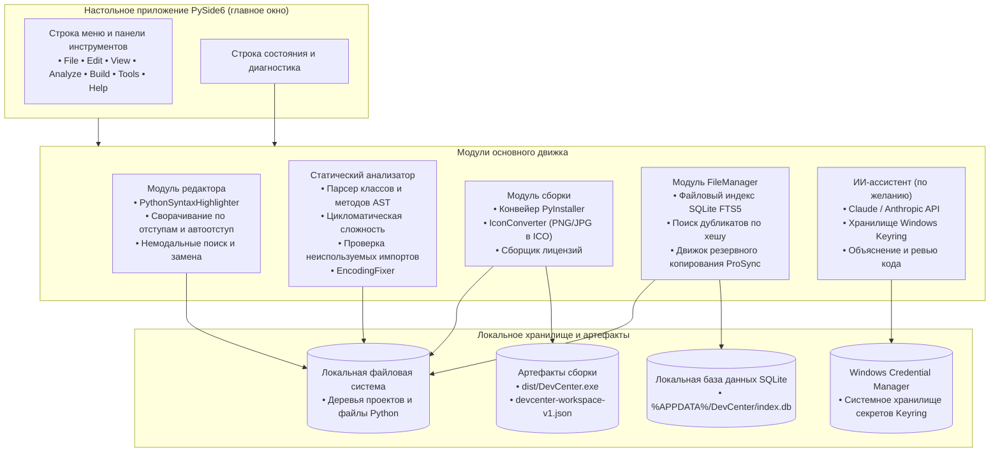
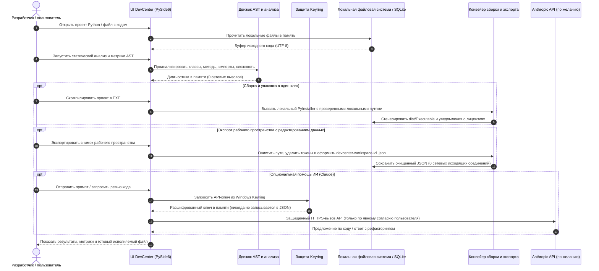

# DevCenter

**Локальная (local-first) Python IDE и набор инструментов разработчика для Windows, Linux и macOS.** DevCenter объединяет в одном цельном настольном комплекте редактор кода на PySide6, статический AST-анализатор, помощник сборки PyInstaller, конвертер иконок, сборщик лицензий, полнотекстовый файловый индекс на SQLite и опциональный ИИ-ассистент Claude/Anthropic.

[English](README.md) · [Deutsch](README_de.md) · [Español](README_es.md) · [简体中文](README_zh.md) · [日本語](README_ja.md) · Русский

> Этот перевод выполнен с помощью машинного перевода; приоритет имеет английский README.md.

[](CHANGELOG.md)
[](https://python.org)
[](LICENSE)
[](NOTICE)
[](https://github.com/dev-bricks/DevCenter)
[](https://www.qt.io/)
[](SECURITY.md)
[](SECURITY.md)
[](SECURITY.md)
[](SECURITY.md)
[](https://github.com/astral-sh/ruff)
[](THIRD_PARTY_LICENSES.md)
[](THIRD_PARTY_LICENSES.txt)
[](tests/)
[](MARKETING-LOG.txt)
[](llms.txt)
[](CHANGELOG.md)
[](https://github.com/dev-bricks)
[](https://github.com/open-bricks)

> [!NOTE]
> **Для ИИ-агентов и LLM-инструментов:** в этом репозитории ведётся машиночитаемый индекс [`llms.txt`](llms.txt) для автоматического обнаружения, сводок возможностей и CLI-интерфейсов. Последняя проверка: **2026-10-04** (базовая версия: 2026-09-28).

> **Не** Azure DevCenter, Microsoft Dev Box, Moderne DevCenter или Devbox. Это `dev-bricks/DevCenter` — настольный комплект на Python с открытым исходным кодом.

---

## 🧭 Быстрая навигация

- [1. Ключевые возможности и особенности](#1-features)
- [2. Архитектура системы и дизайн PySide6](#2-architecture)
- [3. Целевые персоны и обнаруживаемость](#3-target-personas--discoverability)
- [4. Сравнительная матрица с альтернативами](#4-comparative-matrix-vs-alternatives)
- [5. Двойные диаграммы Mermaid и потоки данных](#5-dual-mermaid-diagrams--data-flow)
- [6. Управление и инварианты времени выполнения](#6-governance--runtime-invariants)
- [7. Редактор и эргономика работы с кодом](#7-editor--code-ergonomics)
- [8. Статический анализ и метрики AST](#8-static-analysis--ast-metrics)
- [9. Конвейер сборки PyInstaller и упаковка](#9-pyinstaller-build-pipeline--packaging)
- [10. Полнотекстовый поиск и индексация файлов](#10-full-text-search--file-indexing)
- [11. Опциональный ИИ-ассистент и безопасность Keyring](#11-optional-ai-assistant--keyring-security)
- [12. Экспорт рабочего пространства с редактированием данных и взаимодействие](#12-redacted-workspace-export--interop)
- [13. Горячие клавиши и элементы управления](#13-keyboard-shortcuts--user-controls)
- [14. Структура репозитория и архитектура](#14-repository-layout--architecture)
- [15. Быстрый старт и пакетные лаунчеры](#15-quick-start--batch-launchers)
- [16. Тестирование и проверка качества](#16-testing--quality-verification)
- [17. Лицензии сторонних компонентов и SBOM уровня 1](#17-third-party-licenses--level-1-sbom)
- [18. Политика безопасности, § 521 BGB и родственная экосистема](#18-security-policy--sibling-ecosystem)

---

<a id="sec-01"></a>
<a id="1-features"></a>
<a id="features"></a>
<a id="1-merkmale"></a>
<a id="merkmale"></a>
<a id="start-here"></a>
<a id="schnelleinstieg"></a>
## 1. Ключевые возможности и особенности

### ⚡ Краткая справка

| Свойство | Значение |
|---|---|
| **Канонический репозиторий** | `dev-bricks/DevCenter` |
| **Зонтичная экосистема** | `open-bricks` (организация dev-bricks) |
| **Язык и инструментарий** | Python >=3.11, PySide6 (Qt6), PyInstaller |
| **Целевая среда выполнения** | Нативное настольное приложение: Windows 10/11, POSIX Linux, macOS |
| **Инвариант Zero-Egress** | 100 % офлайн по умолчанию, нулевая телеметрия, нулевые pingback-запросы |
| **Граница исполнения** | Строго непривилегированное пользовательское пространство `RunAsInvoker` |
| **Управление секретами** | Нативное хранилище учётных данных ОС (Windows Credential Manager / Keyring) |
| **SLA по безопасности** | Подтверждение получения за 48 ч / SLA триажа 5 дней |
| **Лицензия с открытым исходным кодом** | GNU General Public License v3.0 ([LICENSE](LICENSE)) |
| **Уведомление об атрибуции** | Каноническое уведомление об атрибуции открытого ПО ([NOTICE](NOTICE)) |

### 🌟 Основные возможности

| Потребность | Инструмент / действие | Интерфейс |
|---|---|---|
| **Локальная Python IDE** | Редактор кода, подсветка синтаксиса, AST-анализатор, помощник сборки | `python main.py` |
| **Упаковка в EXE в один клик** | Мастер сборки PyInstaller (one-file / one-dir) | `build_exe.bat` / вкладка Build |
| **Статический анализ кода** | Методы, классы, сложность, неиспользуемые импорты, TODO | Вкладка Analyze |
| **Диагностика и исправление кодировки** | Обнаружение BOM/«кракозябр» (mojibake), нормализация UTF-8 (`ftfy`) | Вкладка Analyze → Encoding |
| **Полнотекстовый файловый индекс** | Поиск файлов SQLite FTS5, поиск дубликатов, синхронизация резервных копий | Вкладка FileManager |
| **Экспорт рабочего пространства с редактированием данных** | Экспорт очищенных метаданных проекта для передачи | File → Export Workspace |
| **Многоязычный интерфейс** | Интерфейс на 6 языках (DE, EN, ES, ZH, JA, RU) с 4-ступенчатой цепочкой резервных языков | Диалог настроек |
| **Быстрый запуск в Windows** | Скрипт прямого запуска с рабочего стола | `START_DevCenter.bat` |
| **Диагностика и набор CLI** | Автоматическая проверка состояния, версия и безголовый (headless) AST-анализ | `debug.bat` / `python main.py --check` |

### Границы продукта

Настольное приложение на PySide6 — единственный поставляемый продукт и авторитетная среда выполнения. `devcenter-workspace-v1.json` — это локальный экспорт с удалёнными конфиденциальными данными для хранения или явной передачи; в репозитории нет Web/PWA-компаньона или размещённого (hosted) импортёра. Иерархию документации см. в [DOCUMENTATION_STATUS.md](DOCUMENTATION_STATUS.md).


---

<a id="sec-02"></a>
<a id="2-architecture"></a>
<a id="architecture"></a>
<a id="2-architektur"></a>
<a id="system-architecture"></a>
<a id="systemarchitektur"></a>
## 2. Архитектура системы и дизайн PySide6

DevCenter построен на модульном событийно-ориентированном настольном движке PySide6. Основные компоненты строго разделяют слои: представление пользовательского интерфейса, статический анализ кода, управление локальными файлами и опциональные ИИ-сервисы:

- **Слой представления UI (`src/gui/`)**: содержит `MainWindow`, редакторы с вкладками, закрепляемые инструменты, диалоги настроек и доступные контроллеры горячих клавиш.
- **Статический AST-движок (`src/modules/analyzer/`)**: разбирает абстрактные синтаксические деревья Python инертно, не выполняя пользовательский код. Вычисляет цикломатическую сложность, обнаруживает классы и методы и проверяет неиспользуемые импорты.
- **Движок сборки и упаковки (`src/modules/builder/`)**: автоматизирует вызов PyInstaller, генерацию многоразмерных ICO-файлов для Windows (`Pillow`) и автоматическое извлечение лицензий сторонних компонентов (`pip-licenses`).
- **Управление файлами и поиск (`src/modules/filemanager/`)**: использует встроенную базу данных SQLite с полнотекстовым поиском (FTS5) и криптографическим хешированием файлов для навигации по проекту без задержек и очистки дубликатов.
- **Безопасность и хранилище секретов (`src/core/ai_service.py`)**: взаимодействует с нативным системным хранилищем ключей через `keyring` и `pywin32-ctypes`, гарантируя, что API-ключи никогда не записываются на диск.

---

<a id="sec-03"></a>
<a id="3-target-personas--discoverability"></a>
<a id="target-personas"></a>
<a id="3-zielgruppen-personas--auffindbarkeit"></a>
<a id="zielgruppen-personas"></a>
<a id="marketing--target-personas"></a>
<a id="marketing--zielgruppen"></a>
## 3. Целевые персоны и обнаруживаемость

DevCenter ориентирован на четыре различных профиля разработчиков со специализированными рабочими процессами и гарантиями:

### 👤 `[PERSONA-01]` Разработчики настольных Python-приложений для Windows и создатели GUI
- **Профиль**: Python-разработчики, создающие настольное ПО на Qt, PySide6, PyQt или Tkinter для Windows.
- **Проблемы**: сложные флаги командной строки PyInstaller, ручное создание многоразмерных ICO, разбросанные файлы лицензий и повреждение кодировки (mojibake).
- **Решение DevCenter**: графический мастер PyInstaller в один клик, встроенный конвертер изображений в ICO, автоматический сборщик уведомлений о лицензиях и автоматическое восстановление UTF-8 через `ftfy`.
- **Запросы с высоким намерением**: `"pyside6 python code editor desktop"`, `"pyinstaller exe packaging gui tool"`.

### 👤 `[PERSONA-02]` Одиночные мейнтейнеры и инженеры local-first
- **Профиль**: мейнтейнеры открытого ПО и независимые инженеры, создающие модульные настольные и CLI-утилиты.
- **Проблемы**: долгий запуск тяжёлых IDE (Electron/JVM), непрозрачные фоновые демоны и постоянные неудобства с облачными учётными записями.
- **Решение DevCenter**: мгновенный запуск нативного приложения PySide6, молниеносная индексация файлов SQLite FTS5 и автономное переключение между проектами.
- **Запросы с высоким намерением**: `"local-first python ide windows"`, `"lightweight python ide for windows 11"`.

### 👤 `[PERSONA-03]` Разработчики в корпоративных и изолированных (air-gapped) средах с повышенными требованиями к безопасности
- **Профиль**: разработчики, работающие в регулируемых, изолированных или корпоративных air-gapped средах.
- **Проблемы**: обязательный вход в облако, утечки фоновой телеметрии, непроверенные зависимости и требования повышенных привилегий.
- **Решение DevCenter**: строгий режим zero-egress по умолчанию, выполнение в непривилегированном пользовательском пространстве `RunAsInvoker`, нижние границы версий с учётом уязвимостей и прозрачность Level 1 SBOM.
- **Запросы с высоким намерением**: `"offline python ide without cloud login"`, `"zero-egress developer toolkit"`.

### 👤 `[PERSONA-04]` Промпт-инженеры и создатели агентов, работающие с ИИ
- **Профиль**: инженеры, сотрудничающие с LLM-ассистентами по программированию (Claude, GPT, Gemini) для быстрого прототипирования ПО.
- **Проблемы**: случайная утечка API-ключей, неудобное копирование целых деревьев проектов и зашумлённые контексты промптов.
- **Решение DevCenter**: экспорт рабочего пространства с редактированием данных (`devcenter-workspace-v1.json`), хранилище учётных данных на базе нативного keyring ОС и машиночитаемый `llms.txt`.
- **Запросы с высоким намерением**: `"redacted workspace export python ide"`, `"dev-bricks devcenter python development suite"`.

---

<a id="sec-04"></a>
<a id="4-comparative-matrix-vs-alternatives"></a>
<a id="comparative-matrix"></a>
<a id="4-vergleichsmatrix-vs-alternativen"></a>
<a id="vergleichsmatrix"></a>
<a id="why-devcenter"></a>
<a id="warum-devcenter"></a>
## 4. Сравнительная матрица с альтернативами

Следующая матрица сравнения по 10 измерениям сопоставляет DevCenter со стандартными средами разработки на Python и напрямую увязана с нашими инвариантами управления и времени выполнения (`INV-LOCAL-01` — `INV-SLA-10`):

| Критерий оценки | DevCenter | VS Code | PyCharm Comm. | Thonny | CLI-инструменты | Связь с инвариантом |
|---|---|---|---|---|---|---|
| **100 % офлайн / Zero-Egress** | **ДА (строго)** | Требуется настройка | Телеметрия активна | ДА | ДА | `INV-LOCAL-01` |
| **Нативный настольный UI на Qt/PySide6** | **ДА** | НЕТ (Electron) | НЕТ (JVM) | НЕТ (Tk) | Н/Д | `INV-USER-08` |
| **Встроенный GUI для PyInstaller** | **ДА (встроен)** | Нужен плагин | Нужен плагин | НЕТ | Вручную через CLI | `INV-PERM-07` |
| **Конвертер многоразмерных ICO** | **ДА (Pillow)** | НЕТ | НЕТ | НЕТ | Отдельный инструмент | `INV-SECURITY-06` |
| **Автоматическое извлечение лицензий для SBOM** | **ДА (встроено)** | НЕТ | НЕТ | НЕТ | Отдельный инструмент | `INV-PERM-07` |
| **Не исполняющий код AST-парсер сложности** | **ДА (ast)** | Нужен плагин | Встроен | Базовый | Только CLI | `INV-STATIC-05` |
| **Автоматическое исправление кодировки (ftfy)** | **ДА (встроено)** | Вручную | Вручную | Базовое | Только CLI | `INV-LOCAL-01` |
| **Нативное хранилище секретов Keyring** | **ДА (keyring)** | Нужен плагин | Нужен плагин | НЕТ | Н/Д | `INV-KEYRING-03` |
| **Экспорт рабочего пространства с редактированием данных** | **ДА (JSON v1)** | НЕТ | НЕТ | НЕТ | Скрипт вручную | `INV-EXPORT-04` |
| **SLA по безопасности и нижние границы патчей** | **ДА (48 ч / 5 дн.)** | Общий SLA | Общий SLA | Сообщество | Не регулируется | `INV-SLA-10` |

---

<a id="sec-05"></a>
<a id="5-dual-mermaid-diagrams--data-flow"></a>
<a id="dual-mermaid-diagrams"></a>
<a id="5-duale-mermaid-diagramme--datenfluss"></a>
<a id="duale-mermaid-diagramme"></a>
<a id="data-flow--privacy-isolation-zero-egress"></a>
<a id="datenfluss--datenschutz-isolation-zero-egress"></a>
## 5. Двойные диаграммы Mermaid и потоки данных

### 🏗️ Топология архитектуры системы



### 🔒 Поток данных и изоляция приватности (жизненный цикл Zero-Egress)



---

<a id="sec-06"></a>
<a id="6-governance--runtime-invariants"></a>
<a id="governance-invariants"></a>
<a id="6-governance--laufzeit-invarianten"></a>
<a id="laufzeit-invarianten"></a>
<a id="governance--runtime-invariants"></a>
<a id="governance--laufzeit-invarianten"></a>
## 6. Управление и инварианты времени выполнения

DevCenter строго соблюдает 10 архитектурных инвариантов, инвариантов безопасности и цепочки поставок на протяжении всего жизненного цикла:

| ID инварианта | Название | Область применения | Гарантия и проверка |
|---|---|---|---|
| `INV-LOCAL-01` | **Zero-Egress по умолчанию** | Сеть и телеметрия | 100 % офлайн-работа по умолчанию; нулевая телеметрия, нулевая аналитика, никаких фоновых обращений «домой». |
| `INV-OPTIN-02` | **Граница ИИ по явному согласию** | Внешние ИИ-сервисы | Вызовы Claude/Anthropic API выполняются только после явной отправки промпта пользователем; текст промпта никогда не передаётся пассивно. |
| `INV-KEYRING-03` | **Хранилище секретов Keyring** | Управление учётными данными | Учётные данные API хранятся исключительно в нативных хранилищах учётных данных ОС (Windows Credential Manager); никакого хранения в открытом виде на диске. |
| `INV-EXPORT-04` | **Экспорт рабочего пространства с редактированием данных** | Сериализация метаданных | Экспорт `devcenter-workspace-v1.json` удаляет API-токены, учётные данные и абсолютные личные пути; безопасен для передачи команде. |
| `INV-STATIC-05` | **Инертная проверка AST** | Статический анализ | Анализ кода проверяет токены AST и синтаксические деревья инертно, не выполняя и не импортируя целевой пользовательский код. |
| `INV-SECURITY-06` | **Нижние границы версий по уязвимостям** | Безопасность цепочки поставок | Зависимости времени выполнения обеспечивают строгие нижние границы версий по уязвимостям (Pillow >=12.3.0, keyring >=25.0.0, pytest >=9.1.1). |
| `INV-PERM-07` | **100 % разрешительность / разделение** | Лицензирование и соответствие | Комплект под GPLv3 с динамической линковкой LGPL Qt и исключением для загрузчика PyInstaller (Bootloader Exception); упакованные пользовательские приложения сохраняют свободу. |
| `INV-USER-08` | **Непривилегированный RunAsInvoker** | Безопасность операционной системы | DevCenter работает строго в непривилегированном пользовательском пространстве; права администратора, запросы UAC и драйверы не требуются. |
| `INV-MULTI-09` | **Дисциплина мультихостовой синхронизации** | Гигиена репозитория | Git-репозитории строго следуют стандартам Plan D; `.gitignore` блокирует конфликты облачной синхронизации, блокировки и временные артефакты. |
| `INV-SLA-10` | **SLA по безопасности 48 ч / 5 дн.** | Раскрытие уязвимостей | Выделенные каналы реагирования на вопросы безопасности с гарантированным первичным ответом в течение 48 часов и обязательством триажа в течение 5 рабочих дней. |

---

<a id="sec-07"></a>
<a id="7-editor--code-ergonomics"></a>
<a id="editor-features"></a>
<a id="7-editor--code-ergonomie"></a>
<a id="editor-funktionen"></a>
## 7. Редактор и эргономика работы с кодом

Редактор DevCenter обеспечивает отзывчивую нативную работу с кодом на основе PySide6:

- **Подсветка синтаксиса и визуальное оформление**: подсветка синтаксиса Python с настраиваемыми цветовыми схемами для ключевых слов, докстрингов, декораторов и встроенных функций.
- **Сворачивание кода**: сворачивание по уровням отступа для функций, классов и вложенных блоков (`Ctrl+Alt+[` / `Ctrl+Alt+]` / `Ctrl+Alt+0`).
- **Немодальные поиск и замена**: панель поиска в редакторе с учётом регистра, целых слов и регулярных выражений, не блокирующая вид редактора (`Ctrl+F`).
- **Диагностика и исправление кодировки**: обнаружение UTF-8 BOM, ISO-8859-1 и mojibake в реальном времени с автоматической нормализацией в один клик через `ftfy`.

---

<a id="sec-08"></a>
<a id="8-static-analysis--ast-metrics"></a>
<a id="static-analysis"></a>
<a id="8-statische-analyse--ast-metriken"></a>
<a id="statische-analyse"></a>
## 8. Статический анализ и метрики AST

DevCenter инертно анализирует код с помощью модуля `ast` из стандартной библиотеки Python:

- **Обнаружение классов и методов**: находит все структуры классов, графы наследования, функции и сигнатуры методов без импорта модуля.
- **Цикломатическая сложность**: оценивает точки принятия решений (`if`, `for`, `while`, `try`, булевы операторы) и присваивает рейтинг сложности каждой функции.
- **Обнаружение неиспользуемых импортов и переменных**: отслеживает ссылки на символы и импорты с псевдонимами, помечая избыточные зависимости.
- **Агрегатор TODO/FIXME**: собирает и классифицирует рабочие аннотации разработчиков по всему дереву проекта.

---

<a id="sec-09"></a>
<a id="9-pyinstaller-build-pipeline--packaging"></a>
<a id="build-system"></a>
<a id="9-pyinstaller-build-pipeline--packaging"></a>
<a id="build-assistent"></a>
## 9. Конвейер сборки PyInstaller и упаковка

Превратите любой скрипт Python в автономный исполняемый файл Windows без ручного написания CLI-скриптов:

- **Упаковка one-file и one-directory**: переключайтесь между монолитными одиночными исполняемыми файлами и дистрибутивами в виде каталога.
- **Автоматическая генерация ICO для Windows**: встроенный конвертер преобразует изображения PNG или JPG в многоразмерные значки Windows (`16x16`, `32x32`, `48x48`, `64x64`, `128x128`, `256x256`) с высококачественной передискретизацией Ланцоша.
- **Включение лицензий сторонних компонентов**: использует `pip-licenses` для агрегирования лицензий всех установленных зависимостей в файл уведомлений о соответствии, автоматически включаемый в дистрибутив сборки.

---

<a id="sec-10"></a>
<a id="10-full-text-search--file-indexing"></a>
<a id="file-management"></a>
<a id="10-volltext-dateisuche--sqlite-index"></a>
<a id="dateiverwaltung"></a>
## 10. Полнотекстовый поиск и индексация файлов

Встроенная индексация SQLite обеспечивает мгновенное извлечение и порядок в хранилище:

- **Полнотекстовый поиск (FTS5)**: быстрый поиск по содержимому всех исходных файлов, документации и заметок в папке проекта.
- **Обнаружение дубликатов файлов**: сопоставление криптографических хешей выявляет избыточные файлы, временные снимки и забытые копии.
- **Движок резервного копирования ProSync**: лёгкая, учитывающая SQLite синхронизация резервных копий, сохраняющая локальные снимки разработки в безопасности.

---

<a id="sec-11"></a>
<a id="11-optional-ai-assistant--keyring-security"></a>
<a id="ai-assistant"></a>
<a id="11-optionaler-ki-assistent--keyring-sicherheit"></a>
<a id="ki-assistent"></a>
## 11. Опциональный ИИ-ассистент и безопасность Keyring

DevCenter предоставляет опциональный ИИ-компаньон Claude/Anthropic, разработанный по строгим принципам нулевой утечки:

- **Изоляция секретов в keyring ОС**: API-ключи надёжно хранятся в нативном Windows Credential Manager через `keyring` и `pywin32-ctypes`. Ключи никогда не записываются в JSON-файлы настроек, журналы или экспорт рабочего пространства.
- **Явная граница действий**: ИИ-ассистент никогда не сканирует и не передаёт код в фоновом режиме. Сетевые запросы выполняются только тогда, когда разработчик явно запускает промпт или действие ревью кода.
- **Контекст для промпт-инжиниринга**: быстрые инструменты для объяснения кода, предложений по рефакторингу, генерации докстрингов и диагностики ошибок.

---

<a id="sec-12"></a>
<a id="12-redacted-workspace-export--interop"></a>
<a id="workspace-export"></a>
<a id="12-redigierter-workspace-export--interoperabilität"></a>
<a id="workspace-export-de"></a>
## 12. Экспорт рабочего пространства с редактированием данных и взаимодействие

Безопасно экспортируйте состояние проекта для совместной работы между агентами и передачи команде:

- **Схема с редактированием данных (`devcenter-workspace-v1.json`)**: создаёт стандартизированный JSON-снимок метаданных с описанием структуры проекта, обнаруженных фреймворков, открытых задач и зависимостей.
- **Автоматическая очистка приватных данных**: удаляет все абсолютные личные пути к файлам, API-токены, пароли и чувствительные ключи окружения.
- **Стандарт взаимодействия**: упрощает передачу данных агентским инструментам (Codex, Claude Desktop, Antigravity) без выгрузки всего репозитория. См. [EXPORTFORMAT.md](EXPORTFORMAT.md).

---

<a id="sec-13"></a>
<a id="13-keyboard-shortcuts--user-controls"></a>
<a id="keyboard-shortcuts"></a>
<a id="13-tastenkombinationen--steuerung"></a>
<a id="tastenkombinationen"></a>
## 13. Горячие клавиши и элементы управления

| Сочетание клавиш | Действие |
|---|---|
| `Ctrl+N` | Новый файл |
| `Ctrl+O` | Открыть файл |
| `Ctrl+S` | Сохранить файл |
| `Ctrl+Shift+N` | Мастер нового проекта |
| `Ctrl+Shift+O` | Открыть существующий проект |
| `F5` | Запустить активный скрипт Python |
| `F6` | Собрать EXE через мастер PyInstaller |
| `Ctrl+/` | Переключить комментарий для выбранных строк |
| `Ctrl+F` | Открыть панель поиска и замены |
| `Ctrl+Alt+[` | Свернуть текущий блок кода |
| `Ctrl+Alt+]` | Развернуть текущий блок кода |
| `Ctrl+Alt+0` | Развернуть все блоки кода |
| `Ctrl+Shift+A` | Показать/скрыть панель ИИ-ассистента |
| `Ctrl+,` | Открыть диалог настроек |

---

<a id="sec-14"></a>
<a id="14-repository-layout--architecture"></a>
<a id="repository-layout"></a>
<a id="14-repository-struktur--aufbau"></a>
<a id="repository-struktur"></a>
## 14. Структура репозитория и архитектура

```
DevCenter/
├── assets/                     # Visual assets (banner, logos, graphics)
├── locales/                    # Tier-2 translations (DE, EN, ES, ZH, JA, RU)
├── resources/                  # Windows Store packager and templates
├── src/                        # Authoritative application source tree
│   ├── core/                   # ProjectManager, SettingsManager, EventBus, CLI, Logging
│   ├── gui/                    # MainWindow, Editor, DockPanels, Dialogs
│   └── modules/                # Analyzer, Builder, FileManager, EncodingFixer
├── tests/                      # Automated unit, accessibility, and metadata contract tests
├── .gitignore                  # Multi-host lock and cloud-sync defense rules
├── CHANGELOG.md                # Release history and unreleased change ledger
├── DOCUMENTATION_STATUS.md     # Documentation hierarchy and boundary specifications
├── EXPORTFORMAT.md             # Specification of devcenter-workspace-v1.json
├── LICENSE                     # GNU General Public License v3.0 (GPLv3)
├── llms.txt                    # Machine-readable LLM context specification
├── main.py                     # Primary desktop entry point & CLI dispatcher
├── MARKETING-LOG.txt           # Local marketing intelligence and persona ledger
├── NOTICE                      # Canonical open-source attribution notice
├── pyproject.toml              # PEP 621 package metadata, 20 keywords, pytest config
├── README.md                   # English project documentation & architecture guide
├── README_de.md                # German project documentation & architecture guide
├── requirements.txt            # Pinned runtime dependencies
├── SECURITY.md                 # Bilingual security policy & 48h response SLA
├── THIRD_PARTY_LICENSES.md     # Level 1 SBOM and Invariant Cross-Reference Matrix
└── translator.py               # Tier-2 multi-language translation engine
```

---

<a id="sec-15"></a>
<a id="15-quick-start--batch-launchers"></a>
<a id="quick-start"></a>
<a id="15-schnellstart--batch-starter"></a>
<a id="schnellstart"></a>
## 15. Быстрый старт и пакетные лаунчеры

### Стандартная установка

```bash
git clone https://github.com/dev-bricks/DevCenter.git
cd DevCenter
pip install -r requirements.txt
python main.py
```

### Пакетные стартеры Windows

```batch
# Quick GUI Launcher
START_DevCenter.bat

# Diagnostic & Debug Launcher (with console output and UTF-8 code page)
debug.bat

# Automated PyInstaller Compilation Script
build_exe.bat
```

### Диагностика через CLI и безголовые операции

```bash
# Verify system dependencies, PySide6, AST analyzer, and storage paths
python main.py --check

# Run headless AST analysis on a file or folder with JSON output
python main.py --analyze src/modules/analyzer/method_analyzer.py --output report.json

# Generate a sanitized workspace export headless
python main.py --export-workspace
```

---

<a id="sec-16"></a>
<a id="16-testing--quality-verification"></a>
<a id="installation--testing"></a>
<a id="16-testsuite--qualitätsverifikation"></a>
<a id="installation--testausführung"></a>
## 16. Тестирование и проверка качества

DevCenter поддерживает строгий набор тестов, охватывающий основную логику, доступность, исправление кодировки и согласованность метаданных:

```bash
# Run complete test suite with standardized options
python -m pytest

# Run Ruff linter and static verification
ruff check .

# Validate bytecode compilation
python -m compileall -q .
```

Проверка CI (**2026-10-04**): `python -m pytest -q` прошёл **250 тестов** (100 % зелёных) на Python 3.11 и 3.12. Непрерывная интеграция проверяет матрицу тестов на Python 3.11 и 3.12 под Windows, Linux и macOS.

---

<a id="sec-17"></a>
<a id="17-third-party-licenses--level-1-sbom"></a>
<a id="third-party-licenses--transparency"></a>
<a id="17-drittanbieter-lizenzen--level-1-sbom"></a>
<a id="drittanbieter-lizenzen--transparenz"></a>
## 17. Лицензии сторонних компонентов и SBOM уровня 1

DevCenter ведёт полный перечень компонентов программного обеспечения (SBOM) уровня 1 и аудит прозрачности лицензий:

- Подробная разбивка всех 20 прямых, транзитивных, сборочных и тестовых пакетов: [THIRD_PARTY_LICENSES.md](THIRD_PARTY_LICENSES.md).
- Каноническое уведомление об атрибуции: [NOTICE](NOTICE).
- Машиночитаемое сопоставление лицензий: [THIRD_PARTY_LICENSES.txt](THIRD_PARTY_LICENSES.txt).
- Все пакеты проверены на соответствие разрешительным лицензиям открытого ПО (MIT, Apache-2.0, BSD-3-Clause, BSD-2-Clause, HPND-sell-variant) или стандартным копилефтным лицензиям с исключениями для линковки/загрузчика (LGPL-3.0, LGPL-2.1, GPL-2.0 с исключением Bootloader).

---

<a id="sec-18"></a>
<a id="18-security-policy--sibling-ecosystem"></a>
<a id="security-policy"></a>
<a id="privacy--security"></a>
<a id="18-sicherheitsrichtlinie--521-bgb--ökosystem"></a>
<a id="datenschutz--sicherheit"></a>
<a id="sibling-tools--ecosystem-matrix"></a>
<a id="geschwister-tools--ökosystem-matrix"></a>
<a id="license--liability"></a>
<a id="lizenz--haftung"></a>
## 18. Политика безопасности, § 521 BGB и родственная экосистема

### 🛡️ Политика безопасности и законодательная оговорка

DevCenter работает строго по принципу local-first и без привилегий (`RunAsInvoker`). Доступ к сети происходит исключительно по явной инициативе пользователя.

- **Раскрытие уязвимостей**: подтверждение получения в течение 48 часов и обязательство триажа в течение 5 рабочих дней.
- **Контакты для сообщений**: `security@dev-bricks.org`, `security@open-bricks.org`, `security@ellmos.ai`.
- **Законодательная оговорка об ответственности (§ 521 BGB)**: DevCenter предоставляется безвозмездно как программное обеспечение с открытым исходным кодом по лицензии GNU General Public License v3.0. В соответствии с законодательством Германии о безвозмездных договорах (§ 521 BGB / Gefälligkeitsrecht) ответственность автора ограничена умыслом и грубой неосторожностью. Используйте на свой риск.

### 🌐 Родственные инструменты и матрица экосистемы

DevCenter — флагманская Python IDE и центр упаковки в экосистеме **dev-bricks** под зонтиком **open-bricks**:

| Экосистема | Инструмент | Основное назначение | Интерфейс |
|---|---|---|---|
| **dev-bricks** | **DevCenter** | **Локальная настольная Python IDE, статический анализатор и набор для сборки PyInstaller** | **PySide6 / GUI для Windows** |
| **dev-bricks** | [MethodenAnalyser](https://github.com/dev-bricks/MethodenAnalyser) | Автономный AST-анализатор методов, проверка сложности и автоисправление | Tkinter / CLI |
| **dev-bricks** | [CodeBox](https://github.com/dev-bricks/CodeBox) | Быстрый настольный просмотрщик и редактор кода с подсветкой синтаксиса | GUI на PySide6 |
| **dev-bricks** | [pythonbox](https://github.com/dev-bricks/pythonbox) | Лёгкая Python IDE и интерактивный отладчик PDB | GUI на PySide6 |
| **dev-bricks** | [safe-start-for-codex](https://github.com/dev-bricks/safe-start-for-codex) | Предварительная проверка и безопасный загрузчик для Codex | Python CLI |
| **dev-bricks** | [automizer-for-claude-desktop](https://github.com/dev-bricks/automizer-for-claude-desktop) | Мост автоматизации и лаунчер для Claude Desktop | Python GUI |
| **ellmos-ai** | [clutch](https://github.com/ellmos-ai/clutch) | Управление подпроцессами и мост PTY-терминала | Python CLI |
| **ellmos-ai** | [coma](https://github.com/ellmos-ai/coma) | Разрешение конфликтов между несколькими хостами и распределённая синхронизация состояния | Python CLI |
| **ellmos-ai** | [swarm-ai](https://github.com/ellmos-ai/swarm-ai) | Координация распределённого роя агентов и движок консенсуса | Python Core |
| **ellmos-ai** | [ellmos-controlcenter-mcp](https://github.com/ellmos-ai/ellmos-controlcenter-mcp) | Управление парком MCP, разрешение бандлов и контроль доступа | MCP-сервер |
| **file-bricks** | [ProFiler](https://github.com/file-bricks/ProFiler) | Локальный настольный файловый менеджер с несколькими вкладками и очиститель дубликатов | GUI на PySide6 |
| **file-bricks** | [ExplorerPro](https://github.com/file-bricks/ExplorerPro) | Высокопроизводительный компаньон Windows Explorer и индексация файлов | GUI на PySide6 |
| **file-bricks** | [ProSync](https://github.com/file-bricks/ProSync) | Движок резервного копирования с поддержкой SQLite и менеджер синхронизации с несколькими целями | GUI на PySide6 |
| **doc-bricks** | [DokuZen](https://github.com/doc-bricks/DokuZen) | Менеджер документов Markdown, конвертер в PDF и поисковый движок | GUI на PySide6 |
| **doc-bricks** | [PDFtoPDFocr](https://github.com/doc-bricks/PDFtoPDFocr) | Локальный инжектор текстового слоя OCR для отсканированных PDF-документов | PySide6 / CLI |
| **open-bricks** | [open-bricks](https://github.com/open-bricks) | Зонтичный индекс локального ПО, уважающего приватность | Открытый исходный код |
