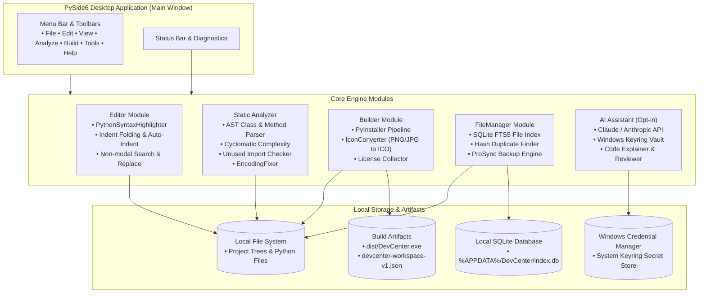
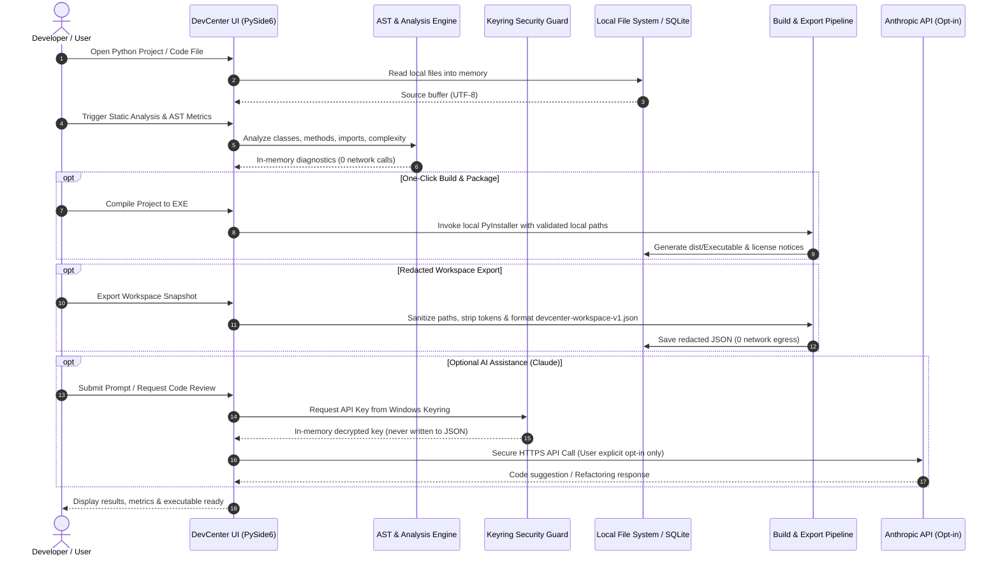

# DevCenter

**适用于 Windows、Linux 和 macOS 的本地优先 Python IDE 与开发者工具包。** DevCenter 将 PySide6 代码编辑器、AST 静态分析器、PyInstaller 打包助手、图标转换器、许可证收集器、全文 SQLite 文件索引以及可选的 Claude/Anthropic AI 助手整合在一套协调一致的桌面套件中。

[English](README.md) · [Deutsch](README_de.md) · [Español](README_es.md) · 简体中文 · [日本語](README_ja.md) · [Русский](README_ru.md)

> 本文为机器辅助翻译；以英文 README.md 为准。

[](CHANGELOG.md)
[](https://python.org)
[](LICENSE)
[](NOTICE)
[](https://github.com/dev-bricks/DevCenter)
[](https://www.qt.io/)
[](SECURITY.md)
[](SECURITY.md)
[](SECURITY.md)
[](SECURITY.md)
[](https://github.com/astral-sh/ruff)
[](THIRD_PARTY_LICENSES.md)
[](THIRD_PARTY_LICENSES.txt)
[](tests/)
[](MARKETING-LOG.txt)
[](llms.txt)
[](CHANGELOG.md)
[](https://github.com/dev-bricks)
[](https://github.com/open-bricks)

> [!NOTE]
> **致 AI 智能体与 LLM 工具：** 本仓库维护了一份机器可读的 [`llms.txt`](llms.txt) 索引，用于自动发现、能力概要和 CLI 接口。最近检查：**2026-10-04**（基线：2026-09-28）。

> **并非** Azure DevCenter、Microsoft Dev Box、Moderne DevCenter 或 Devbox。这里是 `dev-bricks/DevCenter` —— 一套开源的 Python 桌面套件。

---

## 🧭 快速导航

- [1. 主要特性与亮点](#1-features)
- [2. 系统架构与 PySide6 设计](#2-architecture)
- [3. 目标用户画像与可发现性](#3-target-personas--discoverability)
- [4. 与替代方案的对比矩阵](#4-comparative-matrix-vs-alternatives)
- [5. 双 Mermaid 图表与数据流](#5-dual-mermaid-diagrams--data-flow)
- [6. 治理与运行时不变量](#6-governance--runtime-invariants)
- [7. 编辑器与代码人体工学](#7-editor--code-ergonomics)
- [8. 静态分析与 AST 指标](#8-static-analysis--ast-metrics)
- [9. PyInstaller 构建流水线与打包](#9-pyinstaller-build-pipeline--packaging)
- [10. 全文搜索与文件索引](#10-full-text-search--file-indexing)
- [11. 可选 AI 助手与密钥环安全](#11-optional-ai-assistant--keyring-security)
- [12. 脱敏工作区导出与互操作](#12-redacted-workspace-export--interop)
- [13. 键盘快捷键与用户控制](#13-keyboard-shortcuts--user-controls)
- [14. 仓库结构与架构](#14-repository-layout--architecture)
- [15. 快速开始与批处理启动器](#15-quick-start--batch-launchers)
- [16. 测试与质量验证](#16-testing--quality-verification)
- [17. 第三方许可证与 Level 1 SBOM](#17-third-party-licenses--level-1-sbom)
- [18. 安全政策、§ 521 BGB 与同系列生态](#18-security-policy--sibling-ecosystem)

---

<a id="sec-01"></a>
<a id="1-features"></a>
<a id="features"></a>
<a id="1-merkmale"></a>
<a id="merkmale"></a>
<a id="start-here"></a>
<a id="schnelleinstieg"></a>
## 1. 主要特性与亮点

### ⚡ 快速参考

| 属性 | 值 |
|---|---|
| **规范仓库** | `dev-bricks/DevCenter` |
| **总括生态系统** | `open-bricks`（dev-bricks 组织） |
| **语言与工具链** | Python >=3.11、PySide6 (Qt6)、PyInstaller |
| **目标运行环境** | 原生桌面：Windows 10/11、POSIX Linux、macOS |
| **零外泄不变量** | 默认 100% 离线，零遥测，零回传 |
| **执行边界** | 严格的非特权 `RunAsInvoker` 用户空间 |
| **密钥管理** | 操作系统原生凭据存储（Windows 凭据管理器 / Keyring） |
| **安全 SLA** | 48 小时响应确认 / 5 天分诊 SLA |
| **开源许可证** | GNU 通用公共许可证 v3.0（[LICENSE](LICENSE)） |
| **署名声明** | 规范的开源署名声明（[NOTICE](NOTICE)） |

### 🌟 核心能力

| 需求 | 工具 / 操作 | 界面 |
|---|---|---|
| **本地 Python IDE** | 代码编辑器、语法高亮、AST 分析器、构建助手 | `python main.py` |
| **一键 EXE 打包** | PyInstaller 构建向导（单文件 / 单目录） | `build_exe.bat` / 构建标签页 |
| **静态代码分析** | 方法、类、复杂度、未使用的导入、TODO | 分析标签页 |
| **编码诊断与修复** | BOM/乱码检测，UTF-8 规范化（`ftfy`） | 分析 → 编码标签页 |
| **全文文件索引** | SQLite FTS5 文件搜索、重复文件查找器、备份同步 | 文件管理器标签页 |
| **脱敏工作区导出** | 用于交接的已清理项目元数据导出 | 文件 → 导出工作区 |
| **多语言界面** | 6 种语言界面（DE、EN、ES、ZH、JA、RU），4 级回退链 | 设置对话框 |
| **Windows 快速启动器** | 直接启动桌面应用的脚本 | `START_DevCenter.bat` |
| **诊断与 CLI 套件** | 自动健康检查、版本信息和无界面 AST 检查 | `debug.bat` / `python main.py --check` |

### 产品边界

PySide6 桌面应用是唯一发布的产品，也是权威运行时。`devcenter-workspace-v1.json` 是用于存储或明确交接的脱敏本地导出文件；本仓库不包含 Web/PWA 配套应用，也不包含托管的导入器。文档层级请参见 [DOCUMENTATION_STATUS.md](DOCUMENTATION_STATUS.md)。


---

<a id="sec-02"></a>
<a id="2-architecture"></a>
<a id="architecture"></a>
<a id="2-architektur"></a>
<a id="system-architecture"></a>
<a id="systemarchitektur"></a>
## 2. 系统架构与 PySide6 设计

DevCenter 围绕模块化、事件驱动的 PySide6 桌面引擎构建。核心组件在用户界面展示、静态代码分析、本地文件管理和可选 AI 服务之间保持严格的分层隔离：

- **UI 展示层（`src/gui/`）**：包含 `MainWindow`、标签式编辑器面板、可停靠工具、设置对话框以及无障碍键盘快捷键控制器。
- **静态 AST 引擎（`src/modules/analyzer/`）**：以惰性方式解析 Python 抽象语法树，不执行用户代码。计算圈复杂度，发现类和方法，并检查未使用的导入。
- **构建与打包引擎（`src/modules/builder/`）**：自动调用 PyInstaller，生成多分辨率 Windows ICO（`Pillow`），并自动提取第三方许可证（`pip-licenses`）。
- **文件管理与搜索（`src/modules/filemanager/`）**：采用内嵌的 SQLite 数据库，支持全文搜索（FTS5）和加密文件哈希，实现零延迟的项目导航和重复文件清理。
- **安全与密钥保险库（`src/core/ai_service.py`）**：通过 `keyring` 和 `pywin32-ctypes` 与操作系统原生密钥环交互，确保 API 密钥绝不会写入磁盘。

---

<a id="sec-03"></a>
<a id="3-target-personas--discoverability"></a>
<a id="target-personas"></a>
<a id="3-zielgruppen-personas--auffindbarkeit"></a>
<a id="zielgruppen-personas"></a>
<a id="marketing--target-personas"></a>
<a id="marketing--zielgruppen"></a>
## 3. 目标用户画像与可发现性

DevCenter 面向四类不同的开发者，提供专门的工作流和保障：

### 👤 `[PERSONA-01]` Windows Python 桌面应用开发者与 GUI 构建者
- **画像**：为 Windows 构建 Qt、PySide6、PyQt 或 Tkinter 桌面软件的 Python 开发者。
- **痛点**：复杂的 PyInstaller 命令行参数、手动创建多分辨率 ICO、分散的许可证文件以及编码损坏（乱码）。
- **DevCenter 方案**：一键式 PyInstaller GUI 向导、内置的图像转 ICO 转换器、自动化的许可证声明收集器以及自动 `ftfy` UTF-8 修复。
- **高意图查询**：`"pyside6 python code editor desktop"`、`"pyinstaller exe packaging gui tool"`。

### 👤 `[PERSONA-02]` 独立维护者与本地优先工程师
- **画像**：构建模块化桌面和 CLI 实用工具的开源维护者与独立工程师。
- **痛点**：笨重 IDE（Electron/JVM）的启动延迟、不透明的后台守护进程，以及持续不断的云账户困扰。
- **DevCenter 方案**：即时的原生 PySide6 桌面启动、极速的 SQLite FTS5 文件索引以及独立的项目切换。
- **高意图查询**：`"local-first python ide windows"`、`"lightweight python ide for windows 11"`。

### 👤 `[PERSONA-03]` 注重安全的企业开发者与物理隔离环境开发者
- **画像**：在受监管、隔离或企业物理隔离（air-gapped）环境中工作的开发者。
- **痛点**：强制云登录、后台遥测泄露、未经审查的依赖项以及对提升权限的要求。
- **DevCenter 方案**：严格的默认零外泄、非提升的 `RunAsInvoker` 用户空间执行、漏洞下限以及 Level 1 SBOM 透明度。
- **高意图查询**：`"offline python ide without cloud login"`、`"zero-egress developer toolkit"`。

### 👤 `[PERSONA-04]` AI 辅助的提示工程师与智能体构建者
- **画像**：与 LLM 编码助手（Claude、GPT、Gemini）协作进行快速软件原型开发的工程师。
- **痛点**：意外泄露 API 密钥、繁琐地复制粘贴整个项目树，以及嘈杂的提示上下文。
- **DevCenter 方案**：脱敏的工作区导出（`devcenter-workspace-v1.json`）、操作系统原生的密钥环凭据保险库以及机器可读的 `llms.txt`。
- **高意图查询**：`"redacted workspace export python ide"`、`"dev-bricks devcenter python development suite"`。

---

<a id="sec-04"></a>
<a id="4-comparative-matrix-vs-alternatives"></a>
<a id="comparative-matrix"></a>
<a id="4-vergleichsmatrix-vs-alternativen"></a>
<a id="vergleichsmatrix"></a>
<a id="why-devcenter"></a>
<a id="warum-devcenter"></a>
## 4. 与替代方案的对比矩阵

下面这份 10 维度对比矩阵将 DevCenter 与标准 Python 开发环境进行对照，并直接映射到我们的治理与运行时不变量（`INV-LOCAL-01` 至 `INV-SLA-10`）：

| 评估维度 | DevCenter | VS Code | PyCharm Comm. | Thonny | CLI 工具链 | 不变量链接 |
|---|---|---|---|---|---|---|
| **100% 离线 / 零外泄** | **是（严格）** | 需配置 | 遥测启用 | 是 | 是 | `INV-LOCAL-01` |
| **原生 Qt/PySide6 桌面 UI** | **是** | 否（Electron） | 否（JVM） | 否（Tk） | 不适用 | `INV-USER-08` |
| **集成 PyInstaller GUI** | **是（内置）** | 需插件 | 需插件 | 否 | 手动 CLI | `INV-PERM-07` |
| **多分辨率 ICO 转换器** | **是（Pillow）** | 否 | 否 | 否 | 独立工具 | `INV-SECURITY-06` |
| **自动化许可证 SBOM 提取** | **是（内置）** | 否 | 否 | 否 | 独立工具 | `INV-PERM-07` |
| **不执行代码的 AST 复杂度解析器** | **是（ast）** | 需插件 | 内置 | 基础 | 仅 CLI | `INV-STATIC-05` |
| **自动化编码修复（ftfy）** | **是（内置）** | 手动 | 手动 | 基础 | 仅 CLI | `INV-LOCAL-01` |
| **原生密钥环密钥保险库** | **是（keyring）** | 需插件 | 需插件 | 否 | 不适用 | `INV-KEYRING-03` |
| **脱敏工作区导出** | **是（JSON v1）** | 否 | 否 | 否 | 手动脚本 | `INV-EXPORT-04` |
| **安全 SLA 与补丁下限** | **是（48 小时 / 5 天）** | 通用 SLA | 通用 SLA | 社区 | 无人管理 | `INV-SLA-10` |

---

<a id="sec-05"></a>
<a id="5-dual-mermaid-diagrams--data-flow"></a>
<a id="dual-mermaid-diagrams"></a>
<a id="5-duale-mermaid-diagramme--datenfluss"></a>
<a id="duale-mermaid-diagramme"></a>
<a id="data-flow--privacy-isolation-zero-egress"></a>
<a id="datenfluss--datenschutz-isolation-zero-egress"></a>
## 5. 双 Mermaid 图表与数据流

### 🏗️ 系统架构拓扑



### 🔒 数据流与隐私隔离（零外泄生命周期）



---

<a id="sec-06"></a>
<a id="6-governance--runtime-invariants"></a>
<a id="governance-invariants"></a>
<a id="6-governance--laufzeit-invarianten"></a>
<a id="laufzeit-invarianten"></a>
<a id="governance--runtime-invariants"></a>
<a id="governance--laufzeit-invarianten"></a>
## 6. 治理与运行时不变量

DevCenter 在其整个生命周期内严格执行 10 项架构、安全和供应链不变量：

| 不变量 ID | 名称 | 作用范围 | 保证与验证 |
|---|---|---|---|
| `INV-LOCAL-01` | **默认零外泄** | 网络与遥测 | 默认 100% 离线运行；零遥测，零分析，零后台回传调用。 |
| `INV-OPTIN-02` | **AI 须主动启用的边界** | 外部 AI 服务 | Claude/Anthropic API 调用仅在用户明确提交提示时执行；提示文本绝不会被被动传输。 |
| `INV-KEYRING-03` | **密钥环密钥保险库** | 凭据管理 | API 凭据仅存储于操作系统原生凭据存储（Windows 凭据管理器）中；零明文磁盘持久化。 |
| `INV-EXPORT-04` | **脱敏工作区导出** | 元数据序列化 | `devcenter-workspace-v1.json` 导出会剥离 API 令牌、凭据和个人绝对路径；可安全用于团队交接。 |
| `INV-STATIC-05` | **惰性 AST 检查** | 静态分析 | 代码分析以惰性方式检查 AST 标记和语法树，不执行也不导入目标用户代码。 |
| `INV-SECURITY-06` | **漏洞下限** | 供应链安全 | 运行时依赖项强制执行严格的漏洞下限（Pillow >=12.3.0、keyring >=25.0.0、pytest >=9.1.1）。 |
| `INV-PERM-07` | **100% 宽松许可 / 分离** | 许可与合规 | GPLv3 套件，采用动态 LGPL Qt 链接及 PyInstaller Bootloader 例外；打包的用户应用保留其自由。 |
| `INV-USER-08` | **非特权 RunAsInvoker** | 操作系统安全 | DevCenter 严格在非特权用户空间中运行；无需管理员权限、UAC 提示或驱动程序。 |
| `INV-MULTI-09` | **多主机同步规范** | 仓库卫生 | Git 仓库严格遵循 Plan D 标准；`.gitignore` 阻止云同步冲突、锁文件和临时产物。 |
| `INV-SLA-10` | **48 小时 / 5 天安全 SLA** | 漏洞披露 | 专用安全响应渠道，保证 48 小时内首次响应并承诺 5 个工作日内完成分诊。 |

---

<a id="sec-07"></a>
<a id="7-editor--code-ergonomics"></a>
<a id="editor-features"></a>
<a id="7-editor--code-ergonomie"></a>
<a id="editor-funktionen"></a>
## 7. 编辑器与代码人体工学

DevCenter 编辑器基于 PySide6，提供响应迅速的原生编码体验：

- **语法高亮与视觉样式**：Python 语法高亮器，为关键字、文档字符串、装饰器和内置函数提供自定义配色方案。
- **代码折叠**：针对函数、类和嵌套块的缩进级别折叠（`Ctrl+Alt+[` / `Ctrl+Alt+]` / `Ctrl+Alt+0`）。
- **非模态搜索与替换**：编辑器内搜索栏，支持区分大小写、全字匹配和正则表达式，且不会阻塞编辑器视图（`Ctrl+F`）。
- **编码诊断与修复**：实时检测 UTF-8 BOM、ISO-8859-1 和乱码，并通过 `ftfy` 一键自动规范化。

---

<a id="sec-08"></a>
<a id="8-static-analysis--ast-metrics"></a>
<a id="static-analysis"></a>
<a id="8-statische-analyse--ast-metriken"></a>
<a id="statische-analyse"></a>
## 8. 静态分析与 AST 指标

DevCenter 使用 Python 标准库的 `ast` 模块以惰性方式检查代码：

- **类与方法检测**：无需导入模块即可发现所有类结构、继承图、函数和方法签名。
- **圈复杂度**：评估决策点（`if`、`for`、`while`、`try`、布尔运算符），为每个函数给出复杂度评级。
- **未使用的导入与变量检测**：跟踪符号引用和别名导入，标记冗余依赖项。
- **TODO/FIXME 聚合器**：在整个项目树中收集并分类可操作的开发者注释。

---

<a id="sec-09"></a>
<a id="9-pyinstaller-build-pipeline--packaging"></a>
<a id="build-system"></a>
<a id="9-pyinstaller-build-pipeline--packaging"></a>
<a id="build-assistent"></a>
## 9. PyInstaller 构建流水线与打包

无需手动编写任何 CLI 脚本，即可将任意 Python 脚本转换为独立的 Windows 可执行文件：

- **单文件与单目录打包**：可在整体式单文件可执行文件和目录式发行版之间切换。
- **自动生成 Windows ICO**：内置转换器使用高质量 Lanczos 重采样，将 PNG 或 JPG 图像转换为多分辨率 Windows 图标（`16x16`、`32x32`、`48x48`、`64x64`、`128x128`、`256x256`）。
- **第三方许可证打包**：使用 `pip-licenses` 汇总所有已安装依赖项的许可证，生成合规声明文件，并自动包含在构建发行版中。

---

<a id="sec-10"></a>
<a id="10-full-text-search--file-indexing"></a>
<a id="file-management"></a>
<a id="10-volltext-dateisuche--sqlite-index"></a>
<a id="dateiverwaltung"></a>
## 10. 全文搜索与文件索引

内嵌的 SQLite 索引可确保即时检索和存储整洁：

- **全文搜索（FTS5）**：快速搜索项目文件夹中所有源文件、文档和笔记的内容。
- **重复文件检测**：通过加密哈希匹配识别冗余文件、临时快照和被遗弃的副本。
- **ProSync 备份引擎**：轻量级、感知 SQLite 的备份同步，确保本地开发快照安全。

---

<a id="sec-11"></a>
<a id="11-optional-ai-assistant--keyring-security"></a>
<a id="ai-assistant"></a>
<a id="11-optionaler-ki-assistent--keyring-sicherheit"></a>
<a id="ki-assistent"></a>
## 11. 可选 AI 助手与密钥环安全

DevCenter 提供一个可选的 Claude/Anthropic AI 伙伴，其设计遵循严格的零泄露原则：

- **操作系统密钥环密钥隔离**：API 密钥通过 `keyring` 和 `pywin32-ctypes` 安全存储在原生 Windows 凭据管理器中。密钥绝不会写入设置 JSON 文件、日志或工作区导出。
- **明确的操作边界**：AI 助手绝不会在后台扫描或传输代码。仅当开发者明确触发提示或代码审查操作时，才会发出网络请求。
- **提示工程上下文**：提供代码解释、重构建议、文档字符串生成和缺陷诊断的快捷工具。

---

<a id="sec-12"></a>
<a id="12-redacted-workspace-export--interop"></a>
<a id="workspace-export"></a>
<a id="12-redigierter-workspace-export--interoperabilität"></a>
<a id="workspace-export-de"></a>
## 12. 脱敏工作区导出与互操作

安全地导出项目状态，用于跨智能体协作和团队交接：

- **脱敏模式（`devcenter-workspace-v1.json`）**：生成标准化的 JSON 元数据快照，详细描述项目结构、检测到的框架、未完成任务和依赖项。
- **自动隐私清理**：剥离所有个人绝对文件路径、API 令牌、密码和敏感环境变量键。
- **互操作标准**：便于在不外泄整个仓库的情况下向智能体工具（Codex、Claude Desktop、Antigravity）交接。参见 [EXPORTFORMAT.md](EXPORTFORMAT.md)。

---

<a id="sec-13"></a>
<a id="13-keyboard-shortcuts--user-controls"></a>
<a id="keyboard-shortcuts"></a>
<a id="13-tastenkombinationen--steuerung"></a>
<a id="tastenkombinationen"></a>
## 13. 键盘快捷键与用户控制

| 快捷键 | 操作 |
|---|---|
| `Ctrl+N` | 新建文件 |
| `Ctrl+O` | 打开文件 |
| `Ctrl+S` | 保存文件 |
| `Ctrl+Shift+N` | 新建项目向导 |
| `Ctrl+Shift+O` | 打开现有项目 |
| `F5` | 运行当前 Python 脚本 |
| `F6` | 通过 PyInstaller 向导构建 EXE |
| `Ctrl+/` | 切换所选行的注释 |
| `Ctrl+F` | 打开搜索与替换栏 |
| `Ctrl+Alt+[` | 折叠当前代码块 |
| `Ctrl+Alt+]` | 展开当前代码块 |
| `Ctrl+Alt+0` | 展开所有代码块 |
| `Ctrl+Shift+A` | 切换 AI 助手面板 |
| `Ctrl+,` | 打开设置对话框 |

---

<a id="sec-14"></a>
<a id="14-repository-layout--architecture"></a>
<a id="repository-layout"></a>
<a id="14-repository-struktur--aufbau"></a>
<a id="repository-struktur"></a>
## 14. 仓库结构与架构

```
DevCenter/
├── assets/                     # 视觉资源（横幅、徽标、图形）
├── locales/                    # Tier-2 翻译（DE、EN、ES、ZH、JA、RU）
├── resources/                  # Windows Store 打包器和模板
├── src/                        # 权威的应用程序源码树
│   ├── core/                   # ProjectManager、SettingsManager、EventBus、CLI、日志
│   ├── gui/                    # MainWindow、编辑器、停靠面板、对话框
│   └── modules/                # Analyzer、Builder、FileManager、EncodingFixer
├── tests/                      # 自动化单元、无障碍和元数据契约测试
├── .gitignore                  # 多主机锁文件与云同步防护规则
├── CHANGELOG.md                # 发布历史与未发布变更台账
├── DOCUMENTATION_STATUS.md     # 文档层级与边界规范
├── EXPORTFORMAT.md             # devcenter-workspace-v1.json 规范
├── LICENSE                     # GNU 通用公共许可证 v3.0 (GPLv3)
├── llms.txt                    # 机器可读的 LLM 上下文规范
├── main.py                     # 主桌面入口与 CLI 调度器
├── MARKETING-LOG.txt           # 本地营销情报与用户画像台账
├── NOTICE                      # 规范的开源署名声明
├── pyproject.toml              # PEP 621 包元数据、20 个关键字、pytest 配置
├── README.md                   # 英文项目文档与架构指南
├── README_de.md                # 德文项目文档与架构指南
├── requirements.txt            # 固定版本的运行时依赖
├── SECURITY.md                 # 双语安全政策与 48 小时响应 SLA
├── THIRD_PARTY_LICENSES.md     # Level 1 SBOM 与不变量交叉引用矩阵
└── translator.py               # Tier-2 多语言翻译引擎
```

---

<a id="sec-15"></a>
<a id="15-quick-start--batch-launchers"></a>
<a id="quick-start"></a>
<a id="15-schnellstart--batch-starter"></a>
<a id="schnellstart"></a>
## 15. 快速开始与批处理启动器

### 标准安装

```bash
git clone https://github.com/dev-bricks/DevCenter.git
cd DevCenter
pip install -r requirements.txt
python main.py
```

### Windows 批处理启动器

```batch
# Quick GUI Launcher
START_DevCenter.bat

# Diagnostic & Debug Launcher (with console output and UTF-8 code page)
debug.bat

# Automated PyInstaller Compilation Script
build_exe.bat
```

### CLI 诊断与无界面操作

```bash
# Verify system dependencies, PySide6, AST analyzer, and storage paths
python main.py --check

# Run headless AST analysis on a file or folder with JSON output
python main.py --analyze src/modules/analyzer/method_analyzer.py --output report.json

# Generate a sanitized workspace export headless
python main.py --export-workspace
```

---

<a id="sec-16"></a>
<a id="16-testing--quality-verification"></a>
<a id="installation--testing"></a>
<a id="16-testsuite--qualitätsverifikation"></a>
<a id="installation--testausführung"></a>
## 16. 测试与质量验证

DevCenter 维护着一套严格的测试套件，涵盖核心逻辑、无障碍、编码修复和元数据一致性：

```bash
# Run complete test suite with standardized options
python -m pytest

# Run Ruff linter and static verification
ruff check .

# Validate bytecode compilation
python -m compileall -q .
```

CI 验证（**2026-10-04**）：`python -m pytest -q` 在 Python 3.11 和 3.12 上通过了 **250 项测试**（100% 通过）。持续集成在 Windows、Linux 和 macOS 上针对 Python 3.11 和 3.12 验证测试矩阵。

---

<a id="sec-17"></a>
<a id="17-third-party-licenses--level-1-sbom"></a>
<a id="third-party-licenses--transparency"></a>
<a id="17-drittanbieter-lizenzen--level-1-sbom"></a>
<a id="drittanbieter-lizenzen--transparenz"></a>
## 17. 第三方许可证与 Level 1 SBOM

DevCenter 维护完整的 Level 1 软件物料清单（SBOM）和许可证透明度审计：

- 所有 20 个直接依赖、传递依赖、构建及测试包的详细明细：[THIRD_PARTY_LICENSES.md](THIRD_PARTY_LICENSES.md)。
- 规范的署名声明：[NOTICE](NOTICE)。
- 机器可读的许可证映射：[THIRD_PARTY_LICENSES.txt](THIRD_PARTY_LICENSES.txt)。
- 所有软件包均已审计，采用宽松的开源许可证（MIT、Apache-2.0、BSD-3-Clause、BSD-2-Clause、HPND-sell-variant），或带有链接/引导加载器例外的标准 copyleft 许可证（LGPL-3.0、LGPL-2.1、带 Bootloader 例外的 GPL-2.0）。

---

<a id="sec-18"></a>
<a id="18-security-policy--sibling-ecosystem"></a>
<a id="security-policy"></a>
<a id="privacy--security"></a>
<a id="18-sicherheitsrichtlinie--521-bgb--ökosystem"></a>
<a id="datenschutz--sicherheit"></a>
<a id="sibling-tools--ecosystem-matrix"></a>
<a id="geschwister-tools--ökosystem-matrix"></a>
<a id="license--liability"></a>
<a id="lizenz--haftung"></a>
## 18. 安全政策、§ 521 BGB 与同系列生态

### 🛡️ 安全政策与法定免责声明

DevCenter 严格以本地优先且非特权（`RunAsInvoker`）方式运行。仅在用户明确发起时才会访问网络。

- **漏洞披露**：48 小时内确认响应，并承诺 5 个工作日内完成分诊。
- **报告联系方式**：`security@dev-bricks.org`、`security@open-bricks.org`、`security@ellmos.ai`。
- **法定责任免责声明（§ 521 BGB）**：DevCenter 作为开源软件，依据 GNU 通用公共许可证 v3.0 免费提供。依照德国法定无偿合同法（§ 521 BGB / Gefälligkeitsrecht），作者的责任仅限于故意和重大过失。使用风险自负。

### 🌐 同系列工具与生态矩阵

DevCenter 是 **open-bricks** 总括之下 **dev-bricks** 生态系统中的旗舰 Python IDE 与打包中心：

| 生态系统 | 工具 | 主要用途 | 界面 |
|---|---|---|---|
| **dev-bricks** | **DevCenter** | **本地 Python 桌面 IDE、静态分析器与 PyInstaller 构建套件** | **PySide6 / Windows GUI** |
| **dev-bricks** | [MethodenAnalyser](https://github.com/dev-bricks/MethodenAnalyser) | 独立的 AST 方法分析器、复杂度检查器与自动修复器 | Tkinter / CLI |
| **dev-bricks** | [CodeBox](https://github.com/dev-bricks/CodeBox) | 支持语法高亮的快速桌面代码查看器与编辑器 | PySide6 GUI |
| **dev-bricks** | [pythonbox](https://github.com/dev-bricks/pythonbox) | 轻量级 Python IDE 与交互式 PDB 调试器 | PySide6 GUI |
| **dev-bricks** | [safe-start-for-codex](https://github.com/dev-bricks/safe-start-for-codex) | Codex 的预检验证与安全引导程序 | Python CLI |
| **dev-bricks** | [automizer-for-claude-desktop](https://github.com/dev-bricks/automizer-for-claude-desktop) | Claude Desktop 的自动化桥接与启动器 | Python GUI |
| **ellmos-ai** | [clutch](https://github.com/ellmos-ai/clutch) | 子进程管理与 PTY 终端桥接 | Python CLI |
| **ellmos-ai** | [coma](https://github.com/ellmos-ai/coma) | 多主机冲突解决与分布式状态同步 | Python CLI |
| **ellmos-ai** | [swarm-ai](https://github.com/ellmos-ai/swarm-ai) | 分布式智能体集群协调与共识引擎 | Python Core |
| **ellmos-ai** | [ellmos-controlcenter-mcp](https://github.com/ellmos-ai/ellmos-controlcenter-mcp) | MCP 集群治理、捆绑包解析与访问控制 | MCP Server |
| **file-bricks** | [ProFiler](https://github.com/file-bricks/ProFiler) | 多标签本地桌面文件管理器与重复文件清理器 | PySide6 GUI |
| **file-bricks** | [ExplorerPro](https://github.com/file-bricks/ExplorerPro) | 高性能 Windows 资源管理器伴侣与文件索引 | PySide6 GUI |
| **file-bricks** | [ProSync](https://github.com/file-bricks/ProSync) | 感知 SQLite 的备份引擎与多目标同步管理器 | PySide6 GUI |
| **doc-bricks** | [DokuZen](https://github.com/doc-bricks/DokuZen) | Markdown 文档管理器、PDF 转换器与搜索引擎 | PySide6 GUI |
| **doc-bricks** | [PDFtoPDFocr](https://github.com/doc-bricks/PDFtoPDFocr) | 为扫描版 PDF 文档注入本地 OCR 文本层 | PySide6 / CLI |
| **open-bricks** | [open-bricks](https://github.com/open-bricks) | 本地优先、尊重隐私软件的总括索引 | 开源 |
